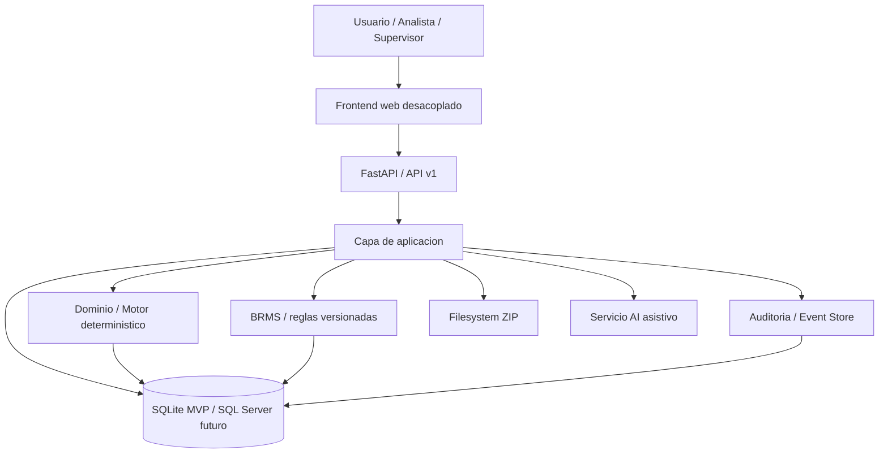
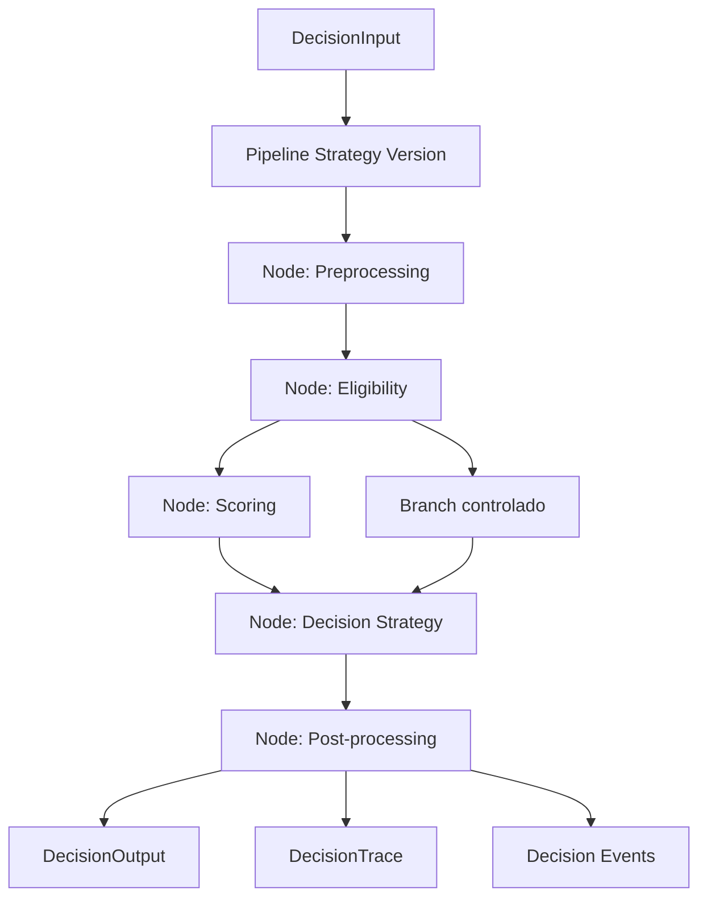

# DDR - Decision Engine MVP

## 1. Proposito

Definir la arquitectura del MVP de `Decision Engine` como una plataforma `PLD-first` en lo funcional, pero multiproducto en su base tecnica, tomando como referencia funcional el legado en `old-version/` y como marco objetivo el `docs/SPEC.md`.

El legado confirma que el negocio no es solo consulta y registro: incluye consulta de cliente, recalculo de oferta, validaciones, registro de solicitud, bandeja operativa, anulacion, cambio de estado, adjuntos ZIP y trazabilidad basica. El nuevo sistema debe reproducir ese flujo sin repetir los acoplamientos del monolito R + HTML/jQuery y sin convertir `PLD` en la forma estructural del sistema completo.

## 2. Requisitos

### Funcionales

- Consultar cliente por tipo y numero de documento.
- Mostrar datos relevantes, campanas/ofertas y resultado de evaluacion.
- Recalcular oferta con reglas de negocio deterministicas.
- Registrar solicitud, anularla y cambiar su estado.
- Consultar bandeja por periodo y exportar resultados.
- Cargar, descargar y visualizar adjuntos ZIP.
- Registrar trazabilidad completa de evaluaciones y acciones operativas.
- Ofrecer asistencia AI para explicacion, resumen y sugerencias.
- Preparar la base para BRMS y futuros productos de prestamo.
- Permitir que negocio administre reglas, parametros y secuencia del flujo con gobierno y auditoria.
- Dejar validada la capacidad de incorporar un segundo producto al finalizar el MVP.

### No funcionales

- Motor de decisiones deterministico y testeable.
- Frontend desacoplado de la logica de negocio.
- API tipada y versionada.
- Autenticacion y autorizacion modernas con RBAC.
- Compatibilidad inicial con SQLite y camino claro a SQL Server.
- Observabilidad con logs estructurados, request id y auditoria.
- AI opcional: si falla, el flujo principal sigue operando.
- Sin migracion historica; arranque con base limpia.
- DecisionTrace consumible por AI y por auditoria humana.
- Flexibilidad temprana de configuracion sin perder determinismo.

## 3. Entendimiento Del Legado

### Flujo PLD observado

- `get_tn`: consulta cliente y oferta base.
- `validate1`: prepara datos de evaluacion y captura campos complementarios.
- `validate2`: recalcula oferta y guarda la validacion.
- `grabasol`: registra la solicitud con controles de negocio.
- `bandejasol`: consulta bandeja, habilita anulacion y cambio de estado.
- `anulasol` y `updatesol`: mantenimiento operativo de la solicitud.
- `upload_file` y `download_file`: manejo de ZIP en filesystem.

### Lo que el legado enseña

- La evaluacion esta mezclada con UI y handlers HTTP.
- La autenticacion depende de IP.
- Parte de la regla vive en SQL, parte en Excel y parte en JS.
- El sistema expone HTML desde el backend, lo cual no debe repetirse.

## 4. Arquitectura Propuesta

Se adopta un modular monolith para el MVP: un solo backend desplegable, pero con limites internos estrictos entre API, aplicacion, dominio e infraestructura. Dentro del motor se propone un pipeline configurable por nodos gobernados, en lugar de un pipeline estrictamente lineal codificado.

## 5. Componentes

### Frontend

- Interfaz desacoplada, servida como assets estaticos.
- Consume la API por JSON.
- No contiene reglas de negocio criticas.
- Gestiona consulta, evaluacion, solicitud, bandeja, adjuntos y pantallas admin.

### Backend API

- FastAPI como punto de entrada HTTP.
- Pydantic para contratos.
- Casos de uso en capa de aplicacion.
- Repositorios y adaptadores aislados en infraestructura.

Los endpoints multiproducto bajo `/loans/{product_code}/...` no deben consolidar un
schema PLD como contrato estructural universal. La capa HTTP debe resolver el contrato
REST de entrada y salida segun `product_code`, manteniendo adapters explicitos por
producto para traducir hacia el contrato interno generico del motor.

Mientras existan contratos transicionales PLD-especificos en el borde HTTP, deben tratarse
como compatibilidad temporal y no como la forma final de la API multiproducto.

### Motor de decisiones

- Modulo interno, separado del framework web.
- Core agnostico al producto, con resolucion por `product_code` y `workflow_code`.
- Pipeline deterministico configurable por nodos gobernados.
- Nodos base: preprocessing, eligibility, scoring, decision strategy, post-processing.
- Branching controlado por estrategia versionada.
- Reglas, parametros y secuencia versionadas y reproducibles.
- Salida nativa de `DecisionTrace`.

El motor debe evolucionar desde un core multiproducto hacia una capacidad administrable por negocio y riesgos, donde el alta de productos y la creacion de workflows no dependan de cambios en codigo ni de aprobacion de TI como mecanismo normal de operacion.

En el estado actual del repositorio, esta base ya existe a nivel de dominio. `PLD` se
registra como primer runtime concreto sobre infraestructura generica; lo pendiente sigue
siendo completar los casos de uso funcionales y persistidos sobre esa base, converger el
borde REST multiproducto y reemplazar el bootstrap manual de un unico producto por un
registro extensible de runtimes.

La arquitectura objetivo debe contemplar:

- productos registrados en persistencia
- workflows registrados por producto
- catalogo de variables por producto
- reglas declarativas por workflow en JSON/DSL restringido
- herencia de variables y reglas base desde producto hacia workflow
- resolucion de inputs desde tablas internas de campana y desde datos capturados en UI

El registro de runtimes del motor debe soportar incorporacion extensible de productos, ya
sea por modulos registradores, discovery controlado o carga desde persistencia o
configuracion activa. `PLD` es el primer runtime concreto, no el unico runtime cableado de
forma permanente en el bootstrap.

### Resolucion de contratos y runtimes por producto

`product_code` gobierna dos resoluciones distintas y complementarias:

- resolucion del contrato REST de borde
- resolucion del runtime interno del motor

Ambas resoluciones deben ser explicitas y desacopladas. El contrato REST no es el contrato
canonico del motor: su responsabilidad es validar el payload especifico del producto y
traducirlo, mediante un mapper, al contrato interno generico del motor.

La primera resolucion selecciona request y response schemas compatibles con el producto en
el borde HTTP. La segunda selecciona estrategia de pipeline, normalizacion, catalogo de
variables, reglas y nodos del motor para el producto y workflow solicitados.

El estado actual del repositorio mantiene ambas resoluciones en una forma parcial:

- el core del motor ya resuelve `product_code` y `workflow_code`
- el borde REST todavia conserva contratos PLD-especificos en endpoints multiproducto
- el bootstrap del registry todavia registra solo `PLD`

La convergencia esperada del MVP es eliminar esas dos ultimas restricciones sin perder el
aislamiento entre API, dominio y configuracion administrable.

### BRMS

- Catalogo de reglas y versiones en BD.
- Activacion por producto y vigencia.
- Sandbox de pruebas para administracion.
- Administracion gobernada de secuencia del flujo por producto.

El BRMS debe ampliarse con cuatro capacidades administrables adicionales:

- catalogo de productos
- catalogo de workflows por producto
- catalogo de variables por producto
- resolucion declarativa de fuentes de input

La plataforma debe validar configuraciones y activaciones, pero no debe exigir aprobacion de TI para registrar un producto o crear un workflow. Ambos deben guardarse primero como `draft` y activarse luego por usuarios autorizados de negocio o riesgos.

### Event Store

- Tabla append-only para eventos de evaluacion y solicitud.
- Fuente de trazabilidad y reproduccion.

### AI asistiva

- Servicio auxiliar del backend.
- Consume solo salida estructurada del motor y datos permitidos.
- No decide aprobaciones ni rechazos.
- Consume `DecisionTrace` para explicacion y soporte de auditoria humana.

### ZIP / adjuntos

- Persistencia inicial en filesystem.
- Metadatos y auditoria en BD.

## 6. Decisiones Clave

### ADR-001: Modular monolith para el MVP

**Status:** Accepted

**Contexto**

El MVP necesita velocidad de entrega, baja complejidad operativa y una separacion real de dominio, pero el equipo y el alcance no justifican microservicios.

**Decision**

Implementar el MVP como monolito modular con limites claros entre API, aplicacion, dominio e infraestructura.

**Consequences**

- Positivas: despliegue simple, debugging sencillo, menor costo operativo.
- Negativas: escalado independiente limitado por modulo.

**Alternativas Consideradas**

- Microservices: descartado por sobrecosto operativo.
- Monolito sin modularidad: descartado por acoplamiento excesivo.

### ADR-002: FastAPI + Pydantic como backend base

**Status:** Accepted

**Contexto**

Se requiere API tipada, documentada y facil de probar.

**Decision**

Usar FastAPI con Pydantic v2 y SQLAlchemy/Alembic en la capa de persistencia.

**Consequences**

- Positivas: OpenAPI automatico, validacion fuerte, buen soporte async.
- Negativas: requiere disciplina para no mezclar dominio con framework.

**Alternatives Considered**

- Flask: mas simple, pero menos estructurado para contratos.
- Django: mas pesado para este MVP.

### ADR-003: SQLite inicial con compatibilidad SQL Server

**Status:** Accepted

**Contexto**

El MVP necesita arrancar rapido sin bloquear la migracion futura a SQL Server.

**Decision**

Usar SQLite como base inicial y diseniar el esquema para compatibilidad con SQL Server.

**Consequences**

- Positivas: arranque facil, bajo costo, ideal para desarrollo y pruebas.
- Negativas: diferencias de dialecto y concurrencia frente a SQL Server.

**Alternatives Considered**

- SQL Server desde el inicio: mayor costo y friccion de entorno.
- PostgreSQL: viable tecnicamente, pero no alineado con la especificacion actual.

### ADR-004: Motor deterministico aislado de la AI

**Status:** Accepted

**Contexto**

La AI debe explicar y asistir, no decidir.

**Decision**

Separar el motor deterministico de la capa AI; la AI consume resultados estructurados, nunca reglas vivas.

**Consequences**

- Positivas: reproducibilidad, auditoria, explicabilidad.
- Negativas: dos capas que coordinar y versionar.

**Alternatives Considered**

- AI en el camino critico: rechazado por no determinismo.

### ADR-005: Event Store append-only en la misma BD

**Status:** Accepted

**Contexto**

Se necesita trazabilidad completa sin agregar infraestructura innecesaria.

**Decision**

Persistir eventos inmutables en tablas append-only dentro de la misma base transaccional.

**Consequences**

- Positivas: simple de operar, auditable, compatible con SQLite.
- Negativas: no ofrece desacople total como un bus dedicado.

**Alternatives Considered**

- Kafka/event bus: sobredimensionado para el MVP.

### ADR-006: ZIP en filesystem para el MVP

**Status:** Accepted

**Contexto**

El alcance cerrado incluye carga y descarga de ZIP, pero no se pide un object store en esta fase.

**Decision**

Guardar archivos ZIP en filesystem con metadatos y control de acceso en backend.

**Consequences**

- Positivas: rapido de implementar, facil de validar.
- Negativas: requiere disciplina en backups, permisos y limpieza.

**Alternatives Considered**

- Object storage: mas robusto, pero no necesario para el MVP.

### ADR-007: Pipeline configurable por nodos gobernados para el motor

**Status:** Accepted

**Contexto**

Negocio administrara reglas, parametros y secuencia del flujo. Se espera un segundo producto al finalizar el MVP y la prioridad es flexibilidad temprana de configuracion. Aun asi, el motor debe seguir siendo deterministico, explicable y auditable.

**Decision**

Adoptar un pipeline configurable por nodos gobernados, con branching controlado, topologia validada, versionado de estrategia y `DecisionTrace` estructurado. No adoptar un workflow engine general de proposito amplio en el MVP.

**Consequences**

- Positivas: mayor flexibilidad temprana, mejor preparacion multiproducto, secuencias administrables por negocio, mejor soporte a AI y auditoria.
- Negativas: mayor complejidad de gobierno, validacion y testing que un pipeline lineal fijo.

**Alternatives Considered**

- Pipeline lineal codificado: demasiado rigido para la prioridad de configuracion temprana.
- Workflow engine general: demasiado complejo operacionalmente para el MVP.

### ADR-008: Vite + React + TypeScript como frontend base

**Status:** Accepted

**Contexto**

El MVP necesita un frontend desplegable de forma simple, con formularios complejos, tablas, manejo de rutas y una base preparada para futuras extensiones sin acoplarse al legacy.

**Decision**

Usar `Vite + React + TypeScript` y desplegar el resultado como assets estaticos detras de Nginx o un reverse proxy equivalente.

**Consequences**

- Positivas: bootstrap rapido, build estatico simple, buena ergonomia para UI operativa y separacion clara con la API.
- Negativas: requiere disciplina para mantener la UI sin reglas de negocio criticas.

**Alternatives Considered**

- SPA pesada con framework mas opinado: descartada por mayor costo de arranque.
- HTML generado por backend: descartado por el acoplamiento legado que el proyecto busca eliminar.

### ADR-009: `PLD` como primer producto registrado sobre core multiproducto

**Status:** Accepted

**Contexto**

El proyecto necesita entregar primero el flujo `PLD`, pero tambien necesita validar desde el MVP que la plataforma soporta mas de un producto y mas de un workflow sin reescribir su base tecnica.

**Decision**

Modelar `PLD` como primer producto registrado sobre un core multiproducto, manteniendo `product_code` y `workflow_code` como dimensiones de primer nivel y reservando metricas como `RCI`, `oferta`, `cuota`, `tasa` y `plazo` al resultado del producto o workflow, no al contrato universal del motor.

**Consequences**

- Positivas: evita hardcode estructural de `PLD`, facilita onboarding de futuros productos y mantiene compartidas las capas de seguridad, auditoria, errores y trazabilidad.
- Negativas: obliga a distinguir mejor entre contratos genericos de plataforma y payloads todavia transicionales o PLD-especificos en el borde HTTP.

**Alternatives Considered**

- Motor centrado en `PLD` con refactor posterior: descartado por el riesgo de acoplamiento y retrabajo.

### ADR-010: Autonomia operativa de riesgos y negocio sobre configuracion del motor

**Status:** Accepted

**Contexto**

El objetivo del motor no es solo soportar multiples productos, sino permitir que riesgos y negocio puedan registrar productos, crear workflows, definir variables y administrar reglas sin depender de intervenciones recurrentes de TI.

**Decision**

Adoptar un modelo administrable en BD donde productos, workflows, variables y reglas se gestionan por configuracion persistida. Las reglas se expresan en un JSON/DSL restringido y validable. Las variables de campana se leen desde tablas internas del sistema nuevo. El catalogo de variables se define a nivel producto y los workflows pueden heredar variables y reglas base del producto. El alta de productos y workflows se guarda primero como `draft` y se activa luego por usuarios autorizados de negocio o riesgos.

**Consequences**

- Positivas: reduce dependencia operativa de TI, acelera alta de productos y politicas, mejora trazabilidad de cambios y fortalece el gobierno funcional del motor.
- Negativas: incrementa complejidad del BRMS, exige validadores mas estrictos y requiere una UI administrativa mas rica.

**Alternatives Considered**

- Mantener productos y workflows definidos en codigo: descartado por baja autonomia y alto costo operativo.
- Permitir reglas totalmente libres o ejecutables sin restriccion: descartado por riesgo de seguridad, falta de validacion y baja auditabilidad.

### ADR-011: Resolucion de contratos REST por producto

**Status:** Accepted

**Contexto**

La API del MVP expone endpoints multiproducto bajo `/loans/{product_code}/...`, pero el
estado actual del repositorio todavia conserva contratos PLD-especificos en algunos
endpoints de evaluacion. Esto crea una divergencia entre el shape nominal de la API y la
filosofia multiproducto del proyecto.

**Decision**

Adoptar un mecanismo explicito de resolucion de contratos REST por `product_code`, capaz de
seleccionar request schema, response schema y mapper de borde para cada producto soportado.
Los schemas de producto viven en la capa API; el contrato canonico del motor permanece en
dominio y recibe entradas ya adaptadas desde el borde HTTP.

**Consequences**

- Positivas: alinea el borde HTTP con la estrategia multiproducto, evita consolidar `PLD`
  como contrato universal y permite extender la API sin redisenar el core del motor.
- Negativas: aumenta la complejidad del wiring de endpoints, de la publicacion OpenAPI y de
  las pruebas de contrato por producto.

**Alternatives Considered**

- Mantener un unico schema REST PLD y reinterpretarlo internamente para otros productos:
  descartado por acoplar el borde HTTP a `PLD` y degradar la evolucion de contratos.
- Mover la variacion de contratos enteramente al frontend sin resolverla en backend:
  descartado porque la API debe seguir siendo tipada, validable y consistente por producto.

### ADR-012: Registro extensible de runtimes del motor

**Status:** Accepted

**Contexto**

El registry del motor ya soporta resolucion por `product_code` y `workflow_code`, pero el
bootstrap actual registra solo `PLD`. Eso valida el core multiproducto a nivel de dominio,
pero no deja resuelto el punto de extension para incorporar nuevos productos sin modificar
el bootstrap central.

**Decision**

Separar el bootstrap base del mecanismo de incorporacion de runtimes y adoptar un registro
extensible de productos. La incorporacion puede materializarse mediante modulos
registradores por producto, discovery controlado o carga desde persistencia o configuracion
activa, siempre bajo validacion explicita.

**Consequences**

- Positivas: reduce el acoplamiento del bootstrap a `PLD`, mejora el onboarding tecnico de
  nuevos productos y prepara la transicion desde runtimes codificados hacia configuracion
  administrable.
- Negativas: introduce mas disciplina de lifecycle, validacion y observabilidad del proceso
  de registro de runtimes.

**Alternatives Considered**

- Mantener un bootstrap central con `if/else` por producto: descartado por escalar mal y
  recentralizar el motor en cambios manuales recurrentes.
- Cargar productos sin validacion desde cualquier modulo disponible: descartado por riesgo
  operacional, baja trazabilidad y menor control sobre configuraciones activas.

## 7. Modelo De Datos

### Entidades base

- `users`, `roles`, `user_roles`
- `loan_products`
- `workflow_definitions`
- `variable_definitions`
- `variable_source_bindings`
- `loan_evaluations`
- `evaluation_input_snapshots`
- `credit_requests`
- `credit_request_status_history`
- `decision_events`
- `decision_traces`
- `rule_sets`, `rule_versions`, `pipeline_strategies`
- `pipeline_nodes`
- `audit_logs`
- `ai_interactions`, `ai_prompt_templates`

### Principio de modelado

Persistir solo los campos efectivamente consumidos por el motor en cada evaluacion. El snapshot debe ser minimo, no un volcado completo de formularios.

Separar explicitamente versionado de reglas, parametros y estrategia de flujo para evitar que una misma version mezcle cambios heterogeneos dificiles de auditar.

La base canonica del modelo debe ser compartida por plataforma. Si aparecen estructuras auxiliares especificas por producto, no deben desplazar a `loan_evaluations`, `rule_sets`, `pipeline_strategies`, `decision_traces` o `decision_events` como modelo principal.

El modelado debe soportar explicitamente:

- catalogo de variables por producto
- asociacion de reglas a workflows
- herencia de variables y reglas base hacia workflows
- declaracion de fuente por variable
- resolucion de variables de `campaign_db` desde tablas internas del sistema nuevo

### Campos adicionales esperados

#### `loan_evaluations`

- `workflow_code`
- `pipeline_version`
- `variable_catalog_version`

#### `decision_traces`

- `id`
- `evaluation_id` (FK a `loan_evaluations`)
- `workflow_code`
- `pipeline_version`
- `trace_payload` (JSON)
- `human_summary` (TEXT, nullable)
- `created_at`

#### `workflow_definitions`

- `id` (UUID, PK)
- `loan_product_code` (FK a `loan_products`)
- `workflow_code` (VARCHAR)
- `name` (VARCHAR)
- `description` (TEXT, nullable)
- `status` (VARCHAR: 'draft', 'active', 'inactive', 'retired')
- `is_default` (BOOLEAN)
- `effective_from` (TIMESTAMP, nullable)
- `effective_to` (TIMESTAMP, nullable)
- `created_by` (FK a `users`)
- `created_at` (TIMESTAMP)

#### `variable_definitions`

- `id` (UUID, PK)
- `loan_product_code` (FK a `loan_products`)
- `variable_key` (VARCHAR)
- `label` (VARCHAR)
- `description` (TEXT, nullable)
- `variable_kind` (VARCHAR)
- `data_type` (VARCHAR)
- `required` (BOOLEAN)
- `allowed_in_rules` (BOOLEAN)
- `persist_in_evidence` (BOOLEAN)
- `source_type` (VARCHAR: 'campaign_db', 'user_input', 'derived', 'constant')
- `source_config` (JSON)
- `validation_config` (JSON, nullable)
- `created_by` (FK a `users`)
- `created_at` (TIMESTAMP)

#### `rule_versions`

Debe permitir representar reglas declarativas en JSON/DSL restringido y asociarlas a workflows concretos o a reglas base heredables desde producto.

#### `pipeline_strategies`

- `id` (UUID, PK)
- `loan_product_code` (FK a `loan_products`)
- `workflow_code` (VARCHAR)
- `version_number` (INT)
- `graph_definition` (JSON)
- `status` (VARCHAR: 'draft', 'active', 'deprecated')
- `approved_by` (FK a `users`, nullable)
- `created_by` (FK a `users`)
- `created_at` (TIMESTAMP)

## 8. Seguridad

- Autenticacion moderna, no por IP.
- RBAC con roles `analista`, `evaluador`, `supervisor`, `admin`.
- HTTPS en entornos no locales.
- Sesiones o tokens con expiracion.
- CORS restringido.
- Validacion estricta de payloads.
- Logs estructurados y request id.
- Auditoria de acciones sensibles con usuario, rol, accion, entidad y resultado.

## 9. Riesgos Y Mitigaciones

### Riesgos

- Diferencias de comportamiento entre legacy y nuevo motor.
- Reglas implicitas no documentadas.
- Complejidad de compatibilidad SQLite/SQL Server.
- Acoplamiento accidental de UI y negocio.
- API multiproducto nominal con contratos REST realmente PLD-centricos.
- Fallo o indisponibilidad de la AI.
- Complejidad de gobierno del flujo configurable.
- Bootstrap multiproducto nominal con registro efectivo de un solo producto.

### Mitigaciones

- Catalogo de reglas y casos canonicos de regresion.
- Pipeline deterministico con tests por etapa.
- Esquema relacional portable y sin SQL dependiente del motor.
- Contratos API versionados y dominio aislado.
- Resolucion explicita de schemas REST por `product_code` con adapters y pruebas de
  contrato por producto.
- AI opcional con fallback completo al flujo deterministico.
- Validacion de topologia antes de activar un pipeline.
- Aprobacion separada para cambios de reglas y cambios de secuencia.
- Registro extensible de runtimes con validacion controlada, en lugar de bootstrap manual
  permanente de un unico producto.

## 10. Conclusion

La arquitectura recomendada para el MVP es un backend FastAPI modular, con motor
deterministico aislado, BRMS y event store dentro del mismo sistema, frontend desacoplado
y ZIP sobre filesystem. El motor se implementa con pipeline configurable por nodos
gobernados, con `DecisionTrace` estructurado para AI y auditoria humana.

El estado actual del repositorio ya valida el core multiproducto del motor, pero todavia no
ha convergido por completo en dos frentes: el borde REST sigue parcialmente modelado con
contratos PLD-especificos y el bootstrap del registry sigue registrando un unico runtime
concreto. La direccion correcta del MVP es cerrar ambas brechas sin reintroducir los
acoplamientos del legacy, de modo que la plataforma quede lista para incorporar un segundo
producto sin redisenar sus capas compartidas.
