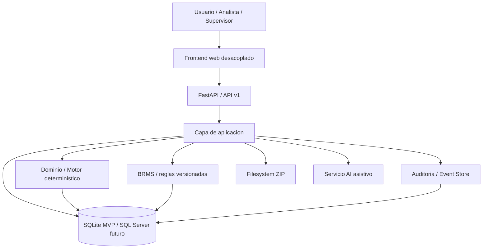
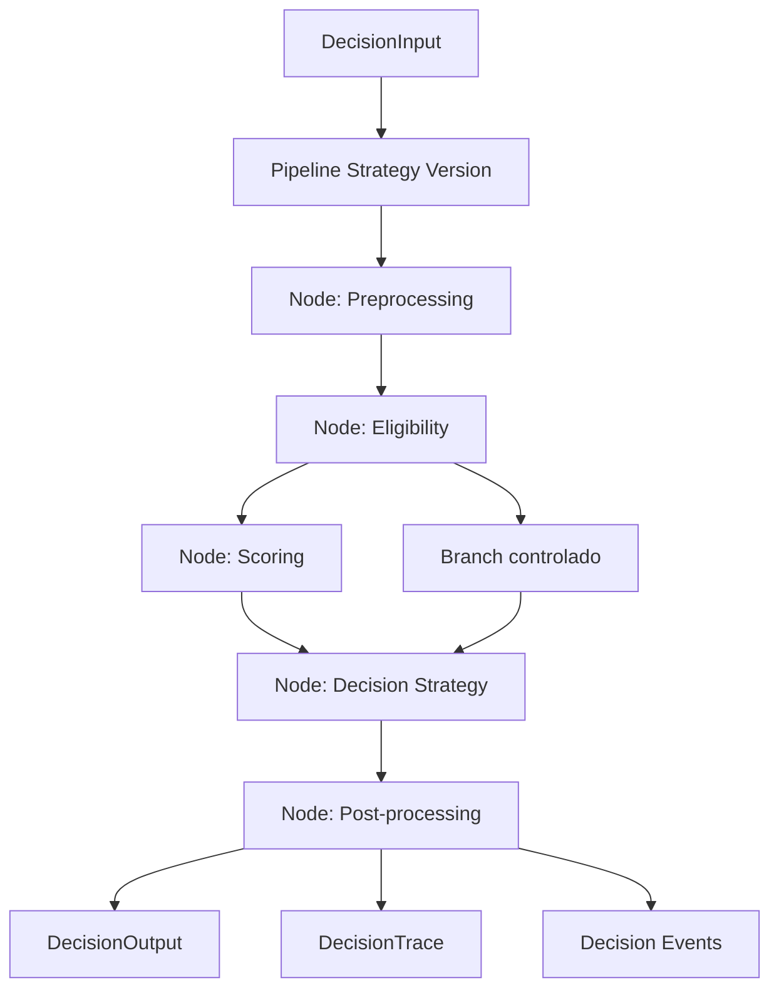

# DDR - Decision Engine MVP

## 1. Proposito

Definir la arquitectura del MVP de `Decision Engine` para `PLD / solicitudes de credito`, tomando como referencia funcional el legado en `old-version/` y como marco objetivo el `docs/SPEC.md`.

El legado confirma que el negocio no es solo consulta y registro: incluye consulta de cliente, recalculo de oferta, validaciones, registro de solicitud, bandeja operativa, anulacion, cambio de estado, adjuntos ZIP y trazabilidad basica. El nuevo sistema debe reproducir ese flujo sin repetir los acoplamientos del monolito R + HTML/jQuery.

## 2. Requisitos

### Funcionales

- Consultar cliente por tipo y numero de documento.
- Mostrar datos relevantes, campanas/ofertas y resultado de evaluacion.
- Recalcular oferta con reglas de negocio deterministicas.
- Registrar solicitud, anularla y cambiar su estado.
- Consultar bandeja por periodo y exportar resultados.
- Cargar, descargar y visualizar adjuntos ZIP.
- Registrar trazabilidad completa de evaluaciones y acciones operativas.
- Ofrecer asistencia AI para explicacion, resumen y sugerencias.
- Preparar la base para BRMS y futuros productos de prestamo.
- Permitir que negocio administre reglas, parametros y secuencia del flujo con gobierno y auditoria.
- Dejar validada la capacidad de incorporar un segundo producto al finalizar el MVP.

### No funcionales

- Motor de decisiones deterministico y testeable.
- Frontend desacoplado de la logica de negocio.
- API tipada y versionada.
- Autenticacion y autorizacion modernas con RBAC.
- Compatibilidad inicial con SQLite y camino claro a SQL Server.
- Observabilidad con logs estructurados, request id y auditoria.
- AI opcional: si falla, el flujo principal sigue operando.
- Sin migracion historica; arranque con base limpia.
- DecisionTrace consumible por AI y por auditoria humana.
- Flexibilidad temprana de configuracion sin perder determinismo.

## 3. Entendimiento Del Legado

### Flujo PLD observado

- `get_tn`: consulta cliente y oferta base.
- `validate1`: prepara datos de evaluacion y captura campos complementarios.
- `validate2`: recalcula oferta y guarda la validacion.
- `grabasol`: registra la solicitud con controles de negocio.
- `bandejasol`: consulta bandeja, habilita anulacion y cambio de estado.
- `anulasol` y `updatesol`: mantenimiento operativo de la solicitud.
- `upload_file` y `download_file`: manejo de ZIP en filesystem.

### Lo que el legado enseña

- La evaluacion esta mezclada con UI y handlers HTTP.
- La autenticacion depende de IP.
- Parte de la regla vive en SQL, parte en Excel y parte en JS.
- El sistema expone HTML desde el backend, lo cual no debe repetirse.

## 4. Arquitectura Propuesta

Se adopta un modular monolith para el MVP: un solo backend desplegable, pero con limites internos estrictos entre API, aplicacion, dominio e infraestructura. Dentro del motor se propone un pipeline configurable por nodos gobernados, en lugar de un pipeline estrictamente lineal codificado.

## 5. Componentes

### Frontend

- Interfaz desacoplada, servida como assets estaticos.
- Consume la API por JSON.
- No contiene reglas de negocio criticas.
- Gestiona consulta, evaluacion, solicitud, bandeja, adjuntos y pantallas admin.

### Backend API

- FastAPI como punto de entrada HTTP.
- Pydantic para contratos.
- Casos de uso en capa de aplicacion.
- Repositorios y adaptadores aislados en infraestructura.

### Motor de decisiones

- Modulo interno, separado del framework web.
- Pipeline deterministico configurable por nodos gobernados.
- Nodos base: preprocessing, eligibility, scoring, decision strategy, post-processing.
- Branching controlado por estrategia versionada.
- Reglas, parametros y secuencia versionadas y reproducibles.
- Salida nativa de `DecisionTrace`.

### BRMS

- Catalogo de reglas y versiones en BD.
- Activacion por producto y vigencia.
- Sandbox de pruebas para administracion.
- Administracion gobernada de secuencia del flujo por producto.

### Event Store

- Tabla append-only para eventos de evaluacion y solicitud.
- Fuente de trazabilidad y reproduccion.

### AI asistiva

- Servicio auxiliar del backend.
- Consume solo salida estructurada del motor y datos permitidos.
- No decide aprobaciones ni rechazos.
- Consume `DecisionTrace` para explicacion y soporte de auditoria humana.

### ZIP / adjuntos

- Persistencia inicial en filesystem.
- Metadatos y auditoria en BD.

## 6. Decisiones Clave

### ADR-001: Modular monolith para el MVP

**Status:** Accepted

**Contexto**

El MVP necesita velocidad de entrega, baja complejidad operativa y una separacion real de dominio, pero el equipo y el alcance no justifican microservicios.

**Decision**

Implementar el MVP como monolito modular con limites claros entre API, aplicacion, dominio e infraestructura.

**Consequences**

- Positivas: despliegue simple, debugging sencillo, menor costo operativo.
- Negativas: escalado independiente limitado por modulo.

**Alternativas Consideradas**

- Microservices: descartado por sobrecosto operativo.
- Monolito sin modularidad: descartado por acoplamiento excesivo.

### ADR-002: FastAPI + Pydantic como backend base

**Status:** Accepted

**Contexto**

Se requiere API tipada, documentada y facil de probar.

**Decision**

Usar FastAPI con Pydantic v2 y SQLAlchemy/Alembic en la capa de persistencia.

**Consequences**

- Positivas: OpenAPI automatico, validacion fuerte, buen soporte async.
- Negativas: requiere disciplina para no mezclar dominio con framework.

**Alternatives Considered**

- Flask: mas simple, pero menos estructurado para contratos.
- Django: mas pesado para este MVP.

### ADR-003: SQLite inicial con compatibilidad SQL Server

**Status:** Accepted

**Contexto**

El MVP necesita arrancar rapido sin bloquear la migracion futura a SQL Server.

**Decision**

Usar SQLite como base inicial y diseniar el esquema para compatibilidad con SQL Server.

**Consequences**

- Positivas: arranque facil, bajo costo, ideal para desarrollo y pruebas.
- Negativas: diferencias de dialecto y concurrencia frente a SQL Server.

**Alternatives Considered**

- SQL Server desde el inicio: mayor costo y friccion de entorno.
- PostgreSQL: viable tecnicamente, pero no alineado con la especificacion actual.

### ADR-004: Motor deterministico aislado de la AI

**Status:** Accepted

**Contexto**

La AI debe explicar y asistir, no decidir.

**Decision**

Separar el motor deterministico de la capa AI; la AI consume resultados estructurados, nunca reglas vivas.

**Consequences**

- Positivas: reproducibilidad, auditoria, explicabilidad.
- Negativas: dos capas que coordinar y versionar.

**Alternatives Considered**

- AI en el camino critico: rechazado por no determinismo.

### ADR-005: Event Store append-only en la misma BD

**Status:** Accepted

**Contexto**

Se necesita trazabilidad completa sin agregar infraestructura innecesaria.

**Decision**

Persistir eventos inmutables en tablas append-only dentro de la misma base transaccional.

**Consequences**

- Positivas: simple de operar, auditable, compatible con SQLite.
- Negativas: no ofrece desacople total como un bus dedicado.

**Alternatives Considered**

- Kafka/event bus: sobredimensionado para el MVP.

### ADR-006: ZIP en filesystem para el MVP

**Status:** Accepted

**Contexto**

El alcance cerrado incluye carga y descarga de ZIP, pero no se pide un object store en esta fase.

**Decision**

Guardar archivos ZIP en filesystem con metadatos y control de acceso en backend.

**Consequences**

- Positivas: rapido de implementar, facil de validar.
- Negativas: requiere disciplina en backups, permisos y limpieza.

**Alternatives Considered**

- Object storage: mas robusto, pero no necesario para el MVP.

### ADR-007: Pipeline configurable por nodos gobernados para el motor

**Status:** Accepted

**Contexto**

Negocio administrara reglas, parametros y secuencia del flujo. Se espera un segundo producto al finalizar el MVP y la prioridad es flexibilidad temprana de configuracion. Aun asi, el motor debe seguir siendo deterministico, explicable y auditable.

**Decision**

Adoptar un pipeline configurable por nodos gobernados, con branching controlado, topologia validada, versionado de estrategia y `DecisionTrace` estructurado. No adoptar un workflow engine general de proposito amplio en el MVP.

**Consequences**

- Positivas: mayor flexibilidad temprana, mejor preparacion multiproducto, secuencias administrables por negocio, mejor soporte a AI y auditoria.
- Negativas: mayor complejidad de gobierno, validacion y testing que un pipeline lineal fijo.

**Alternatives Considered**

- Pipeline lineal codificado: demasiado rigido para la prioridad de configuracion temprana.
- Workflow engine general: demasiado complejo operacionalmente para el MVP.

## 7. Modelo De Datos

### Entidades base

- `users`, `roles`, `user_roles`
- `loan_products`
- `clients`
- `pld_campaigns`
- `pld_rule_sets`, `pld_rule_parameters`
- `pld_evaluations`
- `pld_evaluation_inputs`, `pld_evaluation_results`
- `evaluation_input_snapshots`
- `credit_requests`
- `credit_request_status_history`
- `decision_events`
- `decision_traces`
- `rule_sets`, `rule_versions`, `pipeline_strategies`
- `pipeline_nodes`
- `audit_logs`
- `ai_interactions`, `ai_prompt_templates`

### Principio de modelado

Persistir solo los campos efectivamente consumidos por el motor en cada evaluacion. El snapshot debe ser minimo, no un volcado completo de formularios.

Separar explicitamente versionado de reglas, parametros y estrategia de flujo para evitar que una misma version mezcle cambios heterogeneos dificiles de auditar.

### Campos adicionales esperados

#### `pld_evaluations`

- `pipeline_version`

#### `decision_traces`

- `id`
- `evaluation_id` (FK a `pld_evaluations`)
- `pipeline_version`
- `trace_payload` (JSON)
- `human_summary` (TEXT, nullable)
- `created_at`

#### `pipeline_strategies`

- `id` (UUID, PK)
- `loan_product_code` (FK a `loan_products`)
- `version_number` (INT)
- `graph_definition` (JSON)
- `status` (VARCHAR: 'draft', 'active', 'deprecated')
- `approved_by` (FK a `users`, nullable)
- `created_by` (FK a `users`)
- `created_at` (TIMESTAMP)

## 8. Seguridad

- Autenticacion moderna, no por IP.
- RBAC con roles `analista`, `evaluador`, `supervisor`, `admin`.
- HTTPS en entornos no locales.
- Sesiones o tokens con expiracion.
- CORS restringido.
- Validacion estricta de payloads.
- Logs estructurados y request id.
- Auditoria de acciones sensibles con usuario, rol, accion, entidad y resultado.

## 9. Riesgos Y Mitigaciones

### Riesgos

- Diferencias de comportamiento entre legacy y nuevo motor.
- Reglas implicitas no documentadas.
- Complejidad de compatibilidad SQLite/SQL Server.
- Acoplamiento accidental de UI y negocio.
- Fallo o indisponibilidad de la AI.
- Complejidad de gobierno del flujo configurable.

### Mitigaciones

- Catalogo de reglas y casos canonicos de regresion.
- Pipeline deterministico con tests por etapa.
- Esquema relacional portable y sin SQL dependiente del motor.
- Contratos API versionados y dominio aislado.
- AI opcional con fallback completo al flujo deterministico.
- Validacion de topologia antes de activar un pipeline.
- Aprobacion separada para cambios de reglas y cambios de secuencia.

## 10. Conclusion

La arquitectura recomendada para el MVP es un backend FastAPI modular, con motor deterministico aislado, BRMS y event store dentro del mismo sistema, frontend desacoplado y ZIP sobre filesystem. El motor se implementa con pipeline configurable por nodos gobernados, con `DecisionTrace` estructurado para AI y auditoria humana. Esta forma replica el flujo legado de PLD, elimina sus dependencias fragiles y deja una base real para incorporar un segundo producto al finalizar el MVP.
