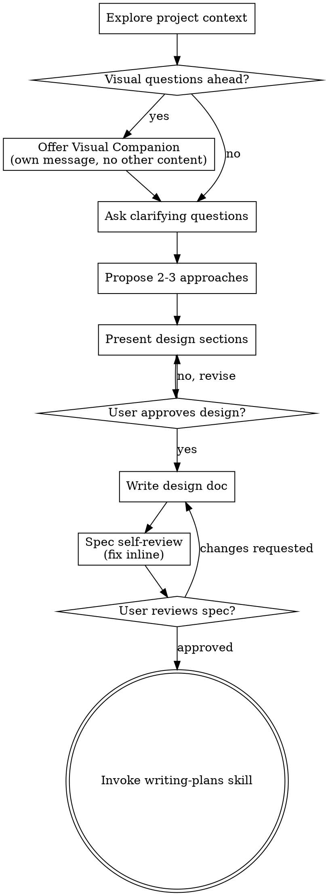
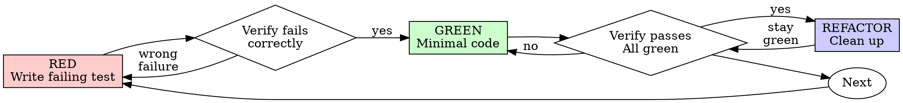

# Service detail workspace layout refactor

**Session ID:** ses_127763a90ffeEAYGquQINZ1fuO
**Created:** 17/6/2026, 21:22:48
**Updated:** 17/6/2026, 21:48:22

---

## User

You are a senior frontend engineer.

Refactor the current service detail page layout from a card-based dashboard into a sidebar-based workspace layout.

The current screen uses separate cards for sections such as Business Rules, Parameters, Workflows, and Inspector. Replace this structure with a layout where all navigation menus are located in a left-side panel, and the selected content is displayed in the central workspace.

Do not rebuild the existing environment module.
Do not change the business logic or domain concepts.
Do not implement backend integration.
Use frontend state and mock data only if needed.

## Main objective

Transform the current page into a professional enterprise web app layout with:

- Left sidebar panel containing all menus and submenus
- Central content area showing the selected section
- Optional right inspector panel only for "Motor de Decisiones" service
- Full-width workspace layout
- Clean enterprise SaaS styling 

---

## Assistant (Plan · GPT-5.4 · 11.7s)

_Thinking:_

**Planning tech tasks**

I'm in read-only plan mode, needing to inspect the codebase and consider using my skills. The user is asking a senior frontend engineer and focusing on planning. I probably need to brainstorm for creative work before implementation, considering interface design as well. I should check the README as per AGENTS and think about writing a to-do list for multi-step planning. I’ll send a brief commentary before diving into substantial work. Let’s proceed with the to-do writing!

Primero voy a ubicar la pantalla actual, revisar la estructura real del frontend y entender cómo está compuesta la página de detalle del servicio antes de proponer el refactor.

**Tool: todowrite**

**Input:**
```json
{
  "todos": [
    {
      "content": "Revisar contexto del repo y restricciones del frontend relevantes para la pantalla",
      "status": "in_progress",
      "priority": "high"
    },
    {
      "content": "Localizar la página actual de detalle del servicio y sus componentes/estilos asociados",
      "status": "pending",
      "priority": "high"
    },
    {
      "content": "Analizar cómo están modeladas las secciones actuales y el inspector",
      "status": "pending",
      "priority": "high"
    },
    {
      "content": "Preparar plan de refactor a layout tipo workspace con sidebar",
      "status": "pending",
      "priority": "high"
    }
  ]
}
```

**Output:**
```
[
  {
    "content": "Revisar contexto del repo y restricciones del frontend relevantes para la pantalla",
    "status": "in_progress",
    "priority": "high"
  },
  {
    "content": "Localizar la página actual de detalle del servicio y sus componentes/estilos asociados",
    "status": "pending",
    "priority": "high"
  },
  {
    "content": "Analizar cómo están modeladas las secciones actuales y el inspector",
    "status": "pending",
    "priority": "high"
  },
  {
    "content": "Preparar plan de refactor a layout tipo workspace con sidebar",
    "status": "pending",
    "priority": "high"
  }
]
```

---

## Assistant (Plan · GPT-5.4 · 9.1s)

_Thinking:_


**Tool: skill**

**Input:**
```json
{
  "name": "brainstorming"
}
```

**Output:**
```
<skill_content name="brainstorming">
# Skill: brainstorming

# Brainstorming Ideas Into Designs

Help turn ideas into fully formed designs and specs through natural collaborative dialogue.

Start by understanding the current project context, then ask questions one at a time to refine the idea. Once you understand what you're building, present the design and get user approval.

<HARD-GATE>
Do NOT invoke any implementation skill, write any code, scaffold any project, or take any implementation action until you have presented a design and the user has approved it. This applies to EVERY project regardless of perceived simplicity.
</HARD-GATE>

## Anti-Pattern: "This Is Too Simple To Need A Design"

Every project goes through this process. A todo list, a single-function utility, a config change — all of them. "Simple" projects are where unexamined assumptions cause the most wasted work. The design can be short (a few sentences for truly simple projects), but you MUST present it and get approval.

## Checklist

You MUST create a task for each of these items and complete them in order:

1. **Explore project context** — check files, docs, recent commits
2. **Offer visual companion** (if topic will involve visual questions) — this is its own message, not combined with a clarifying question. See the Visual Companion section below.
3. **Ask clarifying questions** — one at a time, understand purpose/constraints/success criteria
4. **Propose 2-3 approaches** — with trade-offs and your recommendation
5. **Present design** — in sections scaled to their complexity, get user approval after each section
6. **Write design doc** — save to `docs/superpowers/specs/YYYY-MM-DD-<topic>-design.md` and commit
7. **Spec self-review** — quick inline check for placeholders, contradictions, ambiguity, scope (see below)
8. **User reviews written spec** — ask user to review the spec file before proceeding
9. **Transition to implementation** — invoke writing-plans skill to create implementation plan

## Process Flow



**The terminal state is invoking writing-plans.** Do NOT invoke frontend-design, mcp-builder, or any other implementation skill. The ONLY skill you invoke after brainstorming is writing-plans.

## The Process

**Understanding the idea:**

- Check out the current project state first (files, docs, recent commits)
- Before asking detailed questions, assess scope: if the request describes multiple independent subsystems (e.g., "build a platform with chat, file storage, billing, and analytics"), flag this immediately. Don't spend questions refining details of a project that needs to be decomposed first.
- If the project is too large for a single spec, help the user decompose into sub-projects: what are the independent pieces, how do they relate, what order should they be built? Then brainstorm the first sub-project through the normal design flow. Each sub-project gets its own spec → plan → implementation cycle.
- For appropriately-scoped projects, ask questions one at a time to refine the idea
- Prefer multiple choice questions when possible, but open-ended is fine too
- Only one question per message - if a topic needs more exploration, break it into multiple questions
- Focus on understanding: purpose, constraints, success criteria

**Exploring approaches:**

- Propose 2-3 different approaches with trade-offs
- Present options conversationally with your recommendation and reasoning
- Lead with your recommended option and explain why

**Presenting the design:**

- Once you believe you understand what you're building, present the design
- Scale each section to its complexity: a few sentences if straightforward, up to 200-300 words if nuanced
- Ask after each section whether it looks right so far
- Cover: architecture, components, data flow, error handling, testing
- Be ready to go back and clarify if something doesn't make sense

**Design for isolation and clarity:**

- Break the system into smaller units that each have one clear purpose, communicate through well-defined interfaces, and can be understood and tested independently
- For each unit, you should be able to answer: what does it do, how do you use it, and what does it depend on?
- Can someone understand what a unit does without reading its internals? Can you change the internals without breaking consumers? If not, the boundaries need work.
- Smaller, well-bounded units are also easier for you to work with - you reason better about code you can hold in context at once, and your edits are more reliable when files are focused. When a file grows large, that's often a signal that it's doing too much.

**Working in existing codebases:**

- Explore the current structure before proposing changes. Follow existing patterns.
- Where existing code has problems that affect the work (e.g., a file that's grown too large, unclear boundaries, tangled responsibilities), include targeted improvements as part of the design - the way a good developer improves code they're working in.
- Don't propose unrelated refactoring. Stay focused on what serves the current goal.

## After the Design

**Documentation:**

- Write the validated design (spec) to `docs/superpowers/specs/YYYY-MM-DD-<topic>-design.md`
  - (User preferences for spec location override this default)
- Use elements-of-style:writing-clearly-and-concisely skill if available
- Commit the design document to git

**Spec Self-Review:**
After writing the spec document, look at it with fresh eyes:

1. **Placeholder scan:** Any "TBD", "TODO", incomplete sections, or vague requirements? Fix them.
2. **Internal consistency:** Do any sections contradict each other? Does the architecture match the feature descriptions?
3. **Scope check:** Is this focused enough for a single implementation plan, or does it need decomposition?
4. **Ambiguity check:** Could any requirement be interpreted two different ways? If so, pick one and make it explicit.

Fix any issues inline. No need to re-review — just fix and move on.

**User Review Gate:**
After the spec review loop passes, ask the user to review the written spec before proceeding:

> "Spec written and committed to `<path>`. Please review it and let me know if you want to make any changes before we start writing out the implementation plan."

Wait for the user's response. If they request changes, make them and re-run the spec review loop. Only proceed once the user approves.

**Implementation:**

- Invoke the writing-plans skill to create a detailed implementation plan
- Do NOT invoke any other skill. writing-plans is the next step.

## Key Principles

- **One question at a time** - Don't overwhelm with multiple questions
- **Multiple choice preferred** - Easier to answer than open-ended when possible
- **YAGNI ruthlessly** - Remove unnecessary features from all designs
- **Explore alternatives** - Always propose 2-3 approaches before settling
- **Incremental validation** - Present design, get approval before moving on
- **Be flexible** - Go back and clarify when something doesn't make sense

## Visual Companion

A browser-based companion for showing mockups, diagrams, and visual options during brainstorming. Available as a tool — not a mode. Accepting the companion means it's available for questions that benefit from visual treatment; it does NOT mean every question goes through the browser.

**Offering the companion:** When you anticipate that upcoming questions will involve visual content (mockups, layouts, diagrams), offer it once for consent:
> "Some of what we're working on might be easier to explain if I can show it to you in a web browser. I can put together mockups, diagrams, comparisons, and other visuals as we go. This feature is still new and can be token-intensive. Want to try it? (Requires opening a local URL)"

**This offer MUST be its own message.** Do not combine it with clarifying questions, context summaries, or any other content. The message should contain ONLY the offer above and nothing else. Wait for the user's response before continuing. If they decline, proceed with text-only brainstorming.

**Per-question decision:** Even after the user accepts, decide FOR EACH QUESTION whether to use the browser or the terminal. The test: **would the user understand this better by seeing it than reading it?**

- **Use the browser** for content that IS visual — mockups, wireframes, layout comparisons, architecture diagrams, side-by-side visual designs
- **Use the terminal** for content that is text — requirements questions, conceptual choices, tradeoff lists, A/B/C/D text options, scope decisions

A question about a UI topic is not automatically a visual question. "What does personality mean in this context?" is a conceptual question — use the terminal. "Which wizard layout works better?" is a visual question — use the browser.

If they agree to the companion, read the detailed guide before proceeding:
`skills/brainstorming/visual-companion.md`

Base directory for this skill: file:///C:/Users/User/.agents/skills/brainstorming
Relative paths in this skill (e.g., scripts/, reference/) are relative to this base directory.
Note: file list is sampled.

<skill_files>
<file>C:\Users\User\.agents\skills\brainstorming\visual-companion.md</file>
<file>C:\Users\User\.agents\skills\brainstorming\spec-document-reviewer-prompt.md</file>
<file>C:\Users\User\.agents\skills\brainstorming\scripts\server.cjs</file>
<file>C:\Users\User\.agents\skills\brainstorming\scripts\start-server.sh</file>
<file>C:\Users\User\.agents\skills\brainstorming\scripts\helper.js</file>
<file>C:\Users\User\.agents\skills\brainstorming\scripts\frame-template.html</file>
<file>C:\Users\User\.agents\skills\brainstorming\scripts\stop-server.sh</file>
</skill_files>
</skill_content>
```

---

## Assistant (Plan · GPT-5.4 · 10.7s)

_Thinking:_

**Exploring visual tasks**

I’m figuring out how to follow up on the user’s request. It mentions offering a visual companion for topics that involve visuals and that I should wait for a response before continuing. However, the user has asked for a plan. Since it's a visual UI task, I think offering might be needed after exploring the project context first. So, I’ll focus on reading the files now.

**Tool: read**

**Input:**
```json
{
  "filePath": "C:\\Users\\User\\Documents\\1. Projects\\23. Decision Engine 1\\README.md",
  "offset": 1,
  "limit": 220
}
```

**Output:**
```
<path>C:\Users\User\Documents\1. Projects\23. Decision Engine 1\README.md</path>
<type>file</type>
<content>
1: # Decision Engine
2: 
3: ## Resumen
4: 
5: `Decision Engine` es la nueva implementacion del MVP para productos de prestamo. Reemplaza progresivamente al sistema legacy en `old-version/`, pero sin heredar su arquitectura.
6: 
7: Stack actual:
8: 
9: - backend `FastAPI` + `SQLAlchemy` + `Alembic`
10: - frontend `Vite` + `React` + `TypeScript`
11: - persistencia inicial en `SQLite`
12: - motor de decisiones deterministico y aislado del borde HTTP
13: - autenticacion moderna con usuarios, roles y permisos
14: 
15: `PLD` (`Prestamo de Libre Disponibilidad`) es el primer producto implementado. `Cobranzas` queda fuera de alcance salvo pedido explicito.
16: 
17: ## Estado Real Del Repo
18: 
19: Este repositorio ya no es solo documentacion. Tiene una base ejecutable en desarrollo activo.
20: 
21: Hoy existe:
22: 
23: - backend operativo en `backend/`
24: - frontend operativo en `frontend/`
25: - migraciones y modelos de base de datos
26: - autenticacion con login y resolucion de sesion
27: - administracion del motor con productos, workflows, variables, parametros, pipeline, reglas y permisos por perfil
28: - consulta de cliente/campanas para `PLD`
29: 
30: Hoy todavia estan como contrato sin implementacion runtime completa:
31: 
32: - evaluaciones
33: - solicitudes de credito
34: - trazas de decision recuperables via API
35: - flujos AI fuera del camino critico
36: 
37: ## Arquitectura Base
38: 
39: - `backend/app/main.py`: entrypoint `FastAPI`
40: - `backend/app/domain/decision_engine/`: motor deterministico aislado
41: - `backend/app/application/engine_admin/`: administracion gobernada del runtime
42: - `backend/app/infrastructure/db/`: modelos, sesion y seed local
43: - `frontend/src/App.tsx`: login, restauracion de sesion y panel admin inicial
44: - `old-version/`: referencia funcional y de reglas del sistema anterior
45: 
46: Principios que gobiernan la implementacion:
47: 
48: - plataforma multiproducto primero
49: - motor deterministico separado de HTTP, UI y AI
50: - configuracion y evidencia versionadas
51: - seguridad moderna con trazabilidad completa
52: - AI asistiva, nunca autonoma
53: 
54: Referencia: `.specify/memory/constitution.md`
55: 
56: ## API Disponible Hoy
57: 
58: Rutas activas o expuestas en `backend/app/main.py`:
59: 
60: - `GET /api/v1/health`
61: - `POST /api/v1/auth/login`
62: - `GET /api/v1/me`
63: - `POST /api/v1/loans/{product_code}/consultas`
64: - `GET /api/v1/admin/health`
65: - `POST /api/v1/admin/engine/products`
66: - `POST /api/v1/admin/engine/products/{productCode}/activation`
67: - `POST /api/v1/admin/engine/products/{productCode}/retirement`
68: - `DELETE /api/v1/admin/engine/products/{productCode}`
69: - `POST /api/v1/admin/engine/products/{productCode}/workflows`
70: - `POST /api/v1/admin/engine/products/{productCode}/variables`
71: - `POST /api/v1/admin/engine/products/{productCode}/variable-catalogs`
72: - `POST /api/v1/admin/engine/products/{productCode}/parameter-sets`
73: - `POST /api/v1/admin/engine/products/{productCode}/pipeline-strategies`
74: - `POST /api/v1/admin/engine/workflows/{workflowId}/rules`
75: - `POST /api/v1/admin/engine/workflows/{workflowId}/versions`
76: - `GET /api/v1/admin/engine/profiles/{roleCode}/permissions`
77: - `PUT /api/v1/admin/engine/profiles/{roleCode}/permissions`
78: 
79: Tambien existen contratos publicados pero hoy responden `501 Not Implemented`:
80: 
81: - `POST /api/v1/loans/{product_code}/evaluaciones`
82: - `GET /api/v1/loans/{product_code}/evaluaciones/{evaluation_id}`
83: - `GET /api/v1/loans/{product_code}/evaluaciones/{evaluation_id}/trace`
84: - `POST /api/v1/credit-requests`
85: - `GET /api/v1/credit-requests/{request_id}`
86: - `POST /api/v1/credit-requests/{request_id}/status-transitions`
87: 
88: ## Consulta Demo Disponible
89: 
90: La unica implementacion de negocio completa hoy es la consulta de prestamos en `PLD` usando un provider local en memoria.
91: 
92: Happy path local incorporado:
93: 
94: - producto: `PLD`
95: - documento: `DNI`
96: - numero: `12345678`
97: 
98: La consulta devuelve un cliente demo y al menos una campana (`PLD_48M`).
99: 
100: ## Estructura Del Repo
101: 
102: ```text
103: backend/
104:   app/
105:     api/
106:     application/
107:     config/
108:     domain/
109:     infrastructure/
110:     security/
111:     main.py
112:   alembic/
113:   tests/
114: 
115: frontend/
116:   src/
117:   package.json
118:   vite.config.ts
119: 
120: old-version/
121: specs/
122: AGENTS.md
123: README.md
124: pyproject.toml
125: ```
126: 
127: ## Requisitos
128: 
129: - Python `3.12+`
130: - Node.js compatible con `Vite 5`
131: - entorno virtual `.venv` en la raiz
132: 
133: Dependencias declaradas:
134: 
135: - backend: `fastapi`, `uvicorn`, `sqlalchemy`, `alembic`, `httpx`
136: - frontend: `react`, `react-dom`, `vite`, `typescript`, `vitest`
137: 
138: ## Arranque Local
139: 
140: ### 1. Backend
141: 
142: Instala dependencias del backend dentro de tu `.venv` segun tu flujo habitual y luego ejecuta:
143: 
144: ```bash
145: .venv\Scripts\python -m alembic -c backend/alembic.ini upgrade head
146: .venv\Scripts\python -m backend.app.infrastructure.db.seed
147: .venv\Scripts\python -m uvicorn backend.app.main:app --reload
148: ```
149: 
150: ### 2. Frontend
151: 
152: Desde `frontend/`:
153: 
154: ```bash
155: npm install
156: npm run dev
157: ```
158: 
159: Desde la raiz:
160: 
161: ```bash
162: .venv\Scripts\python scripts/frontend_init.py
163: ```
164: 
165: ## URLs Locales
166: 
167: - frontend: `http://127.0.0.1:5173/`
168: - backend API: `http://127.0.0.1:8000/`
169: - OpenAPI/Swagger: `http://127.0.0.1:8000/docs`
170: 
171: El frontend usa proxy Vite para `/api/*` hacia `http://127.0.0.1:8000`.
172: 
173: ## Usuarios Locales Semilla
174: 
175: El seed local crea roles y usuarios iniciales.
176: 
177: - `admin / admin123`
178: - `analista / analista123`
179: - `evaluador / evaluador123`
180: - `auditor / auditor123`
181: - `negocio / negocio123`
182: - `riesgos / riesgos123`
183: - `plataforma / plataforma123`
184: 
185: La pantalla principal del frontend hoy arranca orientada a login y panel administrativo basico.
186: 
187: ## Tests Y Verificacion
188: 
189: Backend:
190: 
191: ```bash
192: .venv\Scripts\python -m unittest backend.tests.test_issue_013_consultations_api
193: ```
194: 
195: Frontend desde `frontend/`:
196: 
197: ```bash
198: npm run test
199: npm run build
200: ```
201: 
202: ## Configuracion Y Entorno
203: 
204: - `backend/app/config/settings.py` auto-carga el archivo `.env` en la raiz del repo
205: - puedes cambiar el archivo de entorno con `DECISION_ENGINE_ENV_FILE`
206: - no imprimas ni subas `.env`; puede contener secretos reales
207: - `get_settings()`, `get_engine()` y `get_session_factory()` usan cache
208: - los tests que cambian entorno o base deben limpiar caches con `clear_settings_cache()` y `clear_database_caches()`
209: 
210: Base por defecto:
211: 
212: - `DATABASE_URL=sqlite+pysqlite:///./decision_engine.db`
213: 
214: ## Documentacion Relacionada
215: 
216: - especificacion: `specs/001-project-specification/spec.md`
217: - plan: `specs/001-project-specification/plan.md`
218: - tasks: `specs/001-project-specification/tasks.md`
219: - guia operativa para agentes: `AGENTS.md`
220: - constitucion del proyecto: `.specify/memory/constitution.md`

(Showing lines 1-220 of 225. Use offset=221 to continue.)
</content>
```

**Tool: read**

**Input:**
```json
{
  "filePath": "C:\\Users\\User\\Documents\\1. Projects\\23. Decision Engine 1\\frontend\\package.json",
  "offset": 1,
  "limit": 220
}
```

**Output:**
```
<path>C:\Users\User\Documents\1. Projects\23. Decision Engine 1\frontend\package.json</path>
<type>file</type>
<content>
1: {
2:   "name": "decision-engine-frontend",
3:   "private": true,
4:   "version": "0.1.0",
5:   "type": "module",
6:   "scripts": {
7:     "dev": "vite",
8:     "build": "tsc -b && vite build",
9:     "preview": "vite preview",
10:     "test": "vitest run"
11:   },
12:   "dependencies": {
13:     "react": "^18.3.1",
14:     "react-dom": "^18.3.1",
15:     "react-router-dom": "^6.28.1"
16:   },
17:   "devDependencies": {
18:     "@types/react": "^18.3.12",
19:     "@types/react-dom": "^18.3.1",
20:     "@vitejs/plugin-react": "^4.3.4",
21:     "jsdom": "^29.1.1",
22:     "typescript": "^5.6.3",
23:     "vite": "^5.4.10",
24:     "vitest": "^2.1.8"
25:   }
26: }

(End of file - total 26 lines)
</content>
```

**Tool: read**

**Input:**
```json
{
  "filePath": "C:\\Users\\User\\Documents\\1. Projects\\23. Decision Engine 1\\frontend\\vite.config.ts",
  "offset": 1,
  "limit": 220
}
```

**Output:**
```
<path>C:\Users\User\Documents\1. Projects\23. Decision Engine 1\frontend\vite.config.ts</path>
<type>file</type>
<content>
1: import { defineConfig } from "vite";
2: import react from "@vitejs/plugin-react";
3: 
4: export default defineConfig({
5:   plugins: [react()],
6:   server: {
7:     host: "127.0.0.1",
8:     proxy: {
9:       "/api": {
10:         target: "http://127.0.0.1:8000",
11:         changeOrigin: true,
12:       },
13:     },
14:   },
15: });

(End of file - total 15 lines)
</content>
```

**Tool: read**

**Input:**
```json
{
  "filePath": "C:\\Users\\User\\Documents\\1. Projects\\23. Decision Engine 1\\.specify\\memory\\constitution.md",
  "offset": 1,
  "limit": 240
}
```

**Output:**
```
<path>C:\Users\User\Documents\1. Projects\23. Decision Engine 1\.specify\memory\constitution.md</path>
<type>file</type>
<content>
1: <!--
2: Sync Impact Report
3: - Version change: template -> 1.0.0
4: - Modified principles:
5:   - Template Principle 1 -> I. Multiproduct Platform First
6:   - Template Principle 2 -> II. Deterministic Engine Boundary
7:   - Template Principle 3 -> III. Governed Configuration and Versioned Evidence
8:   - Template Principle 4 -> IV. Modern Security and Full Traceability
9:   - Template Principle 5 -> V. Assisted AI, Never Autonomous AI
10: - Added sections:
11:   - Engineering Boundaries
12:   - Delivery Workflow and Quality Gates
13: - Removed sections:
14:   - None
15: - Templates requiring updates:
16:   - ✅ updated: .specify/templates/plan-template.md
17:   - ✅ updated: .specify/templates/spec-template.md
18:   - ✅ updated: .specify/templates/tasks-template.md
19:   - ⚠ pending: .specify/templates/commands/*.md (directory not present in repository)
20: - Follow-up TODOs:
21:   - None
22: -->
23: # Decision Engine Constitution
24: 
25: ## Core Principles
26: 
27: ### I. Multiproduct Platform First
28: The platform MUST treat `product_code` and `workflow_code` as first-class runtime and
29: contract dimensions. `PLD` is the first implemented product, not the universal shape of
30: the system. Shared modules for security, audit, error handling, API contracts,
31: traceability, and persistence MUST remain product-agnostic. New functionality MUST extend
32: the shared platform without hardcoding `PLD` assumptions into reusable layers.
33: 
34: Rationale: the MVP is functionally `PLD-first`, but the project explicitly expects a
35: second loan product during the MVP horizon and forbids re-centering the architecture on a
36: single product.
37: 
38: ### II. Deterministic Engine Boundary
39: The decision engine MUST remain deterministic, testable, and isolated from FastAPI, the
40: frontend, and AI services. Business calculations, eligibility, scoring, strategy, and
41: blocking rules MUST execute inside the engine boundary with typed inputs, typed outputs,
42: and structured `DecisionTrace` evidence. AI MUST never decide approvals or alter engine
43: results.
44: 
45: Rationale: reproducibility and auditable correctness are mandatory for loan decisions.
46: 
47: ### III. Governed Configuration and Versioned Evidence
48: Rules, parameters, variables, workflows, and pipeline strategies MUST be governed through
49: versioned configuration and explicit activation states. Products and workflows MUST be
50: created in `draft`, validated automatically, and activated only by authorized business or
51: risk users. Evaluations MUST persist the effective versions of rules, parameters,
52: variables, workflow, pipeline, and the material evidence actually consumed by the engine.
53: No runtime-critical rule source may depend on HTML structure, Excel files, or hardcoded
54: definitions as the sole source of truth.
55: 
56: Rationale: the project requires auditable change control, operational autonomy for risk
57: and business, and reproducible evaluations.
58: 
59: ### IV. Modern Security and Full Traceability
60: The system MUST use modern authentication and role-based authorization, not IP-based
61: access control. Sensitive actions MUST emit structured audit records including actor,
62: role, action, affected entity, outcome, timestamp, request identifier, and AI trace when
63: applicable. Non-local environments MUST enforce HTTPS, restricted CORS, strict payload
64: validation, secure secret handling, and standard HTTP security protections.
65: 
66: Rationale: the replacement of the legacy access model is a core project goal, not a later
67: enhancement.
68: 
69: ### V. Assisted AI, Never Autonomous AI
70: AI capabilities MUST be assistive, grounded, auditable, and optional. Prompts and outputs
71: MUST be traceable to the model, template version, permitted input payload, and the engine
72: versions used for the underlying evaluation. If AI is disabled or fails, consultation,
73: evaluation, request registration, and trace retrieval MUST continue to operate without
74: loss of deterministic behavior.
75: 
76: Rationale: the product includes AI features in the MVP, but only as a copilot around a
77: deterministic and auditable core.
78: 
79: ## Engineering Boundaries
80: 
81: The approved baseline stack for the MVP is `FastAPI`, `Pydantic`, `SQLAlchemy`,
82: `Alembic`, `Vite`, `React`, and `TypeScript`. SQLite is the initial persistence target,
83: and all schema decisions MUST preserve a viable migration path to SQL Server.
84: 
85: `old-version/` is a functional and rule reference only. The new platform MUST NOT
86: reintroduce HTML generated by backend, IP-based authentication, runtime Excel dependence,
87: or business logic coupled to UI tables or DOM positions.
88: 
89: Persisted evaluation snapshots MUST be minimal. The system MUST store only the fields and
90: source evidence actually consumed by the engine or required for auditability.
91: 
92: `Cobranzas` is out of scope unless explicitly requested.
93: 
94: ## Delivery Workflow and Quality Gates
95: 
96: Every implementation plan MUST pass a constitution check before research or design is
97: considered complete. That check MUST confirm:
98: 
99: - the feature preserves multiproduct boundaries and does not hardcode `PLD` into shared
100:   layers
101: - the engine remains deterministic and isolated from AI and HTTP concerns
102: - any new rules, variables, workflows, or pipeline behaviors are versioned and auditable
103: - security, RBAC, and audit impacts are identified
104: - AI changes, if any, are grounded, optional, and outside the critical path
105: 
106: Specifications MUST identify product-specific versus platform-shared behavior, required
107: auditing and evidence, and whether AI is involved. Tasks MUST include automated validation
108: when changing engine logic, API contracts, persistence, security, or AI traceability.
109: 
110: The implementation of new features should prioritize the Test-Driven Development (TDD) methodology as a development approach, following the Red → Green → Refactor cycle.
111: 
112: Tests are not optional for domain-critical changes. Contract, integration, or regression
113: coverage MUST be added or updated when behavior changes in the decision engine, workflow
114: resolution, audit trails, security enforcement, or public API contracts.
115: 
116: ## Governance
117: 
118: This constitution overrides conflicting local practices for project design and delivery.
119: Source-of-truth precedence for implementation decisions is: executable code and config,
120: then this constitution, then `specs/001-project-specification/spec.md`, then other project documents, and finally the
121: legacy reference when interpreting old behavior.
122: 
123: Amendments MUST document the rationale, affected principles, downstream template impact,
124: and any migration or follow-up work. Versioning follows semantic intent:
125: 
126: - MAJOR: removing or redefining a principle in a backward-incompatible way
127: - MINOR: adding a new principle or materially expanding governance requirements
128: - PATCH: clarification, wording, or non-semantic refinements
129: 
130: Compliance MUST be reviewed in planning, implementation, and review phases. Any justified
131: violation MUST be recorded explicitly in the relevant implementation plan under complexity
132: or exception tracking.
133: 
134: **Version**: 1.0.0 | **Ratified**: 2026-06-11 | **Last Amended**: 2026-06-11

(End of file - total 134 lines)
</content>
```

---

## Assistant (Plan · GPT-5.4 · 10.1s)

_Thinking:_

**Reading plan specifications**

I think it might be useful to read the plan specifications, especially relating to the relevant frontend workspace. Additionally, I need to locate the service detail page for a clearer understanding. I could use tools like glob or grep to help me search through everything in parallel, making the process more efficient. I'll definitely take some time to see how these components fit together. This should help clarify my next steps!

Necesito ver dónde vive exactamente la vista actual de detalle del servicio y qué componentes renderizan esas tarjetas para poder proponer un refactor acotado y sin tocar lógica de dominio.

**Tool: glob**

**Input:**
```json
{
  "pattern": "frontend/src/**/*.{ts,tsx,css}",
  "path": "C:\\Users\\User\\Documents\\1. Projects\\23. Decision Engine 1"
}
```

**Output:**
```
C:\Users\User\Documents\1. Projects\23. Decision Engine 1\frontend\src\styles.css
C:\Users\User\Documents\1. Projects\23. Decision Engine 1\frontend\src\session-storage.ts
C:\Users\User\Documents\1. Projects\23. Decision Engine 1\frontend\src\services\runtime-api.ts
C:\Users\User\Documents\1. Projects\23. Decision Engine 1\frontend\src\services\engine-admin-api.ts
C:\Users\User\Documents\1. Projects\23. Decision Engine 1\frontend\src\services\credit-requests-api.ts
C:\Users\User\Documents\1. Projects\23. Decision Engine 1\frontend\src\services\audit-api.ts
C:\Users\User\Documents\1. Projects\23. Decision Engine 1\frontend\src\services\attachments-api.ts
C:\Users\User\Documents\1. Projects\23. Decision Engine 1\frontend\src\routes\app-router.tsx
C:\Users\User\Documents\1. Projects\23. Decision Engine 1\frontend\src\main.tsx
C:\Users\User\Documents\1. Projects\23. Decision Engine 1\frontend\src\features\service-catalog\ServiceCatalogPage.tsx
C:\Users\User\Documents\1. Projects\23. Decision Engine 1\frontend\src\features\service-catalog\ServiceCard.tsx
C:\Users\User\Documents\1. Projects\23. Decision Engine 1\frontend\src\features\product-catalog\ProductCatalogPage.tsx
C:\Users\User\Documents\1. Projects\23. Decision Engine 1\frontend\src\features\product-catalog\ProductCard.tsx
C:\Users\User\Documents\1. Projects\23. Decision Engine 1\frontend\src\features\platform\status-labels.ts
C:\Users\User\Documents\1. Projects\23. Decision Engine 1\frontend\src\features\platform\service-visibility.ts
C:\Users\User\Documents\1. Projects\23. Decision Engine 1\frontend\src\features\platform\platform-seed-data.ts
C:\Users\User\Documents\1. Projects\23. Decision Engine 1\frontend\src\features\platform\catalog-types.ts
C:\Users\User\Documents\1. Projects\23. Decision Engine 1\frontend\src\features\loan-consultations\ConsultationPage.tsx
C:\Users\User\Documents\1. Projects\23. Decision Engine 1\frontend\src\features\loan-consultations\consultation-form.tsx
C:\Users\User\Documents\1. Projects\23. Decision Engine 1\frontend\src\features\evaluations\trace-panel.tsx
C:\Users\User\Documents\1. Projects\23. Decision Engine 1\frontend\src\features\evaluations\EvaluationPage.tsx
C:\Users\User\Documents\1. Projects\23. Decision Engine 1\frontend\src\features\evaluations\evaluation-form.tsx
C:\Users\User\Documents\1. Projects\23. Decision Engine 1\frontend\src\features\engine-admin\WorkflowsPage.tsx
C:\Users\User\Documents\1. Projects\23. Decision Engine 1\frontend\src\features\engine-admin\VariablesPage.tsx
C:\Users\User\Documents\1. Projects\23. Decision Engine 1\frontend\src\features\engine-admin\RulesPage.tsx
C:\Users\User\Documents\1. Projects\23. Decision Engine 1\frontend\src\features\engine-admin\ProfilePermissionsPage.tsx
C:\Users\User\Documents\1. Projects\23. Decision Engine 1\frontend\src\features\engine-admin\ProfilePermissionList.tsx
C:\Users\User\Documents\1. Projects\23. Decision Engine 1\frontend\src\features\engine-admin\ProfilePermissionEditor.tsx
C:\Users\User\Documents\1. Projects\23. Decision Engine 1\frontend\src\features\engine-admin\ProductsPage.tsx
C:\Users\User\Documents\1. Projects\23. Decision Engine 1\frontend\src\features\engine-admin\PipelinePage.tsx
C:\Users\User\Documents\1. Projects\23. Decision Engine 1\frontend\src\features\engine-admin\ParametersPage.tsx
C:\Users\User\Documents\1. Projects\23. Decision Engine 1\frontend\src\features\decision-workspace\WorkspaceSidebar.tsx
C:\Users\User\Documents\1. Projects\23. Decision Engine 1\frontend\src\features\decision-workspace\WorkspaceCanvas.tsx
C:\Users\User\Documents\1. Projects\23. Decision Engine 1\frontend\src\features\decision-workspace\workspace-types.ts
C:\Users\User\Documents\1. Projects\23. Decision Engine 1\frontend\src\features\decision-workspace\workspace-session.ts
C:\Users\User\Documents\1. Projects\23. Decision Engine 1\frontend\src\features\decision-workspace\workspace-reducer.ts
C:\Users\User\Documents\1. Projects\23. Decision Engine 1\frontend\src\features\decision-workspace\workspace-context.tsx
C:\Users\User\Documents\1. Projects\23. Decision Engine 1\frontend\src\features\decision-workspace\workspace-api-adapters.ts
C:\Users\User\Documents\1. Projects\23. Decision Engine 1\frontend\src\features\decision-workspace\WorkflowCatalogPanel.tsx
C:\Users\User\Documents\1. Projects\23. Decision Engine 1\frontend\src\features\decision-workspace\workflow-seed-data.ts
C:\Users\User\Documents\1. Projects\23. Decision Engine 1\frontend\src\features\decision-workspace\TestingPanel.tsx
C:\Users\User\Documents\1. Projects\23. Decision Engine 1\frontend\src\features\decision-workspace\ProfileMenu.tsx
C:\Users\User\Documents\1. Projects\23. Decision Engine 1\frontend\src\features\decision-workspace\ParametersPanel.tsx
C:\Users\User\Documents\1. Projects\23. Decision Engine 1\frontend\src\features\decision-workspace\NodeInspector.tsx
C:\Users\User\Documents\1. Projects\23. Decision Engine 1\frontend\src\features\decision-workspace\EventsPanel.tsx
C:\Users\User\Documents\1. Projects\23. Decision Engine 1\frontend\src\features\decision-workspace\DecisionWorkspacePage.tsx
C:\Users\User\Documents\1. Projects\23. Decision Engine 1\frontend\src\features\decision-workspace\DataPanel.tsx
C:\Users\User\Documents\1. Projects\23. Decision Engine 1\frontend\src\features\decision-workspace\ChannelPanel.tsx
C:\Users\User\Documents\1. Projects\23. Decision Engine 1\frontend\src\features\credit-requests\status-actions.tsx
C:\Users\User\Documents\1. Projects\23. Decision Engine 1\frontend\src\features\credit-requests\QueuePage.tsx
C:\Users\User\Documents\1. Projects\23. Decision Engine 1\frontend\src\features\credit-requests\CreditRequestPage.tsx
C:\Users\User\Documents\1. Projects\23. Decision Engine 1\frontend\src\App.tsx
C:\Users\User\Documents\1. Projects\23. Decision Engine 1\frontend\src\features\auth\LoginPage.tsx
C:\Users\User\Documents\1. Projects\23. Decision Engine 1\frontend\src\features\auth\auth-service.ts
C:\Users\User\Documents\1. Projects\23. Decision Engine 1\frontend\src\app\session-context.tsx
C:\Users\User\Documents\1. Projects\23. Decision Engine 1\frontend\src\app\AppShell.tsx
C:\Users\User\Documents\1. Projects\23. Decision Engine 1\frontend\src\features\attachments\upload-form.tsx
C:\Users\User\Documents\1. Projects\23. Decision Engine 1\frontend\src\features\attachments\AuditTimeline.tsx
C:\Users\User\Documents\1. Projects\23. Decision Engine 1\frontend\src\features\attachments\AttachmentsPanel.tsx
```

**Tool: grep**

**Input:**
```json
{
  "pattern": "Business Rules|Parameters|Workflows|Inspector|Motor de Decisiones|service detail|detalle del servicio|reglas|parametros|workflow",
  "path": "C:\\Users\\User\\Documents\\1. Projects\\23. Decision Engine 1\\frontend\\src",
  "include": "*.{ts,tsx,css}"
}
```

**Output:**
```
Found 100 matches (more matches available)
C:\Users\User\Documents\1. Projects\23. Decision Engine 1\frontend\src\services\engine-admin-api.ts:
  Line 41:   activeWorkflows: WorkflowResponse[];

  Line 47:   workflowCode: string;

  Line 93:   workflowCode: string;

  Line 109:   workflowId: string;

  Line 121:   workflowId: string;

  Line 145:   workflowCode: string;

  Line 146:   workflowId: string | null;

  Line 153:   workflowVersionId: string | null;

  Line 161:   workflowCode: "",

  Line 162:   workflowId: null,

  Line 169:   workflowVersionId: null,

  Line 235:   createWorkflow(productCode: string, input: { workflowCode: string; name: string; description?: string }): Promise<WorkflowResponse> {

  Line 236:     return this.request(`/api/v1/admin/engine/products/${productCode}/workflows`, {

  Line 242:   listWorkflows(productCode: string, state: AdminArtifactState = "active"): Promise<WorkflowListResponse> {

  Line 244:     return this.request(`/api/v1/admin/engine/products/${productCode}/workflows${query}`);

  Line 247:   getWorkflowDetail(workflowId: string): Promise<WorkflowDetailResponse> {

  Line 248:     return this.request(`/api/v1/admin/engine/workflows/${workflowId}`);

  Line 251:   retireWorkflow(workflowId: string): Promise<WorkflowResponse> {

  Line 252:     return this.request(`/api/v1/admin/engine/workflows/${workflowId}/retirement`, { method: "POST" });

  Line 255:   async deleteWorkflow(workflowId: string): Promise<void> {

  Line 256:     await this.request(`/api/v1/admin/engine/workflows/${workflowId}`, { method: "DELETE" });

  Line 281:   createParameterSet(productCode: string, workflowCode: string, payload: Record<string, unknown>): Promise<ParameterSetResponse> {

  Line 284:       body: JSON.stringify({ workflowCode, payload }),

  Line 306:   createRule(workflowId: string, input: Record<string, unknown>): Promise<RuleResponse> {

  Line 307:     return this.request(`/api/v1/admin/engine/workflows/${workflowId}/rules`, {

  Line 321:   createWorkflowVersion(workflowId: string, input: Record<string, unknown>): Promise<WorkflowVersionResponse> {

  Line 322:     return this.request(`/api/v1/admin/engine/workflows/${workflowId}/versions`, {

  Line 329:     return this.request(`/api/v1/admin/engine/workflow-versions/${versionId}/activation`, { method: "POST" });

  Line 354:   const workflow = await client.createWorkflow(product.productCode, {

  Line 355:     workflowCode: state.workflowCode,

  Line 376:   const parameterSet = await client.createParameterSet(product.productCode, workflow.workflowCode, {

  Line 385:   const rule = await client.createRule(workflow.id, {

  Line 393:   const workflowVersion = await client.createWorkflowVersion(workflow.id, {

  Line 400:   await client.activateWorkflowVersion(workflowVersion.id);

  Line 404:     workflow,

  Line 410:     workflowVersion,


C:\Users\User\Documents\1. Projects\23. Decision Engine 1\frontend\src\services\credit-requests-api.ts:
  Line 38:   workflow_code?: string | null;

  Line 78:   workflow_code?: string | null;


C:\Users\User\Documents\1. Projects\23. Decision Engine 1\frontend\src\features\engine-admin\WorkflowsPage.tsx:
  Line 18: export function WorkflowsPage({ client, workspace, onWorkspaceChange, onNotice }: Props) {

  Line 21:   const [workflows, setWorkflows] = useState<WorkflowResponse[]>([]);

  Line 26:       setWorkflows([]);

  Line 31:     async function loadWorkflows() {

  Line 33:         const response = await client.listWorkflows(workspace.productCode, viewState);

  Line 35:           setWorkflows(response.items);

  Line 39:           onNotice(error instanceof Error ? error.message : "No se pudieron cargar workflows.");

  Line 44:     void loadWorkflows();

  Line 52:       setWorkflows([]);

  Line 55:     const response = await client.listWorkflows(workspace.productCode, viewState);

  Line 56:     setWorkflows(response.items);

  Line 59:   async function handleLoadDetail(workflowId: string) {

  Line 61:       const response = await client.getWorkflowDetail(workflowId);

  Line 63:       onWorkspaceChange({ workflowId: response.id, workflowCode: response.workflowCode });

  Line 65:       onNotice(error instanceof Error ? error.message : "No se pudo cargar el detalle del workflow.");

  Line 71:       workspace.workflowId === null ||

  Line 77:       onNotice("Completa catalogo, parametros, pipeline y reglas antes de versionar.");

  Line 83:       const version = await client.createWorkflowVersion(workspace.workflowId, {

  Line 90:       onWorkspaceChange({ workflowVersionId: version.id });

  Line 94:       onNotice(error instanceof Error ? error.message : "No se pudo crear la version del workflow.");

  Line 101:     if (workspace.workflowVersionId === null) {

  Line 102:       onNotice("Primero crea una version de workflow.");

  Line 108:       await client.activateWorkflowVersion(workspace.workflowVersionId);

  Line 109:       if (workspace.workflowId) {

  Line 110:         await handleLoadDetail(workspace.workflowId);

  Line 115:       onNotice(error instanceof Error ? error.message : "No se pudo activar la version del workflow.");

  Line 122:     if (workspace.workflowId === null) {

  Line 123:       onNotice("Primero crea un workflow.");

  Line 129:       await client.deleteWorkflow(workspace.workflowId);

  Line 134:       onNotice(error instanceof Error ? error.message : "No se pudo eliminar el workflow.");

  Line 141:     if (workspace.workflowId === null) {

  Line 142:       onNotice("Primero crea un workflow.");

  Line 148:       await client.retireWorkflow(workspace.workflowId);

  Line 150:       await handleLoadDetail(workspace.workflowId);

  Line 153:       onNotice(error instanceof Error ? error.message : "No se pudo retirar el workflow.");

  Line 161:       <h2>Versionado de workflow</h2>

  Line 172:           Crear version de workflow

  Line 175:           Activar version de workflow

  Line 178:           Eliminar workflow draft

  Line 181:           Retirar workflow

  Line 184:       <p className="workspace-hint">Workflow version: {workspace.workflowVersionId ?? "pendiente"}</p>

  Line 186:         {workflows.map((workflow) => (

  Line 187:           <li key={workflow.id}>

  Line 188:             {workflow.workflowCode} · {workflow.name} · {workflow.status}{" "}

  Line 189:             <button className="secondary-button" type="button" onClick={() => void handleLoadDetail(workflow.id)}>

  Line 197:           <h3>Detalle del workflow</h3>

  Line 199:             {detail.workflowCode} · {detail.name}


C:\Users\User\Documents\1. Projects\23. Decision Engine 1\frontend\src\features\engine-admin\PipelinePage.tsx:
  Line 63:       <p className="workspace-hint">Workflow asociado: {workspace.workflowCode || "sin definir"}</p>


C:\Users\User\Documents\1. Projects\23. Decision Engine 1\frontend\src\features\engine-admin\VariablesPage.tsx:
  Line 120:           <textarea name="businessMeaning" defaultValue="Ingreso aprobado para reglas." />

  Line 164:       <p className="workspace-hint">Workflow alineado: {workspace.workflowCode || "sin definir"}</p>


C:\Users\User\Documents\1. Projects\23. Decision Engine 1\frontend\src\features\engine-admin\ParametersPage.tsx:
  Line 12: export function ParametersPage({ client, workspace, onWorkspaceChange, onNotice }: Props) {

  Line 18:       const parameterSet = await client.createParameterSet(workspace.productCode, workspace.workflowCode, {

  Line 22:       onNotice(`Set de parametros v${parameterSet.versionNumber} creado.`);

  Line 24:       onNotice(error instanceof Error ? error.message : "No se pudo crear el set de parametros.");

  Line 32:       onNotice("Primero crea un set de parametros.");

  Line 39:       onNotice("Set de parametros activado.");

  Line 41:       onNotice(error instanceof Error ? error.message : "No se pudo activar el set de parametros.");

  Line 51:         Los parametros versionados se publican para el workflow actual. En draft la aprobacion permanece pendiente hasta activacion real.

  Line 55:           Crear parametros draft

  Line 58:           Publicar parametros

  Line 62:       <p className="workspace-hint">Workflow asociado: {workspace.workflowCode || "sin definir"}</p>


C:\Users\User\Documents\1. Projects\23. Decision Engine 1\frontend\src\features\engine-admin\RulesPage.tsx:
  Line 16:     if (workspace.workflowId === null) {


(Results truncated. Consider using a more specific path or pattern.)
```

---

## Assistant (Plan · GPT-5.4 · 12.4s)

_Thinking:_


**Tool: read**

**Input:**
```json
{
  "filePath": "C:\\Users\\User\\Documents\\1. Projects\\23. Decision Engine 1\\frontend\\src\\routes\\app-router.tsx",
  "offset": 1,
  "limit": 260
}
```

**Output:**
```
<path>C:\Users\User\Documents\1. Projects\23. Decision Engine 1\frontend\src\routes\app-router.tsx</path>
<type>file</type>
<content>
1: import { useState } from "react";
2: import {
3:   HashRouter,
4:   Navigate,
5:   Route,
6:   Routes,
7:   useParams,
8: } from "react-router-dom";
9: 
10: import { AppShell } from "../app/AppShell";
11: import { useSessionContext } from "../app/session-context";
12: import { LoginPage } from "../features/auth/LoginPage";
13: import {
14:   findVisibleServiceForRoles,
15: } from "../features/platform/service-visibility";
16: import { ProductCatalogPage } from "../features/product-catalog/ProductCatalogPage";
17: import { DecisionWorkspacePage } from "../features/decision-workspace/DecisionWorkspacePage";
18: import { ServiceCatalogPage } from "../features/service-catalog/ServiceCatalogPage";
19: import { ParametersPage } from "../features/engine-admin/ParametersPage";
20: import { PipelinePage } from "../features/engine-admin/PipelinePage";
21: import { ProfilePermissionsPage } from "../features/engine-admin/ProfilePermissionsPage";
22: import { ProductsPage } from "../features/engine-admin/ProductsPage";
23: import { RulesPage } from "../features/engine-admin/RulesPage";
24: import { VariablesPage } from "../features/engine-admin/VariablesPage";
25: import { WorkflowsPage } from "../features/engine-admin/WorkflowsPage";
26: import { CreditRequestPage } from "../features/credit-requests/CreditRequestPage";
27: import { QueuePage } from "../features/credit-requests/QueuePage";
28: import { EvaluationPage } from "../features/evaluations/EvaluationPage";
29: import { ConsultationPage } from "../features/loan-consultations/ConsultationPage";
30: import { AttachmentsApiClient } from "../services/attachments-api";
31: import { AuditApiClient } from "../services/audit-api";
32: import { CreditRequestsApiClient } from "../services/credit-requests-api";
33: import {
34:   emptyEngineAdminWorkspaceState,
35:   EngineAdminApiClient,
36:   type EngineAdminWorkspaceState,
37: } from "../services/engine-admin-api";
38: import {
39:   RuntimeApiClient,
40:   type ConsultationResponse,
41:   type EvaluationResponse,
42: } from "../services/runtime-api";
43: 
44: type AdminTab =
45:   | "products"
46:   | "variables"
47:   | "parameters"
48:   | "pipeline"
49:   | "rules"
50:   | "workflows"
51:   | "profiles";
52: 
53: function LoginRoute() {
54:   const { status, isSubmitting, error, login } = useSessionContext();
55: 
56:   if (status === "authenticated") {
57:     return <Navigate to="/productos" replace />;
58:   }
59: 
60:   return (
61:     <AppShell>
62:       <LoginPage isSubmitting={isSubmitting} error={error} onLogin={login} />
63:     </AppShell>
64:   );
65: }
66: 
67: function ProtectedRoute() {
68:   const { status } = useSessionContext();
69: 
70:   if (status === "restoring") {
71:     return <AppShell><div /></AppShell>;
72:   }
73: 
74:   if (status !== "authenticated") {
75:     return <Navigate to="/login" replace />;
76:   }
77: 
78:   return <AuthenticatedLayout />;
79: }
80: 
81: function AuthenticatedLayout() {
82:   const { me, token, canManageCurrentSession } = useSessionContext();
83:   const [lastConsultation, setLastConsultation] = useState<ConsultationResponse | null>(null);
84:   const [lastEvaluation, setLastEvaluation] = useState<EvaluationResponse | null>(null);
85:   const [workspace, setWorkspace] = useState<EngineAdminWorkspaceState>(emptyEngineAdminWorkspaceState);
86:   const [notice, setNotice] = useState<string | null>(null);
87:   const [activeAdminTab, setActiveAdminTab] = useState<AdminTab>("products");
88: 
89:   if (me === null || token === null) {
90:     return <Navigate to="/login" replace />;
91:   }
92: 
93:   const runtimeClient = new RuntimeApiClient(token);
94:   const creditRequestsClient = new CreditRequestsApiClient(token);
95:   const attachmentsClient = new AttachmentsApiClient(token);
96:   const auditClient = new AuditApiClient(token);
97:   const adminClient = canManageCurrentSession ? new EngineAdminApiClient(token) : null;
98: 
99:   function renderAdminTab() {
100:     if (adminClient === null) {
101:       return null;
102:     }
103: 
104:     const sharedProps = {
105:       client: adminClient,
106:       workspace,
107:       onWorkspaceChange: (patch: Partial<EngineAdminWorkspaceState>) =>
108:         setWorkspace((current) => ({ ...current, ...patch })),
109:       onNotice: setNotice,
110:     };
111: 
112:     switch (activeAdminTab) {
113:       case "products":
114:         return <ProductsPage {...sharedProps} />;
115:       case "variables":
116:         return <VariablesPage {...sharedProps} />;
117:       case "parameters":
118:         return <ParametersPage {...sharedProps} />;
119:       case "pipeline":
120:         return <PipelinePage {...sharedProps} />;
121:       case "rules":
122:         return <RulesPage {...sharedProps} />;
123:       case "workflows":
124:         return <WorkflowsPage {...sharedProps} />;
125:       case "profiles":
126:         return <ProfilePermissionsPage {...sharedProps} />;
127:     }
128:   }
129: 
130:   return (
131:     <AppShell>
132:       <Routes>
133:         <Route
134:           path="/"
135:           element={<Navigate to="/productos" replace />}
136:         />
137:         <Route
138:           path="/consultas"
139:           element={
140:             <ConsultationPage client={runtimeClient} onConsultationChange={setLastConsultation} />
141:           }
142:         />
143:         <Route
144:           path="/evaluaciones"
145:           element={
146:             <EvaluationPage
147:               client={runtimeClient}
148:               me={me}
149:               consultation={lastConsultation}
150:               onEvaluationChange={setLastEvaluation}
151:             />
152:           }
153:         />
154:         <Route
155:           path="/solicitudes"
156:           element={
157:             <>
158:               <CreditRequestPage
159:                 client={creditRequestsClient}
160:                 attachmentsClient={attachmentsClient}
161:                 auditClient={auditClient}
162:                 me={me}
163:                 consultation={lastConsultation}
164:                 evaluation={lastEvaluation}
165:               />
166:               <QueuePage client={creditRequestsClient} me={me} />
167:             </>
168:           }
169:         />
170:         <Route path="/admin" element={canManageCurrentSession ? (
171:           <section className="admin-shell">
172:             <div className="admin-shell-header">
173:               <div>
174:                 <p className="eyebrow">Motor administrable</p>
175:                 <h2>Phase 3</h2>
176:               </div>
177:               <p className="workspace-hint">
178:                 Producto: {workspace.productCode || "sin definir"} | Workflow: {workspace.workflowCode || "sin definir"}
179:               </p>
180:             </div>
181: 
182:             <div className="tab-strip">
183:               <button className="secondary-button" type="button" onClick={() => setActiveAdminTab("products")}>Productos</button>
184:               <button className="secondary-button" type="button" onClick={() => setActiveAdminTab("variables")}>Variables</button>
185:               <button className="secondary-button" type="button" onClick={() => setActiveAdminTab("parameters")}>Parametros</button>
186:               <button className="secondary-button" type="button" onClick={() => setActiveAdminTab("pipeline")}>Pipeline</button>
187:               <button className="secondary-button" type="button" onClick={() => setActiveAdminTab("rules")}>Reglas</button>
188:               <button className="secondary-button" type="button" onClick={() => setActiveAdminTab("workflows")}>Versionado</button>
189:               <button className="secondary-button" type="button" onClick={() => setActiveAdminTab("profiles")}>Perfiles</button>
190:             </div>
191: 
192:             {notice ? <p className="success-banner">{notice}</p> : null}
193:             {renderAdminTab()}
194:           </section>
195:         ) : <Navigate to="/productos" replace />} />
196:         <Route path="/productos" element={<ProductCatalogPage />} />
197:         <Route path="/productos/:productCode/servicios" element={<ServiceCatalogPage />} />
198:         <Route path="/productos/:productCode/servicios/:serviceKey" element={<ServiceWorkspaceFoundationPage />} />
199:         <Route
200:           path="/productos/:productCode/servicios/decision-engine/:section/:item"
201:           element={<DecisionWorkspaceFoundationPage />}
202:         />
203:         <Route
204:           path="/productos/:productCode/servicios/decision-engine/:section"
205:           element={<DecisionWorkspaceFoundationPage />}
206:         />
207:         <Route path="*" element={<Navigate to="/productos" replace />} />
208:       </Routes>
209:     </AppShell>
210:   );
211: }
212: 
213: function ServiceWorkspaceFoundationPage() {
214:   const { me } = useSessionContext();
215:   const { productCode, serviceKey } = useParams();
216: 
217:   if (me === null || productCode === undefined || serviceKey === undefined) {
218:     return <Navigate to="/productos" replace />;
219:   }
220: 
221:   const service = findVisibleServiceForRoles(me.roles, serviceKey);
222: 
223:   if (service === null) {
224:     return <Navigate to={`/productos/${productCode}/servicios`} replace />;
225:   }
226: 
227:   if (service.routeSegment === "decision-engine") {
228:     return <DecisionWorkspacePage />;
229:   }
230: 
231:   return (
232:     <section className="workspace-card">
233:       <div className="breadcrumb-row">
234:         <span>Productos</span>
235:         <span>/</span>
236:         <span>{productCode}</span>
237:         <span>/</span>
238:         <strong>{service.displayName}</strong>
239:       </div>
240:       <p className="eyebrow">Workspace</p>
241:       <h2>{service.displayName}</h2>
242:       <p className="workspace-hint">
243:         Navegacion protegida lista para {productCode}. Servicio activo: {service.displayName}.
244:       </p>
245:     </section>
246:   );
247: }
248: 
249: function DecisionWorkspaceFoundationPage() {
250:   return <DecisionWorkspacePage />;
251: }
252: 
253: export function AppRouter() {
254:   return (
255:     <HashRouter future={{ v7_startTransition: true, v7_relativeSplatPath: true }}>
256:       <Routes>
257:         <Route path="/login" element={<LoginRoute />} />
258:         <Route path="/*" element={<ProtectedRoute />} />
259:         <Route path="*" element={<Navigate to="/login" replace />} />
260:       </Routes>

(Showing lines 1-260 of 263. Use offset=261 to continue.)
</content>
```

**Tool: read**

**Input:**
```json
{
  "filePath": "C:\\Users\\User\\Documents\\1. Projects\\23. Decision Engine 1\\frontend\\src\\features\\service-catalog\\ServiceCatalogPage.tsx",
  "offset": 1,
  "limit": 260
}
```

**Output:**
```
<path>C:\Users\User\Documents\1. Projects\23. Decision Engine 1\frontend\src\features\service-catalog\ServiceCatalogPage.tsx</path>
<type>file</type>
<content>
1: import { Navigate, useNavigate, useParams } from "react-router-dom";
2: 
3: import { useSessionContext } from "../../app/session-context";
4: import { getVisibleServicesForRoles } from "../platform/service-visibility";
5: import type { PlatformService } from "../platform/catalog-types";
6: import { ServiceCard } from "./ServiceCard";
7: 
8: export function ServiceCatalogPage() {
9:   const navigate = useNavigate();
10:   const { me } = useSessionContext();
11:   const { productCode } = useParams();
12: 
13:   if (me === null || productCode === undefined) {
14:     return <Navigate to="/productos" replace />;
15:   }
16: 
17:   const services = getVisibleServicesForRoles(me.roles);
18: 
19:   function handleOpenService(service: PlatformService) {
20:     navigate(`/productos/${productCode}/servicios/${service.routeSegment}`);
21:   }
22: 
23:   return (
24:     <section className="service-catalog-page">
25:       <div className="breadcrumb-row">
26:         <span>Productos</span>
27:         <span>/</span>
28:         <span>{productCode}</span>
29:         <span>/</span>
30:         <strong>Servicios</strong>
31:       </div>
32: 
33:       <div className="catalog-header">
34:         <div>
35:           <p className="eyebrow">Servicios</p>
36:           <h2>{productCode}</h2>
37:           <p className="workspace-hint">
38:             Catalogo filtrado por rol. La visibilidad se mantiene igual entre productos.
39:           </p>
40:         </div>
41:       </div>
42: 
43:       <div className="service-catalog-grid">
44:         {services.map((service) => (
45:           <ServiceCard key={service.serviceKey} service={service} onOpen={handleOpenService} />
46:         ))}
47:       </div>
48:     </section>
49:   );
50: }

(End of file - total 50 lines)
</content>
```

**Tool: read**

**Input:**
```json
{
  "filePath": "C:\\Users\\User\\Documents\\1. Projects\\23. Decision Engine 1\\frontend\\src\\features\\decision-workspace\\DecisionWorkspacePage.tsx",
  "offset": 1,
  "limit": 320
}
```

**Output:**
```
<path>C:\Users\User\Documents\1. Projects\23. Decision Engine 1\frontend\src\features\decision-workspace\DecisionWorkspacePage.tsx</path>
<type>file</type>
<content>
1: import { useEffect } from "react";
2: import { Navigate, useNavigate, useParams } from "react-router-dom";
3: 
4: import { useSessionContext } from "../../app/session-context";
5: import { EngineAdminApiClient } from "../../services/engine-admin-api";
6: import { canManageEngine } from "../platform/service-visibility";
7: import { loadWorkspaceDraft } from "./workspace-session";
8: import { WorkspaceProvider, useWorkspaceContext } from "./workspace-context";
9: import { createSeededWorkspaceDraft } from "./workflow-seed-data";
10: import { loadGovernedWorkflows } from "./workspace-api-adapters";
11: import { WorkspaceSidebar } from "./WorkspaceSidebar";
12: import { WorkspaceCanvas } from "./WorkspaceCanvas";
13: import { NodeInspector } from "./NodeInspector";
14: import { WorkflowCatalogPanel } from "./WorkflowCatalogPanel";
15: import { ChannelPanel } from "./ChannelPanel";
16: import { TestingPanel } from "./TestingPanel";
17: import { EventsPanel } from "./EventsPanel";
18: import { ParametersPanel } from "./ParametersPanel";
19: import { DataPanel } from "./DataPanel";
20: import { ProfileMenu } from "./ProfileMenu";
21: 
22: function normalizeGroupFromSection(section: string | undefined): string {
23:   switch (section) {
24:     case "parametros":
25:       return "Parametros";
26:     case "data":
27:       return "Data";
28:     default:
29:       return "Reglas de Negocio";
30:   }
31: }
32: 
33: function WorkspaceScreen() {
34:   const navigate = useNavigate();
35:   const { logout, me, token } = useSessionContext();
36:   const { state, dispatch } = useWorkspaceContext();
37:   const { productCode, section, item } = useParams();
38: 
39:   useEffect(() => {
40:     if (token === null || productCode === undefined || !canManageEngine(me?.roles ?? [])) {
41:       return;
42:     }
43: 
44:     const client = new EngineAdminApiClient(token);
45:     void loadGovernedWorkflows(client, productCode)
46:       .then((result) => {
47:         dispatch({ type: "set-governed-workflows", active: result.active, draft: result.draft });
48:       })
49:       .catch(() => {
50:         dispatch({ type: "set-notice", notice: "No fue posible consultar workflows gobernados." });
51:       });
52:   }, [dispatch, me?.roles, productCode, token]);
53: 
54:   useEffect(() => {
55:     dispatch({
56:       type: "set-sidebar-item",
57:       group: normalizeGroupFromSection(section),
58:       item: item ?? (section === "parametros" ? "limites-internos" : section === "data" ? "importar-dataset" : "workflows"),
59:     });
60:   }, [dispatch, item, section]);
61: 
62:   const selectedNode = (state.nodes ?? []).find((node) => node.id === state.selectedNodeId) ?? null;
63: 
64:   function handleSelectSidebar(group: string, nextItem: string) {
65:     const nextSection =
66:       group === "Parametros" ? "parametros" : group === "Data" ? "data" : nextItem;
67:     navigate(`/productos/${state.productCode}/servicios/decision-engine/${nextSection}/${nextItem}`);
68:   }
69: 
70:   function renderPanel() {
71:     if (state.activeSidebarGroup === "Parametros") {
72:       return <ParametersPanel item={state.activeSidebarItem} canEdit={me?.roles.includes("admin_riesgos") ?? false} />;
73:     }
74: 
75:     if (state.activeSidebarGroup === "Data") {
76:       return <DataPanel item={state.activeSidebarItem} />;
77:     }
78: 
79:     if (state.activeSidebarItem === "channels") {
80:       return (
81:         <ChannelPanel
82:           activeWorkflows={state.governedWorkflows.active}
83:           channels={state.channels}
84:           selectedParameterSetIds={state.selectedParameterSetIds}
85:           onToggleParameterSet={(parameterSetId) => dispatch({ type: "toggle-parameter-set", parameterSetId })}
86:         />
87:       );
88:     }
89: 
90:     if (state.activeSidebarItem === "testing") {
91:       return <TestingPanel tests={state.tests} />;
92:     }
93: 
94:     if (state.activeSidebarItem === "events") {
95:       return <EventsPanel events={state.events} />;
96:     }
97: 
98:     return <WorkflowCatalogPanel active={state.governedWorkflows.active} draft={state.governedWorkflows.draft} />;
99:   }
100: 
101:   return (
102:     <section className="decision-workspace-page">
103:       <div className="breadcrumb-row">
104:         <span>Productos</span>
105:         <span>/</span>
106:         <span>{state.productCode}</span>
107:         <span>/</span>
108:         <span>Motor de decisiones</span>
109:         <span>/</span>
110:         <strong>{section ?? "workflows"}</strong>
111:       </div>
112: 
113:       <div>
114:         <p className="eyebrow">Workspace</p>
115:         <h2 className="workspace-title">Motor de decisiones</h2>
116:       </div>
117: 
118:       {state.notice ? <p className="success-banner">{state.notice}</p> : null}
119: 
120:       <div className="decision-workspace-layout">
121:         <WorkspaceSidebar
122:           activeGroup={state.activeSidebarGroup}
123:           activeItem={state.activeSidebarItem}
124:           onSelect={handleSelectSidebar}
125:         />
126: 
127:         <div className="decision-workspace-main">
128:           {renderPanel()}
129:           <WorkspaceCanvas
130:             connections={state.connections ?? []}
131:             nodes={state.nodes ?? []}
132:             selectedNodeId={state.selectedNodeId}
133:             onAddNode={() => dispatch({ type: "add-node" })}
134:             onMoveSelectedNode={() => dispatch({ type: "move-selected-node" })}
135:             onRemoveSelectedNode={() => dispatch({ type: "remove-selected-node" })}
136:             onSelectNode={(nodeId) => dispatch({ type: "select-node", nodeId })}
137:           />
138:         </div>
139: 
140:         <div className="decision-workspace-sidepanel">
141:           <NodeInspector node={selectedNode} />
142:           <ProfileMenu
143:             isOpen={state.profileMenuOpen}
144:             onToggle={() => dispatch({ type: "toggle-profile-menu" })}
145:             onChangePassword={() => dispatch({ type: "set-notice", notice: "Cambio de contrasena disponible como demo local" })}
146:             onShowPermissions={() => dispatch({ type: "set-notice", notice: "Permisos aprobados visibles como referencia local" })}
147:             onLogout={() => {
148:               logout();
149:               navigate("/login");
150:             }}
151:           />
152:         </div>
153:       </div>
154:     </section>
155:   );
156: }
157: 
158: export function DecisionWorkspacePage() {
159:   const { me } = useSessionContext();
160:   const { productCode } = useParams();
161: 
162:   if (me === null || productCode === undefined || !canManageEngine(me.roles)) {
163:     return <Navigate to={`/productos/${productCode ?? "PLD"}/servicios`} replace />;
164:   }
165: 
166:   const storedDraft = loadWorkspaceDraft({
167:     productCode,
168:     serviceKey: "DecisionEngine",
169:     workflowId: "wf-local-originacion",
170:   });
171:   const draft = storedDraft ?? createSeededWorkspaceDraft(productCode);
172: 
173:   return (
174:     <WorkspaceProvider draft={draft}>
175:       <WorkspaceScreen />
176:     </WorkspaceProvider>
177:   );
178: }

(End of file - total 178 lines)
</content>
```

**Tool: read**

**Input:**
```json
{
  "filePath": "C:\\Users\\User\\Documents\\1. Projects\\23. Decision Engine 1\\frontend\\src\\styles.css",
  "offset": 1,
  "limit": 360
}
```

**Output:**
```
<path>C:\Users\User\Documents\1. Projects\23. Decision Engine 1\frontend\src\styles.css</path>
<type>file</type>
<content>
1: :root {
2:   color-scheme: light;
3:   font-family: Arial, Helvetica, sans-serif;
4:   line-height: 1.5;
5:   font-weight: 400;
6:   font-synthesis: none;
7:   text-rendering: optimizeLegibility;
8:   -webkit-font-smoothing: antialiased;
9:   -moz-osx-font-smoothing: grayscale;
10:   --app-shell-padding: 24px;
11:   --app-surface-max-width: 1280px;
12: }
13: 
14: * {
15:   box-sizing: border-box;
16: }
17: 
18: body,
19: body.decision-engine-body {
20:   margin: 0;
21:   min-height: 100vh;
22:   min-width: 320px;
23:   background: #f4f6fb;
24:   color: #14213d;
25: }
26: 
27: #root,
28: #root.decision-engine-root {
29:   min-height: 100vh;
30:   isolation: isolate;
31: }
32: 
33: .shell {
34:   min-height: 100vh;
35:   display: grid;
36:   place-items: center;
37:   width: 100%;
38:   padding: var(--app-shell-padding);
39: }
40: 
41: .card {
42:   width: min(720px, 100%);
43:   max-width: var(--app-surface-max-width);
44:   background: #ffffff;
45:   border: 1px solid #d9e1f2;
46:   border-radius: 16px;
47:   padding: 32px;
48:   box-shadow: 0 18px 45px rgba(20, 33, 61, 0.08);
49: }
50: 
51: .auth-card {
52:   width: min(980px, 100%);
53: }
54: 
55: .eyebrow {
56:   margin: 0 0 8px;
57:   color: #4361ee;
58:   font-size: 12px;
59:   font-weight: 700;
60:   letter-spacing: 0.08em;
61:   text-transform: uppercase;
62: }
63: 
64: h1 {
65:   margin: 0 0 16px;
66:   font-size: 34px;
67: }
68: 
69: .lead {
70:   margin: 0;
71:   max-width: 58ch;
72:   color: #485470;
73: }
74: 
75: .auth-hero {
76:   margin-bottom: 28px;
77: }
78: 
79: .auth-layout {
80:   display: grid;
81:   gap: 24px;
82:   grid-template-columns: minmax(0, 1.2fr) minmax(280px, 0.8fr);
83:   align-items: start;
84: }
85: 
86: .login-form,
87: .session-panel {
88:   background: #f8faff;
89:   border: 1px solid #dbe5ff;
90:   border-radius: 14px;
91:   padding: 24px;
92: }
93: 
94: .login-form {
95:   display: grid;
96:   gap: 16px;
97: }
98: 
99: .field {
100:   display: grid;
101:   gap: 8px;
102: }
103: 
104: .field span,
105: .session-panel h2,
106: .session-grid dt,
107: .login-title {
108:   font-weight: 700;
109: }
110: 
111: .login-title {
112:   margin: 0;
113:   font-size: 28px;
114: }
115: 
116: .field input {
117:   width: 100%;
118:   border: 1px solid #b9c7ea;
119:   border-radius: 10px;
120:   padding: 12px 14px;
121:   font: inherit;
122:   color: inherit;
123:   background: #ffffff;
124: }
125: 
126: .field input:focus {
127:   outline: 2px solid #4361ee;
128:   outline-offset: 2px;
129: }
130: 
131: .primary-button,
132: .secondary-button {
133:   border: 0;
134:   border-radius: 999px;
135:   padding: 12px 18px;
136:   font: inherit;
137:   font-weight: 700;
138:   cursor: pointer;
139: }
140: 
141: .primary-button {
142:   background: #4361ee;
143:   color: #ffffff;
144: }
145: 
146: .primary-button:disabled {
147:   cursor: wait;
148:   opacity: 0.7;
149: }
150: 
151: .secondary-button {
152:   background: #e9eeff;
153:   color: #22325c;
154: }
155: 
156: .hint,
157: .session-empty {
158:   margin: 0;
159:   color: #5d6986;
160: }
161: 
162: .error-banner,
163: .success-banner {
164:   margin: 0;
165:   border-radius: 10px;
166:   padding: 12px 14px;
167:   font-weight: 600;
168: }
169: 
170: .error-banner {
171:   background: #ffe8e8;
172:   color: #a01e1e;
173: }
174: 
175: .success-banner {
176:   background: #e7f8ed;
177:   color: #17673a;
178: }
179: 
180: .session-panel {
181:   display: grid;
182:   gap: 16px;
183: }
184: 
185: .session-panel h2 {
186:   margin: 0;
187:   font-size: 20px;
188: }
189: 
190: .session-grid {
191:   display: grid;
192:   gap: 14px;
193:   margin: 0;
194: }
195: 
196: .session-grid div {
197:   display: grid;
198:   gap: 4px;
199: }
200: 
201: .session-grid dt,
202: .session-grid dd {
203:   margin: 0;
204: }
205: 
206: .token-preview {
207:   word-break: break-all;
208:   color: #485470;
209: }
210: 
211: .feature-list {
212:   margin: 28px 0 0;
213:   padding-left: 20px;
214: }
215: 
216: .admin-shell {
217:   margin-top: 32px;
218:   display: grid;
219:   gap: 18px;
220: }
221: 
222: .admin-shell-header {
223:   display: flex;
224:   justify-content: space-between;
225:   gap: 16px;
226:   align-items: end;
227:   flex-wrap: wrap;
228: }
229: 
230: .tab-strip,
231: .action-row {
232:   display: flex;
233:   flex-wrap: wrap;
234:   gap: 12px;
235: }
236: 
237: .workspace-card {
238:   background: #f8faff;
239:   border: 1px solid #dbe5ff;
240:   border-radius: 14px;
241:   padding: 24px;
242:   display: grid;
243:   gap: 16px;
244: }
245: 
246: .workspace-card h2 {
247:   margin: 0;
248: }
249: 
250: .catalog-header {
251:   display: flex;
252:   justify-content: space-between;
253:   gap: 16px;
254:   align-items: start;
255:   flex-wrap: wrap;
256: }
257: 
258: .catalog-header h2,
259: .product-card h3 {
260:   margin: 0;
261: }
262: 
263: .product-catalog-page {
264:   display: grid;
265:   gap: 20px;
266:   margin-top: 32px;
267: }
268: 
269: .service-catalog-page {
270:   display: grid;
271:   gap: 20px;
272:   margin-top: 32px;
273: }
274: 
275: .decision-workspace-page {
276:   display: grid;
277:   gap: 20px;
278:   margin-top: 32px;
279: }
280: 
281: .product-catalog-grid {
282:   display: grid;
283:   gap: 18px;
284:   grid-template-columns: repeat(2, minmax(0, 1fr));
285: }
286: 
287: .service-catalog-grid {
288:   display: grid;
289:   gap: 18px;
290:   grid-template-columns: repeat(3, minmax(0, 1fr));
291: }
292: 
293: .decision-workspace-layout {
294:   display: grid;
295:   gap: 18px;
296:   grid-template-columns: 250px minmax(0, 1fr) 280px;
297:   align-items: start;
298: }
299: 
300: .decision-workspace-main,
301: .decision-workspace-sidepanel,
302: .workspace-sidebar {
303:   display: grid;
304:   gap: 16px;
305: }
306: 
307: .workspace-sidebar-group,
308: .workspace-inspector,
309: .workspace-canvas-panel,
310: .workspace-profile-menu {
311:   background: #f8faff;
312:   border: 1px solid #dbe5ff;
313:   border-radius: 14px;
314:   padding: 16px;
315: }
316: 
317: .workspace-sidebar-group h3,
318: .workspace-inspector h3,
319: .workspace-card h3 {
320:   margin: 0 0 12px;
321: }
322: 
323: .workspace-sidebar-items,
324: .workspace-profile,
325: .workspace-profile-menu,
326: .workspace-checkboxes,
327: .workspace-toolbar {
328:   display: grid;
329:   gap: 10px;
330: }
331: 
332: .workspace-canvas {
333:   display: grid;
334:   gap: 12px;
335: }
336: 
337: .workspace-node-grid {
338:   display: grid;
339:   gap: 10px;
340:   grid-template-columns: repeat(3, minmax(0, 1fr));
341: }
342: 
343: .workspace-node {
344:   border: 1px solid #c8d6ff;
345:   border-radius: 14px;
346:   background: #ffffff;
347:   color: #22325c;
348:   padding: 16px;
349:   font: inherit;
350:   font-weight: 700;
351:   cursor: pointer;
352: }
353: 
354: .workspace-node--selected {
355:   background: #4361ee;
356:   color: #ffffff;
357: }
358: 
359: .workspace-connection {
360:   color: #5d6986;

(Showing lines 1-360 of 549. Use offset=361 to continue.)
</content>
```

---

## Assistant (Plan · GPT-5.4 · 11.5s)

_Thinking:_

**Exploring workspace styles**

I need to think about finishing up the styles around the workspace, especially regarding service cards. Maybe I'll look into the current details of card-based services and see if I can pull in more definitions about service cards. I should check for any platform seeds that could help with this. It seems I have a lot to consider to get everything set up nicely!

Al revisar la navegación, ya aparece una base de workspace para `decision-engine`, pero el resto de servicios todavía cae en una vista placeholder y el layout actual mezcla paneles tipo tarjeta dentro de una grilla de 3 columnas. Ahora voy a verificar cómo están modelados los servicios y qué tan reutilizable es esa base para llevar todos los menús al sidebar izquierdo.

**Tool: read**

**Input:**
```json
{
  "filePath": "C:\\Users\\User\\Documents\\1. Projects\\23. Decision Engine 1\\frontend\\src\\styles.css",
  "offset": 361,
  "limit": 240
}
```

**Output:**
```
<path>C:\Users\User\Documents\1. Projects\23. Decision Engine 1\frontend\src\styles.css</path>
<type>file</type>
<content>
361:   font-size: 14px;
362: }
363: 
364: .product-card {
365:   display: grid;
366:   gap: 16px;
367:   padding: 24px;
368:   border: 1px solid #dbe5ff;
369:   border-radius: 18px;
370:   background:
371:     linear-gradient(180deg, rgba(255, 255, 255, 0.98), rgba(245, 248, 255, 0.98)),
372:     #ffffff;
373:   box-shadow: 0 12px 28px rgba(20, 33, 61, 0.08);
374: }
375: 
376: .service-card {
377:   display: grid;
378:   gap: 16px;
379:   padding: 22px;
380:   border: 1px solid #dbe5ff;
381:   border-radius: 18px;
382:   background: #ffffff;
383:   box-shadow: 0 10px 24px rgba(20, 33, 61, 0.07);
384: }
385: 
386: .product-card-header,
387: .product-card-toolbar,
388: .service-card-header {
389:   display: flex;
390:   justify-content: space-between;
391:   gap: 16px;
392:   align-items: start;
393: }
394: 
395: .service-card-header h3 {
396:   margin: 0;
397: }
398: 
399: .service-card-icon {
400:   margin: 0 0 8px;
401:   color: #4361ee;
402:   font-size: 12px;
403:   font-weight: 700;
404:   letter-spacing: 0.08em;
405:   text-transform: uppercase;
406: }
407: 
408: .product-card-code {
409:   margin: 0 0 6px;
410:   color: #4361ee;
411:   font-size: 12px;
412:   font-weight: 700;
413:   letter-spacing: 0.08em;
414:   text-transform: uppercase;
415: }
416: 
417: .environment-pill {
418:   display: inline-flex;
419:   align-items: center;
420:   padding: 8px 12px;
421:   border-radius: 999px;
422:   font-size: 12px;
423:   font-weight: 700;
424: }
425: 
426: .environment-pill--production {
427:   background: #e7f8ed;
428:   color: #17673a;
429: }
430: 
431: .environment-pill--staging {
432:   background: #fff1db;
433:   color: #9a5b00;
434: }
435: 
436: .icon-button {
437:   border: 1px solid #dbe5ff;
438:   background: #ffffff;
439:   color: #22325c;
440:   border-radius: 12px;
441:   padding: 8px 12px;
442:   font: inherit;
443:   font-weight: 700;
444:   cursor: pointer;
445: }
446: 
447: .product-quick-actions {
448:   display: flex;
449:   flex-wrap: wrap;
450:   gap: 10px;
451: }
452: 
453: .service-card-actions,
454: .breadcrumb-row {
455:   display: flex;
456:   flex-wrap: wrap;
457:   gap: 8px;
458:   align-items: center;
459: }
460: 
461: .breadcrumb-row {
462:   color: #5d6986;
463:   font-size: 14px;
464: }
465: 
466: .product-menu {
467:   display: grid;
468:   gap: 8px;
469:   padding: 12px;
470:   border: 1px solid #dbe5ff;
471:   border-radius: 14px;
472:   background: #f8faff;
473: }
474: 
475: .product-menu-action,
476: .product-open-button {
477:   border: 0;
478:   background: #eef3ff;
479:   color: #22325c;
480:   border-radius: 12px;
481:   padding: 12px 14px;
482:   font: inherit;
483:   font-weight: 600;
484:   text-align: left;
485:   cursor: pointer;
486: }
487: 
488: .product-open-button {
489:   background: #14213d;
490:   color: #ffffff;
491:   text-align: center;
492: }
493: 
494: .admin-form {
495:   display: grid;
496:   gap: 14px;
497: }
498: 
499: .workspace-hint {
500:   margin: 0;
501:   color: #5d6986;
502: }
503: 
504: .foundation-list {
505:   display: grid;
506:   gap: 12px;
507: }
508: 
509: .foundation-item {
510:   display: flex;
511:   justify-content: space-between;
512:   gap: 16px;
513:   padding: 14px 16px;
514:   border: 1px solid #dbe5ff;
515:   border-radius: 12px;
516:   background: #ffffff;
517: }
518: 
519: p,
520: li {
521:   line-height: 1.6;
522: }
523: 
524: @media (max-width: 840px) {
525:   .auth-layout {
526:     grid-template-columns: 1fr;
527:   }
528: 
529:   .product-catalog-grid,
530:   .service-catalog-grid {
531:     grid-template-columns: 1fr;
532:   }
533: 
534:   .decision-workspace-layout {
535:     grid-template-columns: 1fr;
536:   }
537: 
538:   .workspace-node-grid {
539:     grid-template-columns: 1fr;
540:   }
541: 
542:   h1 {
543:     font-size: 28px;
544:   }
545: 
546:   .shell {
547:     padding: 18px;
548:   }
549: }

(End of file - total 549 lines)
</content>
```

**Tool: read**

**Input:**
```json
{
  "filePath": "C:\\Users\\User\\Documents\\1. Projects\\23. Decision Engine 1\\frontend\\src\\features\\platform\\platform-seed-data.ts",
  "offset": 1,
  "limit": 320
}
```

**Output:**
```
<path>C:\Users\User\Documents\1. Projects\23. Decision Engine 1\frontend\src\features\platform\platform-seed-data.ts</path>
<type>file</type>
<content>
1: import type { PlatformProduct, PlatformService } from "./catalog-types";
2: 
3: export const platformProducts: PlatformProduct[] = [
4:   {
5:     productCode: "PLD",
6:     name: "PLD",
7:     environmentLabel: "Produccion",
8:     environmentTone: "production",
9:     quickActions: [
10:       { key: "services", label: "Servicios" },
11:       { key: "configuration", label: "Configuracion" },
12:       { key: "validation", label: "Validacion" },
13:       { key: "deployment", label: "Despliegue" },
14:     ],
15:     menuActions: [
16:       { key: "rename", label: "Renombrar" },
17:       { key: "duplicate", label: "Duplicar" },
18:       { key: "export", label: "Exportar" },
19:       { key: "delete", label: "Eliminar" },
20:     ],
21:     source: "seed",
22:   },
23:   {
24:     productCode: "Hipotecario",
25:     name: "Hipotecario",
26:     environmentLabel: "Sandbox",
27:     environmentTone: "staging",
28:     quickActions: [
29:       { key: "services", label: "Servicios" },
30:       { key: "configuration", label: "Configuracion" },
31:       { key: "validation", label: "Validacion" },
32:       { key: "deployment", label: "Despliegue" },
33:     ],
34:     menuActions: [
35:       { key: "rename", label: "Renombrar" },
36:       { key: "duplicate", label: "Duplicar" },
37:       { key: "export", label: "Exportar" },
38:       { key: "delete", label: "Eliminar" },
39:     ],
40:     source: "seed",
41:   },
42: ];
43: 
44: export const platformServices: PlatformService[] = [
45:   {
46:     serviceKey: "CreditApplications",
47:     routeSegment: "credit-applications",
48:     displayName: "Bandeja de solicitudes",
49:     description: "Registro y seguimiento de solicitudes de credito.",
50:     statusLabel: "Disponible",
51:     iconKey: "queue",
52:     visibilityRoles: ["analista", "evaluador", "admin", "admin_negocio", "admin_riesgos"],
53:     supportsOpen: true,
54:   },
55:   {
56:     serviceKey: "DecisionEngine",
57:     routeSegment: "decision-engine",
58:     displayName: "Motor de decisiones",
59:     description: "Workspace visual para reglas, workflows y pruebas.",
60:     statusLabel: "Disponible",
61:     iconKey: "engine",
62:     visibilityRoles: ["admin", "admin_negocio", "admin_riesgos"],
63:     supportsOpen: true,
64:   },
65:   {
66:     serviceKey: "DataModel",
67:     routeSegment: "data-model",
68:     displayName: "Modelo de datos",
69:     description: "Administracion visual de estructuras y catalogos de datos.",
70:     statusLabel: "Disponible",
71:     iconKey: "data",
72:     visibilityRoles: ["admin", "admin_negocio", "admin_riesgos"],
73:     supportsOpen: true,
74:   },
75: ];

(End of file - total 75 lines)
</content>
```

**Tool: read**

**Input:**
```json
{
  "filePath": "C:\\Users\\User\\Documents\\1. Projects\\23. Decision Engine 1\\frontend\\src\\features\\platform\\catalog-types.ts",
  "offset": 1,
  "limit": 260
}
```

**Output:**
```
<path>C:\Users\User\Documents\1. Projects\23. Decision Engine 1\frontend\src\features\platform\catalog-types.ts</path>
<type>file</type>
<content>
1: export type ProductCode = string;
2: 
3: export type ServiceKey = "CreditApplications" | "DecisionEngine" | "DataModel";
4: 
5: export type PlatformProductAction = {
6:   key: string;
7:   label: string;
8: };
9: 
10: export type PlatformProduct = {
11:   productCode: ProductCode;
12:   name: string;
13:   environmentLabel: string;
14:   environmentTone: "production" | "staging";
15:   quickActions: PlatformProductAction[];
16:   menuActions: PlatformProductAction[];
17:   source: "seed" | "backend";
18: };
19: 
20: export type PlatformService = {
21:   serviceKey: ServiceKey;
22:   routeSegment: string;
23:   displayName: string;
24:   description: string;
25:   statusLabel: string;
26:   iconKey: string;
27:   visibilityRoles: string[];
28:   supportsOpen: boolean;
29: };

(End of file - total 29 lines)
</content>
```

**Tool: read**

**Input:**
```json
{
  "filePath": "C:\\Users\\User\\Documents\\1. Projects\\23. Decision Engine 1\\frontend\\src\\features\\platform\\service-visibility.ts",
  "offset": 1,
  "limit": 260
}
```

**Output:**
```
<path>C:\Users\User\Documents\1. Projects\23. Decision Engine 1\frontend\src\features\platform\service-visibility.ts</path>
<type>file</type>
<content>
1: import type { PlatformService } from "./catalog-types";
2: import { platformServices } from "./platform-seed-data";
3: 
4: export const ENGINE_MANAGER_ROLES = ["admin", "admin_negocio", "admin_riesgos"] as const;
5: 
6: export function canManageEngine(roles: string[]): boolean {
7:   return roles.some((role) => ENGINE_MANAGER_ROLES.includes(role as (typeof ENGINE_MANAGER_ROLES)[number]));
8: }
9: 
10: export function isServiceVisibleToRoles(service: PlatformService, roles: string[]): boolean {
11:   return roles.some((role) => service.visibilityRoles.includes(role));
12: }
13: 
14: export function getVisibleServicesForRoles(roles: string[]): PlatformService[] {
15:   return platformServices.filter((service) => isServiceVisibleToRoles(service, roles));
16: }
17: 
18: export function findVisibleServiceForRoles(
19:   roles: string[],
20:   serviceIdentifier: string,
21: ): PlatformService | null {
22:   const normalizedIdentifier = serviceIdentifier.trim().toLowerCase();
23: 
24:   return (
25:     getVisibleServicesForRoles(roles).find(
26:       (service) =>
27:         service.routeSegment.toLowerCase() === normalizedIdentifier ||
28:         service.serviceKey.toLowerCase() === normalizedIdentifier,
29:     ) ?? null
30:   );
31: }

(End of file - total 31 lines)
</content>
```

---

## Assistant (Plan · GPT-5.4 · 9.7s)

_Thinking:_


**Tool: read**

**Input:**
```json
{
  "filePath": "C:\\Users\\User\\Documents\\1. Projects\\23. Decision Engine 1\\frontend\\src\\features\\decision-workspace\\WorkspaceSidebar.tsx",
  "offset": 1,
  "limit": 260
}
```

**Output:**
```
<path>C:\Users\User\Documents\1. Projects\23. Decision Engine 1\frontend\src\features\decision-workspace\WorkspaceSidebar.tsx</path>
<type>file</type>
<content>
1: import { workspaceSidebar } from "./workflow-seed-data";
2: 
3: type WorkspaceSidebarProps = {
4:   activeGroup: string;
5:   activeItem: string;
6:   onSelect: (group: string, item: string) => void;
7: };
8: 
9: export function WorkspaceSidebar({ activeGroup, activeItem, onSelect }: WorkspaceSidebarProps) {
10:   return (
11:     <aside className="workspace-sidebar">
12:       {Object.entries(workspaceSidebar).map(([group, items]) => (
13:         <section className="workspace-sidebar-group" key={group}>
14:           <h3>{group}</h3>
15:           <div className="workspace-sidebar-items">
16:             {items.map((item) => {
17:               const isActive = activeGroup === group && activeItem === item.key;
18:               return (
19:                 <button
20:                   aria-label={`Abrir ${item.label}`}
21:                   className={isActive ? "primary-button" : "secondary-button"}
22:                   key={item.key}
23:                   type="button"
24:                   onClick={() => onSelect(group, item.key)}
25:                 >
26:                   {item.label}
27:                 </button>
28:               );
29:             })}
30:           </div>
31:         </section>
32:       ))}
33:     </aside>
34:   );
35: }

(End of file - total 35 lines)
</content>
```

**Tool: read**

**Input:**
```json
{
  "filePath": "C:\\Users\\User\\Documents\\1. Projects\\23. Decision Engine 1\\frontend\\src\\features\\decision-workspace\\workspace-types.ts",
  "offset": 1,
  "limit": 320
}
```

**Output:**
```
<path>C:\Users\User\Documents\1. Projects\23. Decision Engine 1\frontend\src\features\decision-workspace\workspace-types.ts</path>
<type>file</type>
<content>
1: export type WorkspaceViewport = {
2:   x: number;
3:   y: number;
4:   zoom: number;
5: };
6: 
7: export type WorkspaceNode = {
8:   id: string;
9:   name: string;
10:   type: string;
11:   x: number;
12:   y: number;
13:   description?: string;
14:   inputVariables?: string[];
15:   outputVariables?: string[];
16:   decisionLogic?: string;
17:   errorHandling?: string;
18:   executionMode?: string;
19: };
20: 
21: export type WorkspaceConnection = {
22:   id: string;
23:   sourceNodeId: string;
24:   targetNodeId: string;
25:   label: string;
26: };
27: 
28: export type WorkspaceWorkflowSummary = {
29:   id: string;
30:   workflowCode: string;
31:   name: string;
32:   statusLabel: string;
33:   source: "backend" | "session";
34: };
35: 
36: export type WorkspaceChannel = {
37:   id: string;
38:   name: string;
39:   statusLabel: string;
40:   workflowId: string;
41:   approvedParameterSetIds: string[];
42:   compatibilityValidation: string;
43: };
44: 
45: export type WorkspaceDraftLocator = {
46:   productCode: string;
47:   serviceKey: string;
48:   workflowId: string;
49: };
50: 
51: export type WorkspaceDraftRecord = WorkspaceDraftLocator & {
52:   workflowCode: string | null;
53:   title: string;
54:   activeSidebarGroup: string;
55:   activeSidebarItem: string;
56:   selectedNodeId: string | null;
57:   viewport: WorkspaceViewport;
58:   dirty: boolean;
59:   nodes?: WorkspaceNode[];
60:   connections?: WorkspaceConnection[];
61:   executionHistory?: string[];
62:   validationMessages?: string[];
63: };

(End of file - total 63 lines)
</content>
```

**Tool: read**

**Input:**
```json
{
  "filePath": "C:\\Users\\User\\Documents\\1. Projects\\23. Decision Engine 1\\frontend\\src\\features\\decision-workspace\\WorkflowCatalogPanel.tsx",
  "offset": 1,
  "limit": 260
}
```

**Output:**
```
<path>C:\Users\User\Documents\1. Projects\23. Decision Engine 1\frontend\src\features\decision-workspace\WorkflowCatalogPanel.tsx</path>
<type>file</type>
<content>
1: import type { WorkspaceWorkflowSummary } from "./workspace-types";
2: 
3: type WorkflowCatalogPanelProps = {
4:   active: WorkspaceWorkflowSummary[];
5:   draft: WorkspaceWorkflowSummary[];
6: };
7: 
8: export function WorkflowCatalogPanel({ active, draft }: WorkflowCatalogPanelProps) {
9:   return (
10:     <section className="workspace-card">
11:       <h3>Workflows</h3>
12:       <p><strong>Aprobado</strong></p>
13:       {active.map((workflow) => (
14:         <p key={workflow.id}>{workflow.name}</p>
15:       ))}
16:       <p><strong>Borrador</strong></p>
17:       {draft.map((workflow) => (
18:         <p key={workflow.id}>{workflow.name}</p>
19:       ))}
20:     </section>
21:   );
22: }

(End of file - total 22 lines)
</content>
```

**Tool: read**

**Input:**
```json
{
  "filePath": "C:\\Users\\User\\Documents\\1. Projects\\23. Decision Engine 1\\frontend\\src\\features\\decision-workspace\\NodeInspector.tsx",
  "offset": 1,
  "limit": 220
}
```

**Output:**
```
<path>C:\Users\User\Documents\1. Projects\23. Decision Engine 1\frontend\src\features\decision-workspace\NodeInspector.tsx</path>
<type>file</type>
<content>
1: import type { WorkspaceNode } from "./workspace-types";
2: 
3: type NodeInspectorProps = {
4:   node: WorkspaceNode | null;
5: };
6: 
7: export function NodeInspector({ node }: NodeInspectorProps) {
8:   if (node === null) {
9:     return (
10:       <aside className="workspace-inspector">
11:         <h3>Inspector</h3>
12:         <p className="workspace-hint">Selecciona un nodo para ver su configuracion.</p>
13:       </aside>
14:     );
15:   }
16: 
17:   return (
18:     <aside className="workspace-inspector">
19:       <h3>Inspector</h3>
20:       <p><strong>Nodo seleccionado</strong></p>
21:       <p>{node.name}</p>
22:       <p>{`Tipo ${node.type}`}</p>
23:       <p>{node.description}</p>
24:       <p>{node.decisionLogic}</p>
25:     </aside>
26:   );
27: }

(End of file - total 27 lines)
</content>
```

---

## Assistant (Plan · GPT-5.4 · 10.4s)

_Thinking:_

**Inspecting layout panels**

I think I need to inspect the panels to understand their section names and check if the current layout is card-based. It seems essential to get a clear picture of how everything is organized before moving forward. I don’t want to make assumptions without verifying the layout first. Alright, so let’s take a closer look! This will help me ensure I provide the right information and guidance for the user.

**Tool: read**

**Input:**
```json
{
  "filePath": "C:\\Users\\User\\Documents\\1. Projects\\23. Decision Engine 1\\frontend\\src\\features\\decision-workspace\\workflow-seed-data.ts",
  "offset": 1,
  "limit": 320
}
```

**Output:**
```
<path>C:\Users\User\Documents\1. Projects\23. Decision Engine 1\frontend\src\features\decision-workspace\workflow-seed-data.ts</path>
<type>file</type>
<content>
1: import type {
2:   WorkspaceChannel,
3:   WorkspaceConnection,
4:   WorkspaceDraftRecord,
5:   WorkspaceNode,
6:   WorkspaceViewport,
7: } from "./workspace-types";
8: 
9: export const defaultWorkspaceViewport: WorkspaceViewport = {
10:   x: 0,
11:   y: 0,
12:   zoom: 1,
13: };
14: 
15: export const seededWorkflowNodes: WorkspaceNode[] = [
16:   {
17:     id: "node-start",
18:     name: "Inicio",
19:     type: "inicio",
20:     x: 80,
21:     y: 100,
22:     description: "Punto inicial del flujo.",
23:     inputVariables: ["solicitud"],
24:     outputVariables: ["cliente"],
25:     decisionLogic: "Inicializar el contexto.",
26:     errorHandling: "Registrar incidente y detener.",
27:     executionMode: "Secuencial",
28:   },
29:   {
30:     id: "node-identity",
31:     name: "Validacion de identidad",
32:     type: "regla",
33:     x: 260,
34:     y: 100,
35:     description: "Valida identidad y consistencia documental.",
36:     inputVariables: ["cliente", "documento"],
37:     outputVariables: ["identidad_validada"],
38:     decisionLogic: "Comparar documento y biometria.",
39:     errorHandling: "Enviar a revision manual.",
40:     executionMode: "Secuencial",
41:   },
42:   {
43:     id: "node-score",
44:     name: "Verificacion de score",
45:     type: "score",
46:     x: 470,
47:     y: 100,
48:     description: "Consulta score y politicas de endeudamiento.",
49:     inputVariables: ["identidad_validada"],
50:     outputVariables: ["score_cliente"],
51:     decisionLogic: "Evaluar score minimo y perfil de deuda.",
52:     errorHandling: "Asignar score neutral.",
53:     executionMode: "Secuencial",
54:   },
55:   {
56:     id: "node-policy",
57:     name: "Aplicacion de politica",
58:     type: "politica",
59:     x: 680,
60:     y: 100,
61:     description: "Aplica politica aprobada de oferta y riesgo.",
62:     inputVariables: ["score_cliente"],
63:     outputVariables: ["oferta_preliminar"],
64:     decisionLogic: "Seleccionar politica activa.",
65:     errorHandling: "Pasar a revision manual.",
66:     executionMode: "Secuencial",
67:   },
68:   {
69:     id: "node-end",
70:     name: "Aprobacion",
71:     type: "fin",
72:     x: 890,
73:     y: 100,
74:     description: "Fin exitoso del workflow.",
75:     inputVariables: ["oferta_preliminar"],
76:     outputVariables: ["resultado"],
77:     decisionLogic: "Confirmar aprobacion.",
78:     errorHandling: "Ninguno.",
79:     executionMode: "Secuencial",
80:   },
81: ];
82: 
83: export const seededWorkflowConnections: WorkspaceConnection[] = [
84:   { id: "edge-1", sourceNodeId: "node-start", targetNodeId: "node-identity", label: "continuar" },
85:   { id: "edge-2", sourceNodeId: "node-identity", targetNodeId: "node-score", label: "si" },
86:   { id: "edge-3", sourceNodeId: "node-score", targetNodeId: "node-policy", label: "aprobado" },
87:   { id: "edge-4", sourceNodeId: "node-policy", targetNodeId: "node-end", label: "continuar" },
88: ];
89: 
90: export const seededChannels: WorkspaceChannel[] = [
91:   {
92:     id: "channel-1",
93:     name: "Canal originacion digital",
94:     statusLabel: "Borrador",
95:     workflowId: "wf-active",
96:     approvedParameterSetIds: ["param-1", "param-2"],
97:     compatibilityValidation: "Compatibilidad valida",
98:   },
99: ];
100: 
101: export const seededTests = [
102:   "Champion vs challenger - originacion retail",
103:   "Prueba de stress - score bajo",
104: ];
105: 
106: export const seededEvents = [
107:   "Consulta motor 2026-06-17 10:00 - Cliente 1020 - Resultado aprobado",
108:   "Consulta motor 2026-06-17 10:15 - Cliente 1042 - Revision manual",
109: ];
110: 
111: export const workspaceSidebar = {
112:   "Reglas de Negocio": [
113:     { key: "channels", label: "channels" },
114:     { key: "workflows", label: "workflows" },
115:     { key: "testing", label: "testing" },
116:     { key: "events", label: "events" },
117:   ],
118:   Parametros: [
119:     { key: "limites-internos", label: "Limites internos" },
120:     { key: "limites-globales", label: "Limites globales" },
121:     { key: "niveles-autonomia", label: "Niveles de autonomia" },
122:   ],
123:   Data: [
124:     { key: "importar-dataset", label: "Importar dataset" },
125:     { key: "configurar-relaciones", label: "Configurar relaciones" },
126:     { key: "administrar-medidas", label: "Administrar medidas" },
127:     { key: "administrar-catalogos", label: "Administrar catalogos" },
128:   ],
129: } as const;
130: 
131: export function createSeededWorkspaceDraft(productCode: string): WorkspaceDraftRecord {
132:   return {
133:     productCode,
134:     serviceKey: "DecisionEngine",
135:     workflowId: "wf-local-originacion",
136:     workflowCode: "originacion",
137:     title: "Workflow originacion",
138:     activeSidebarGroup: "Reglas de Negocio",
139:     activeSidebarItem: "workflows",
140:     selectedNodeId: null,
141:     viewport: defaultWorkspaceViewport,
142:     dirty: false,
143:     nodes: seededWorkflowNodes,
144:     connections: seededWorkflowConnections,
145:     executionHistory: ["Workflow inicializado"],
146:     validationMessages: ["Compatibilidad valida"],
147:   };
148: }

(End of file - total 148 lines)
</content>
```

**Tool: read**

**Input:**
```json
{
  "filePath": "C:\\Users\\User\\Documents\\1. Projects\\23. Decision Engine 1\\frontend\\src\\features\\decision-workspace\\WorkspaceCanvas.tsx",
  "offset": 1,
  "limit": 260
}
```

**Output:**
```
<path>C:\Users\User\Documents\1. Projects\23. Decision Engine 1\frontend\src\features\decision-workspace\WorkspaceCanvas.tsx</path>
<type>file</type>
<content>
1: import type { WorkspaceConnection, WorkspaceNode } from "./workspace-types";
2: 
3: type WorkspaceCanvasProps = {
4:   nodes: WorkspaceNode[];
5:   connections: WorkspaceConnection[];
6:   selectedNodeId: string | null;
7:   onSelectNode: (nodeId: string) => void;
8:   onMoveSelectedNode: () => void;
9:   onAddNode: () => void;
10:   onRemoveSelectedNode: () => void;
11: };
12: 
13: export function WorkspaceCanvas({
14:   nodes,
15:   connections,
16:   selectedNodeId,
17:   onSelectNode,
18:   onMoveSelectedNode,
19:   onAddNode,
20:   onRemoveSelectedNode,
21: }: WorkspaceCanvasProps) {
22:   return (
23:     <section className="workspace-canvas-panel">
24:       <div className="workspace-toolbar">
25:         <button aria-label="Agregar nodo" className="secondary-button" type="button" onClick={onAddNode}>
26:           Agregar nodo
27:         </button>
28:         <button
29:           aria-label="Mover nodo seleccionado"
30:           className="secondary-button"
31:           type="button"
32:           onClick={onMoveSelectedNode}
33:         >
34:           Mover nodo
35:         </button>
36:         <button
37:           aria-label="Eliminar nodo seleccionado"
38:           className="secondary-button"
39:           type="button"
40:           onClick={onRemoveSelectedNode}
41:         >
42:           Eliminar nodo
43:         </button>
44:       </div>
45: 
46:       <div className="workspace-canvas">
47:         {connections.map((connection) => (
48:           <div className="workspace-connection" key={connection.id}>
49:             {connection.label}
50:           </div>
51:         ))}
52:         <div className="workspace-node-grid">
53:           {nodes.map((node) => {
54:             const isSelected = node.id === selectedNodeId;
55:             return (
56:               <button
57:                 aria-label={`Nodo ${node.name}`}
58:                 className={isSelected ? "workspace-node workspace-node--selected" : "workspace-node"}
59:                 key={node.id}
60:                 type="button"
61:                 onClick={() => onSelectNode(node.id)}
62:               >
63:                 {node.name}
64:               </button>
65:             );
66:           })}
67:         </div>
68:       </div>
69:     </section>
70:   );
71: }

(End of file - total 71 lines)
</content>
```

**Tool: read**

**Input:**
```json
{
  "filePath": "C:\\Users\\User\\Documents\\1. Projects\\23. Decision Engine 1\\frontend\\src\\features\\decision-workspace\\ParametersPanel.tsx",
  "offset": 1,
  "limit": 240
}
```

**Output:**
```
<path>C:\Users\User\Documents\1. Projects\23. Decision Engine 1\frontend\src\features\decision-workspace\ParametersPanel.tsx</path>
<type>file</type>
<content>
1: type ParametersPanelProps = {
2:   item: string;
3:   canEdit: boolean;
4: };
5: 
6: const PARAMETER_TITLES: Record<string, string> = {
7:   "limites-internos": "Limites internos",
8:   "limites-globales": "Limites globales",
9:   "niveles-autonomia": "Niveles de autonomia",
10: };
11: 
12: export function ParametersPanel({ item, canEdit }: ParametersPanelProps) {
13:   return (
14:     <section className="workspace-card">
15:       <h3>{PARAMETER_TITLES[item] ?? "Parametros"}</h3>
16:       <p>{canEdit ? "Editable por riesgos" : "Solo lectura para este rol"}</p>
17:     </section>
18:   );
19: }

(End of file - total 19 lines)
</content>
```

**Tool: read**

**Input:**
```json
{
  "filePath": "C:\\Users\\User\\Documents\\1. Projects\\23. Decision Engine 1\\frontend\\src\\features\\decision-workspace\\DataPanel.tsx",
  "offset": 1,
  "limit": 240
}
```

**Output:**
```
<path>C:\Users\User\Documents\1. Projects\23. Decision Engine 1\frontend\src\features\decision-workspace\DataPanel.tsx</path>
<type>file</type>
<content>
1: type DataPanelProps = {
2:   item: string;
3: };
4: 
5: const DATA_TITLES: Record<string, string> = {
6:   "importar-dataset": "Importar dataset",
7:   "configurar-relaciones": "Configurar relaciones",
8:   "administrar-medidas": "Administrar medidas",
9:   "administrar-catalogos": "Administrar catalogos",
10: };
11: 
12: export function DataPanel({ item }: DataPanelProps) {
13:   return (
14:     <section className="workspace-card">
15:       <h3>{DATA_TITLES[item] ?? "Data"}</h3>
16:       <p>Gobernanza pendiente</p>
17:     </section>
18:   );
19: }

(End of file - total 19 lines)
</content>
```

---

## Assistant (Plan · GPT-5.4 · 13.9s)

_Thinking:_


Ya confirmé que `Motor de decisiones` es el único servicio con navegación propia y que usa `workspaceSidebar`, mientras que los demás servicios aún muestran solo un placeholder. Me falta revisar si existe otra página de detalle intermedia con tarjetas o si la referencia del usuario apunta a esta misma pantalla con paneles/cards dentro del área central.

**Tool: grep**

**Input:**
```json
{
  "pattern": "foundation-list|workspace-card|Business Rules|Parametros|Workflows|Inspector|Reglas de Negocio",
  "path": "C:\\Users\\User\\Documents\\1. Projects\\23. Decision Engine 1\\frontend\\src",
  "include": "*.tsx"
}
```

**Output:**
```
Found 48 matches
C:\Users\User\Documents\1. Projects\23. Decision Engine 1\frontend\src\routes\app-router.tsx:
  Line 25: import { WorkflowsPage } from "../features/engine-admin/WorkflowsPage";

  Line 124:         return <WorkflowsPage {...sharedProps} />;

  Line 185:               <button className="secondary-button" type="button" onClick={() => setActiveAdminTab("parameters")}>Parametros</button>

  Line 232:     <section className="workspace-card">


C:\Users\User\Documents\1. Projects\23. Decision Engine 1\frontend\src\features\engine-admin\WorkflowsPage.tsx:
  Line 18: export function WorkflowsPage({ client, workspace, onWorkspaceChange, onNotice }: Props) {

  Line 21:   const [workflows, setWorkflows] = useState<WorkflowResponse[]>([]);

  Line 26:       setWorkflows([]);

  Line 31:     async function loadWorkflows() {

  Line 33:         const response = await client.listWorkflows(workspace.productCode, viewState);

  Line 35:           setWorkflows(response.items);

  Line 44:     void loadWorkflows();

  Line 52:       setWorkflows([]);

  Line 55:     const response = await client.listWorkflows(workspace.productCode, viewState);

  Line 56:     setWorkflows(response.items);

  Line 160:     <section className="workspace-card">


C:\Users\User\Documents\1. Projects\23. Decision Engine 1\frontend\src\features\engine-admin\ProductsPage.tsx:
  Line 141:     <section className="workspace-card">

  Line 221:           <p>Workflows activos asociados: {detail.activeWorkflows.length}</p>


C:\Users\User\Documents\1. Projects\23. Decision Engine 1\frontend\src\features\engine-admin\VariablesPage.tsx:
  Line 104:     <section className="workspace-card">


C:\Users\User\Documents\1. Projects\23. Decision Engine 1\frontend\src\features\engine-admin\PipelinePage.tsx:
  Line 49:     <section className="workspace-card">


C:\Users\User\Documents\1. Projects\23. Decision Engine 1\frontend\src\features\engine-admin\RulesPage.tsx:
  Line 77:     <section className="workspace-card">


C:\Users\User\Documents\1. Projects\23. Decision Engine 1\frontend\src\features\engine-admin\ParametersPage.tsx:
  Line 48:     <section className="workspace-card">

  Line 49:       <h2>Parametros</h2>


C:\Users\User\Documents\1. Projects\23. Decision Engine 1\frontend\src\features\engine-admin\ProfilePermissionsPage.tsx:
  Line 50:     <section className="workspace-card">


C:\Users\User\Documents\1. Projects\23. Decision Engine 1\frontend\src\features\decision-workspace\DecisionWorkspacePage.tsx:
  Line 10: import { loadGovernedWorkflows } from "./workspace-api-adapters";

  Line 13: import { NodeInspector } from "./NodeInspector";

  Line 25:       return "Parametros";

  Line 29:       return "Reglas de Negocio";

  Line 45:     void loadGovernedWorkflows(client, productCode)

  Line 66:       group === "Parametros" ? "parametros" : group === "Data" ? "data" : nextItem;

  Line 71:     if (state.activeSidebarGroup === "Parametros") {

  Line 82:           activeWorkflows={state.governedWorkflows.active}

  Line 98:     return <WorkflowCatalogPanel active={state.governedWorkflows.active} draft={state.governedWorkflows.draft} />;

  Line 141:           <NodeInspector node={selectedNode} />


C:\Users\User\Documents\1. Projects\23. Decision Engine 1\frontend\src\features\decision-workspace\ChannelPanel.tsx:
  Line 5:   activeWorkflows: WorkspaceWorkflowSummary[];

  Line 12:   activeWorkflows,

  Line 17:     <section className="workspace-card">

  Line 20:       {activeWorkflows.map((workflow) => (


C:\Users\User\Documents\1. Projects\23. Decision Engine 1\frontend\src\features\decision-workspace\NodeInspector.tsx:
  Line 3: type NodeInspectorProps = {

  Line 7: export function NodeInspector({ node }: NodeInspectorProps) {

  Line 11:         <h3>Inspector</h3>

  Line 19:       <h3>Inspector</h3>


C:\Users\User\Documents\1. Projects\23. Decision Engine 1\frontend\src\features\decision-workspace\EventsPanel.tsx:
  Line 7:     <section className="workspace-card">


C:\Users\User\Documents\1. Projects\23. Decision Engine 1\frontend\src\features\decision-workspace\ParametersPanel.tsx:
  Line 14:     <section className="workspace-card">

  Line 15:       <h3>{PARAMETER_TITLES[item] ?? "Parametros"}</h3>


C:\Users\User\Documents\1. Projects\23. Decision Engine 1\frontend\src\features\decision-workspace\WorkflowCatalogPanel.tsx:
  Line 10:     <section className="workspace-card">

  Line 11:       <h3>Workflows</h3>


C:\Users\User\Documents\1. Projects\23. Decision Engine 1\frontend\src\features\decision-workspace\DataPanel.tsx:
  Line 14:     <section className="workspace-card">


C:\Users\User\Documents\1. Projects\23. Decision Engine 1\frontend\src\features\decision-workspace\TestingPanel.tsx:
  Line 7:     <section className="workspace-card">

```

**Tool: read**

**Input:**
```json
{
  "filePath": "C:\\Users\\User\\Documents\\1. Projects\\23. Decision Engine 1\\frontend\\src\\features\\service-catalog\\ServiceCard.tsx",
  "offset": 1,
  "limit": 220
}
```

**Output:**
```
<path>C:\Users\User\Documents\1. Projects\23. Decision Engine 1\frontend\src\features\service-catalog\ServiceCard.tsx</path>
<type>file</type>
<content>
1: import type { PlatformService } from "../platform/catalog-types";
2: 
3: type ServiceCardProps = {
4:   service: PlatformService;
5:   onOpen: (service: PlatformService) => void;
6: };
7: 
8: export function ServiceCard({ service, onOpen }: ServiceCardProps) {
9:   return (
10:     <article className="service-card">
11:       <div className="service-card-header">
12:         <div>
13:           <p className="service-card-icon">{service.iconKey}</p>
14:           <h3>{service.displayName}</h3>
15:         </div>
16:         <span className="environment-pill environment-pill--production">{service.statusLabel}</span>
17:       </div>
18: 
19:       <p className="workspace-hint">{service.description}</p>
20: 
21:       <div className="service-card-actions">
22:         <button
23:           aria-label={`Abrir servicio ${service.displayName}`}
24:           className="primary-button"
25:           type="button"
26:           onClick={() => onOpen(service)}
27:         >
28:           Abrir servicio
29:         </button>
30:         <button
31:           aria-label={`Eliminar servicio ${service.displayName}`}
32:           className="secondary-button"
33:           type="button"
34:         >
35:           Eliminar
36:         </button>
37:       </div>
38:     </article>
39:   );
40: }

(End of file - total 40 lines)
</content>
```

**Tool: read**

**Input:**
```json
{
  "filePath": "C:\\Users\\User\\Documents\\1. Projects\\23. Decision Engine 1\\frontend\\src\\app\\AppShell.tsx",
  "offset": 1,
  "limit": 220
}
```

**Output:**
```
<path>C:\Users\User\Documents\1. Projects\23. Decision Engine 1\frontend\src\app\AppShell.tsx</path>
<type>file</type>
<content>
1: import type { ReactNode } from "react";
2: import { useLocation, useNavigate } from "react-router-dom";
3: 
4: import { useSessionContext } from "./session-context";
5: 
6: type AppShellProps = {
7:   children: ReactNode;
8: };
9: 
10: function isActivePath(currentPath: string, targetPath: string): boolean {
11:   if (targetPath === "/productos") {
12:     return currentPath === "/" || currentPath.startsWith("/productos");
13:   }
14: 
15:   return currentPath === targetPath;
16: }
17: 
18: export function AppShell({ children }: AppShellProps) {
19:   const navigate = useNavigate();
20:   const location = useLocation();
21:   const { me, token, status, canManageCurrentSession, logout } = useSessionContext();
22: 
23:   function navigateTo(path: string): void {
24:     navigate(path);
25:   }
26: 
27:   function handleLogout(): void {
28:     logout();
29:     navigate("/login");
30:   }
31: 
32:   return (
33:     <main className="shell">
34:       <section className="card auth-card">
35:         <div className="auth-hero">
36:           <p className="eyebrow">Decision Engine</p>
37:           <h1>{me === null ? "Inicio de sesion" : "Plataforma visual de decision"}</h1>
38:           <p className="lead">
39:             {me === null
40:               ? "Prueba el acceso real con el usuario administrador sembrado en la base local."
41:               : "Explora productos, servicios y los accesos disponibles segun el rol autenticado."}
42:           </p>
43:         </div>
44: 
45:         {me === null ? children : null}
46: 
47:         <aside className="session-panel">
48:           <h2>Estado de sesion</h2>
49:           {status === "restoring" ? <p className="session-empty">Restaurando sesion...</p> : null}
50: 
51:           {status !== "restoring" && me ? (
52:             <>
53:               <p className="success-banner">Acceso correcto.</p>
54:               <dl className="session-grid">
55:                 <div>
56:                   <dt>Usuario</dt>
57:                   <dd>{me.username}</dd>
58:                 </div>
59:                 <div>
60:                   <dt>Nombre</dt>
61:                   <dd>{me.displayName ?? "Sin nombre"}</dd>
62:                 </div>
63:                 <div>
64:                   <dt>Roles</dt>
65:                   <dd>{me.roles.join(", ")}</dd>
66:                 </div>
67:                 <div>
68:                   <dt>Token</dt>
69:                   <dd className="token-preview">{token}</dd>
70:                 </div>
71:               </dl>
72:               <div className="tab-strip">
73:                 <button
74:                   className={isActivePath(location.pathname, "/productos") ? "primary-button" : "secondary-button"}
75:                   type="button"
76:                   onClick={() => navigateTo("/productos")}
77:                 >
78:                   Productos
79:                 </button>
80:                 <button
81:                   className={isActivePath(location.pathname, "/evaluaciones") ? "primary-button" : "secondary-button"}
82:                   type="button"
83:                   onClick={() => navigateTo("/evaluaciones")}
84:                 >
85:                   Evaluaciones
86:                 </button>
87:                 <button
88:                   className={isActivePath(location.pathname, "/solicitudes") ? "primary-button" : "secondary-button"}
89:                   type="button"
90:                   onClick={() => navigateTo("/solicitudes")}
91:                 >
92:                   Solicitudes
93:                 </button>
94:                 {canManageCurrentSession ? (
95:                   <button
96:                     className={isActivePath(location.pathname, "/admin") ? "primary-button" : "secondary-button"}
97:                     type="button"
98:                     onClick={() => navigateTo("/admin")}
99:                   >
100:                     Motor
101:                   </button>
102:                 ) : null}
103:               </div>
104:               <button className="secondary-button" type="button" onClick={handleLogout}>
105:                 Cerrar sesion
106:               </button>
107:             </>
108:           ) : null}
109: 
110:           {status === "anonymous" ? (
111:             <p className="session-empty">
112:               Aun no hay una sesion activa. Usa el formulario para autenticarte.
113:             </p>
114:           ) : null}
115:         </aside>
116: 
117:         <ul className="feature-list">
118:           <li>Login obligatorio y restauracion de sesion</li>
119:           <li>Catalogo multiproducto visible</li>
120:           <li>Navegacion protegida hacia servicios</li>
121:           <li>Integracion gradual con modulos operativos</li>
122:         </ul>
123: 
124:         {me ? children : null}
125:       </section>
126:     </main>
127:   );
128: }

(End of file - total 128 lines)
</content>
```

**Tool: read**

**Input:**
```json
{
  "filePath": "C:\\Users\\User\\Documents\\1. Projects\\23. Decision Engine 1\\specs\\002-credit-decision-workspace\\plan.md",
  "offset": 1,
  "limit": 260
}
```

**Output:**
```
<path>C:\Users\User\Documents\1. Projects\23. Decision Engine 1\specs\002-credit-decision-workspace\plan.md</path>
<type>file</type>
<content>
1: # Implementation Plan: Plataforma Visual de Decisión de Crédito
2: 
3: **Branch**: `[main]` | **Date**: 2026-06-17 | **Spec**: [spec.md](./spec.md)
4: 
5: **Input**: Feature specification from `/specs/002-credit-decision-workspace/spec.md`
6: 
7: ## Summary
8: 
9: Construir una experiencia frontend de escritorio, en español, para una plataforma visual de decisión de crédito con login obligatorio, catálogo de productos, catálogo de servicios por rol y un workspace visual para `Motor de decisiones`. La implementación debe reutilizar la autenticación real (`/auth/login`, `/me`) y los contratos administrativos existentes donde encajan, pero mantener en estado local de sesión los flujos todavía no soportados por backend, como el canvas editable, `channels`, pruebas AB, vista de eventos de producto y parte del modelado de datos. La decisión central es separar claramente lo persistido y gobernado por el backend de lo que será prototipo frontend, sin introducir suposiciones `PLD` en capas compartidas ni presentar como persistido algo que hoy es solo local de sesión.
10: 
11: ## Technical Context
12: 
13: **Language/Version**: Python 3.12+ backend, TypeScript 5.6+ frontend
14: 
15: **Primary Dependencies**: FastAPI, SQLAlchemy, Alembic, React 18, Vite 5, Vitest, jsdom
16: 
17: **Storage**: SQLite para backend existente; `localStorage` para sesión autenticada; `sessionStorage` para borradores del workspace visual
18: 
19: **Testing**: `unittest` en backend, `vitest run` en frontend, validación adicional con `npm run build`
20: 
21: **Target Platform**: Aplicación web de escritorio servida localmente con backend HTTP en `127.0.0.1:8000` y frontend Vite en `127.0.0.1:5173`
22: 
23: **Project Type**: Web application con backend API, SPA React y prototipo de editor visual frontend-first
24: 
25: **Performance Goals**: restaurar sesión y cargar la primera vista útil en menos de 2 segundos en entorno local típico; mantener interacciones del canvas suficientemente fluidas para arrastre, selección, zoom y paneo en pantallas de escritorio comunes; evitar scroll horizontal para acciones principales en resoluciones de escritorio comunes
26: 
27: **Constraints**: toda la UI visible en español; login obligatorio antes de productos; visibilidad de servicios global por rol y no por producto; `PLD` y `Hipotecario` visibles como semillas UI sin volverlos contratos universales; no reintroducir HTML backend ni dependencia del DOM legacy; no inventar persistencia backend para `channels`, canvas, AB testing o eventos si el contrato real no existe; cualquier gobierno real de workflows/versiones debe apoyarse en estados backend (`draft`, `active`, `retired`) y RBAC existente
28: 
29: **Scale/Scope**: una nueva superficie frontend con 3 niveles principales (login, productos/servicios, workspace visual), 3 servicios visibles, múltiples submódulos de `Motor de decisiones`, un canvas con nodos y conexiones de ejemplo, y estado editable acotado a sesión para esta fase
30: 
31: ## Constitution Check
32: 
33: *GATE: Must pass before Phase 0 research. Re-check after Phase 1 design.*
34: 
35: - Multiproduct boundaries: PASS. `PLD` y `Hipotecario` se modelan como semillas visibles de producto, mientras la navegación, el RBAC y el workspace permanecen genéricos por `productCode` y `serviceKey`.
36: - Deterministic engine isolation: PASS. El alcance es frontend y no modifica cálculos del motor ni mezcla lógica del motor con UI o AI.
37: - Versioning and governance: PASS. El plan distingue entre artefactos reales gobernados por backend (`draft`/`active`/`retired`) y borradores de sesión del canvas que no se presentan como configuraciones publicadas.
38: - Security and audit impacts: PASS. Se apoya en login real, restauración con `/me`, guardas por rol y uso conservador de endpoints admin ya protegidos; se identifican como faltantes los endpoints de autoservicio/perfil y los de catálogo público.
39: - AI optionality: PASS. La feature no agrega cambios AI ni coloca AI en el camino crítico.
40: - Persistence compatibility: PASS. No requiere cambios de persistencia obligatorios; cualquier integración futura seguirá usando los contratos SQLite-compatibles ya existentes.
41: 
42: ## Project Structure
43: 
44: ### Documentation (this feature)
45: 
46: ```text
47: specs/002-credit-decision-workspace/
48: ├── plan.md
49: ├── research.md
50: ├── data-model.md
51: ├── quickstart.md
52: ├── contracts/
53: │   ├── api-integration.md
54: │   └── ui-navigation.md
55: └── tasks.md
56: ```
57: 
58: ### Source Code (repository root)
59: <!--
60:   ACTION REQUIRED: Replace the placeholder tree below with the concrete layout
61:   for this feature. Delete unused options and expand the chosen structure with
62:   real paths (e.g., apps/admin, packages/something). The delivered plan must
63:   not include Option labels.
64: -->
65: 
66: ```text
67: backend/
68: ├── app/
69: │   ├── api/
70: │   │   ├── routes/
71: │   │   └── schemas/
72: │   ├── application/
73: │   ├── config/
74: │   ├── domain/
75: │   ├── infrastructure/
76: │   ├── security/
77: │   └── main.py
78: └── tests/
79:     ├── contract/
80:     ├── integration/
81:     └── *.py
82: 
83: frontend/
84: ├── src/
85: │   ├── app/
86: │   ├── components/
87: │   ├── features/
88: │   │   ├── auth/
89: │   │   ├── platform/
90: │   │   ├── product-catalog/
91: │   │   ├── service-catalog/
92: │   │   ├── decision-workspace/
93: │   │   ├── credit-requests/
94: │   │   ├── engine-admin/
95: │   │   ├── evaluations/
96: │   │   └── loan-consultations/
97: │   ├── routes/
98: │   ├── services/
99: │   ├── App.tsx
100: │   └── main.tsx
101: └── package.json
102: ```
103: 
104: **Structure Decision**: Se mantiene la estructura web application ya presente. El trabajo se concentra en `frontend/src/` con organización por features y una nueva separación explícita entre shell de aplicación, rutas, `platform`, `product-catalog`, `service-catalog` y `decision-workspace`. El backend solo se consume mediante clientes en `frontend/src/services/` y no se amplía en esta fase salvo futura necesidad contractual.
105: 
106: ## Implementation Phases
107: 
108: ### Phase 0 - Research and alignment
109: 
110: 1. Confirmar el encaje entre la spec visual y los contratos/backend reales ya disponibles.
111: 2. Definir qué partes del workspace serán backend-backed y cuáles deben permanecer en sesión local.
112: 3. Fijar el modelo de rutas, estado de sesión, RBAC visible y terminología UI (`channel` visible, `pipeline` interno solo donde aplique).
113: 
114: ### Phase 1 - Design and contracts
115: 
116: 1. Definir el modelo de entidades frontend y de integración para productos, servicios, workflows, `channels`, parámetros y eventos.
117: 2. Documentar el contrato de navegación UI y el contrato de integración API/mock.
118: 3. Especificar la guía de validación end-to-end para login, productos, servicios y workspace.
119: 
120: ### Phase 2 - Implementation planning
121: 
122: 1. Reestructurar `frontend/src/App.tsx` hacia shell + rutas + guards de sesión.
123: 2. Implementar páginas de catálogo de productos y catálogo de servicios con seeds y gating por rol.
124: 3. Implementar workspace visual para `Motor de decisiones` con sidebar, canvas, panel derecho y estado editable en `sessionStorage`.
125: 4. Integrar lecturas reales de autenticación y, donde encaje, lecturas administrativas reales de productos/workflows/perfiles.
126: 5. Cubrir con pruebas de sesión, RBAC, navegación y edición local del canvas.
127: 
128: ## Architecture Decisions For This Plan
129: 
130: 1. **Frontend-first workspace con integración selectiva**. Login, restauración de sesión y endpoints admin existentes se usan como contratos reales; canvas, `channels`, pruebas AB y eventos de producto quedan como prototipo de sesión hasta tener endpoints explícitos.
131: 2. **Separar catálogo público de productos/servicios del módulo admin real**. La vista de productos/servicios no reutiliza directamente la semántica admin-only del backend; consume seeds UI y adapta luego a contratos públicos cuando existan.
132: 3. **RBAC visible derivado de roles autenticados**. La UI calcula visibilidad de servicios desde `/me.roles`, manteniendo una matriz conservadora alineada con los permisos reales del backend.
133: 4. **Borrador del workspace persistido solo por sesión**. El estado editable del canvas se guarda en `sessionStorage` por `productCode` y `workflowId` para cumplir la spec sin crear falsa persistencia backend.
134: 5. **Terminología visible `channel`, integración interna desacoplada de `pipeline`**. La UI no expone `pipeline`; cualquier acoplamiento futuro con `pipeline-strategies` se resuelve mediante adaptadores, no filtrando el término al usuario.
135: 6. **Estados gobernados mapeados en UI, no reinventados**. Donde el backend expone `draft`, `active` o `retired`, la UI presenta `Borrador`, `Aprobado` y `Retirado`; no se inventan estados alternativos en capas compartidas. Por ejemplo, el valor de backend `active` es renderizado como `Aprobado` en la UI.
136: 7. **Desktop-first sin perder claridad estructural**. El layout prioriza pantallas amplias con jerarquía de paneles y navegación lateral, pero debe degradar sin ocultar acciones críticas en anchos de escritorio comunes.
137: 
138: ## Post-Design Constitution Check
139: 
140: - Multiproduct boundaries: PASS. El diseño usa `productCode` como dimensión de navegación y evita acoplar estructuras compartidas a `PLD`.
141: - Deterministic engine isolation: PASS. El canvas y la navegación no mueven lógica determinística fuera del backend ni mezclan decisiones del motor en la UI.
142: - Versioning and governance: PASS. El diseño diferencia artefactos gobernados por backend de ediciones de sesión, y conserva el flujo `draft -> approved/active` para workflows reales.
143: - Security and audit impacts: PASS. La autenticación sigue siendo real; la autorización visible se acota a roles autenticados y no expone acciones fuera del backend disponible.
144: - AI optionality: PASS. No hay nuevas dependencias AI ni impacto en el camino crítico.
145: - Persistence compatibility: PASS. No se requieren tablas o migraciones nuevas para esta fase de planificación.
146: 
147: ## Complexity Tracking
148: 
149: No constitution violations identified.

(End of file - total 149 lines)
</content>
```

---

## Assistant (Plan · GPT-5.4 · 11.2s)

_Thinking:_

**Considering visual companion options**

I think it might be good to ask about the visual companion since the skill says I should send my own message. Even though I've already sent a few messages, it says I MUST offer this. But since the user wants a plan, there may not be a need to keep reading. Still, I could ask about it after providing context. Let's comply and do this as my own message!

Some of what we're working on might be easier to explain if I can show it to you in a web browser. I can put together mockups, diagrams, comparisons, and other visuals as we go. This feature is still new and can be token-intensive. Want to try it? (Requires opening a local URL)

_Thinking:_

**Waiting for a response**

I need to wait for a response before I can continue. The user asked for a plan, but right now, tool execution should pause. Should I just focus on this last request? We do have some context, and I wonder if leaving the user hanging is okay. But since this is commentary, maybe it’s fine. Still, it might help to ask a question if the user doesn't respond. I guess I’ll wait for now.

Puedo seguir en modo texto, pero como esto es un refactor de layout, la comparación visual puede ayudar bastante.

Some of what we're working on might be easier to explain if I can show it to you in a web browser. I can put together mockups, diagrams, comparisons, and other visuals as we go. This feature is still new and can be token-intensive. Want to try it? (Requires opening a local URL)

---

## User

Try it. Frontend and Backend are already started

---

## Assistant (Plan · GPT-5.4 · 11.1s)

_Thinking:_

**Planning visual companion**

I need to brainstorm and plan in a read-only mode. I want to make sure I'm offering a visual companion, so I should read the detailed guide before proceeding. Maybe I'll use Chrome DevTools with a local URL to inspect the running frontend. I also have to write an update along the way. I think I should ask one clarifying question at a time and might create a visual mockup later, but not just yet. I’ll read the visual-companion guide using the read tool.

Voy a abrir la app local y revisar la guía del companion visual para usarlo de forma consistente con esta sesión de diseño.

**Tool: todowrite**

**Input:**
```json
{
  "todos": [
    {
      "content": "Revisar contexto del repo y restricciones del frontend relevantes para la pantalla",
      "status": "completed",
      "priority": "high"
    },
    {
      "content": "Localizar la página actual de detalle del servicio y sus componentes/estilos asociados",
      "status": "completed",
      "priority": "high"
    },
    {
      "content": "Analizar cómo están modeladas las secciones actuales y el inspector",
      "status": "completed",
      "priority": "high"
    },
    {
      "content": "Revisar guía del visual companion y abrir la app local para inspección visual",
      "status": "in_progress",
      "priority": "high"
    },
    {
      "content": "Preparar opciones de refactor a layout tipo workspace con sidebar",
      "status": "pending",
      "priority": "high"
    },
    {
      "content": "Presentar diseño y validar con el usuario antes de implementar",
      "status": "pending",
      "priority": "high"
    }
  ]
}
```

**Output:**
```
[
  {
    "content": "Revisar contexto del repo y restricciones del frontend relevantes para la pantalla",
    "status": "completed",
    "priority": "high"
  },
  {
    "content": "Localizar la página actual de detalle del servicio y sus componentes/estilos asociados",
    "status": "completed",
    "priority": "high"
  },
  {
    "content": "Analizar cómo están modeladas las secciones actuales y el inspector",
    "status": "completed",
    "priority": "high"
  },
  {
    "content": "Revisar guía del visual companion y abrir la app local para inspección visual",
    "status": "in_progress",
    "priority": "high"
  },
  {
    "content": "Preparar opciones de refactor a layout tipo workspace con sidebar",
    "status": "pending",
    "priority": "high"
  },
  {
    "content": "Presentar diseño y validar con el usuario antes de implementar",
    "status": "pending",
    "priority": "high"
  }
]
```

---

## Assistant (Plan · GPT-5.4 · 14.9s)

**Tool: read**

**Input:**
```json
{
  "filePath": "C:\\Users\\User\\.agents\\skills\\brainstorming\\visual-companion.md",
  "offset": 1,
  "limit": 260
}
```

**Output:**
```
<path>C:\Users\User\.agents\skills\brainstorming\visual-companion.md</path>
<type>file</type>
<content>
1: # Visual Companion Guide
2: 
3: Browser-based visual brainstorming companion for showing mockups, diagrams, and options.
4: 
5: ## When to Use
6: 
7: Decide per-question, not per-session. The test: **would the user understand this better by seeing it than reading it?**
8: 
9: **Use the browser** when the content itself is visual:
10: 
11: - **UI mockups** — wireframes, layouts, navigation structures, component designs
12: - **Architecture diagrams** — system components, data flow, relationship maps
13: - **Side-by-side visual comparisons** — comparing two layouts, two color schemes, two design directions
14: - **Design polish** — when the question is about look and feel, spacing, visual hierarchy
15: - **Spatial relationships** — state machines, flowcharts, entity relationships rendered as diagrams
16: 
17: **Use the terminal** when the content is text or tabular:
18: 
19: - **Requirements and scope questions** — "what does X mean?", "which features are in scope?"
20: - **Conceptual A/B/C choices** — picking between approaches described in words
21: - **Tradeoff lists** — pros/cons, comparison tables
22: - **Technical decisions** — API design, data modeling, architectural approach selection
23: - **Clarifying questions** — anything where the answer is words, not a visual preference
24: 
25: A question *about* a UI topic is not automatically a visual question. "What kind of wizard do you want?" is conceptual — use the terminal. "Which of these wizard layouts feels right?" is visual — use the browser.
26: 
27: ## How It Works
28: 
29: The server watches a directory for HTML files and serves the newest one to the browser. You write HTML content to `screen_dir`, the user sees it in their browser and can click to select options. Selections are recorded to `state_dir/events` that you read on your next turn.
30: 
31: **Content fragments vs full documents:** If your HTML file starts with `<!DOCTYPE` or `<html`, the server serves it as-is (just injects the helper script). Otherwise, the server automatically wraps your content in the frame template — adding the header, CSS theme, selection indicator, and all interactive infrastructure. **Write content fragments by default.** Only write full documents when you need complete control over the page.
32: 
33: ## Starting a Session
34: 
35: ```bash
36: # Start server with persistence (mockups saved to project)
37: scripts/start-server.sh --project-dir /path/to/project
38: 
39: # Returns: {"type":"server-started","port":52341,"url":"http://localhost:52341",
40: #           "screen_dir":"/path/to/project/.superpowers/brainstorm/12345-1706000000/content",
41: #           "state_dir":"/path/to/project/.superpowers/brainstorm/12345-1706000000/state"}
42: ```
43: 
44: Save `screen_dir` and `state_dir` from the response. Tell user to open the URL.
45: 
46: **Finding connection info:** The server writes its startup JSON to `$STATE_DIR/server-info`. If you launched the server in the background and didn't capture stdout, read that file to get the URL and port. When using `--project-dir`, check `<project>/.superpowers/brainstorm/` for the session directory.
47: 
48: **Note:** Pass the project root as `--project-dir` so mockups persist in `.superpowers/brainstorm/` and survive server restarts. Without it, files go to `/tmp` and get cleaned up. Remind the user to add `.superpowers/` to `.gitignore` if it's not already there.
49: 
50: **Launching the server by platform:**
51: 
52: **Claude Code (macOS / Linux):**
53: ```bash
54: # Default mode works — the script backgrounds the server itself
55: scripts/start-server.sh --project-dir /path/to/project
56: ```
57: 
58: **Claude Code (Windows):**
59: ```bash
60: # Windows auto-detects and uses foreground mode, which blocks the tool call.
61: # Use run_in_background: true on the Bash tool call so the server survives
62: # across conversation turns.
63: scripts/start-server.sh --project-dir /path/to/project
64: ```
65: When calling this via the Bash tool, set `run_in_background: true`. Then read `$STATE_DIR/server-info` on the next turn to get the URL and port.
66: 
67: **Codex:**
68: ```bash
69: # Codex reaps background processes. The script auto-detects CODEX_CI and
70: # switches to foreground mode. Run it normally — no extra flags needed.
71: scripts/start-server.sh --project-dir /path/to/project
72: ```
73: 
74: **Gemini CLI:**
75: ```bash
76: # Use --foreground and set is_background: true on your shell tool call
77: # so the process survives across turns
78: scripts/start-server.sh --project-dir /path/to/project --foreground
79: ```
80: 
81: **Other environments:** The server must keep running in the background across conversation turns. If your environment reaps detached processes, use `--foreground` and launch the command with your platform's background execution mechanism.
82: 
83: If the URL is unreachable from your browser (common in remote/containerized setups), bind a non-loopback host:
84: 
85: ```bash
86: scripts/start-server.sh \
87:   --project-dir /path/to/project \
88:   --host 0.0.0.0 \
89:   --url-host localhost
90: ```
91: 
92: Use `--url-host` to control what hostname is printed in the returned URL JSON.
93: 
94: ## The Loop
95: 
96: 1. **Check server is alive**, then **write HTML** to a new file in `screen_dir`:
97:    - Before each write, check that `$STATE_DIR/server-info` exists. If it doesn't (or `$STATE_DIR/server-stopped` exists), the server has shut down — restart it with `start-server.sh` before continuing. The server auto-exits after 30 minutes of inactivity.
98:    - Use semantic filenames: `platform.html`, `visual-style.html`, `layout.html`
99:    - **Never reuse filenames** — each screen gets a fresh file
100:    - Use Write tool — **never use cat/heredoc** (dumps noise into terminal)
101:    - Server automatically serves the newest file
102: 
103: 2. **Tell user what to expect and end your turn:**
104:    - Remind them of the URL (every step, not just first)
105:    - Give a brief text summary of what's on screen (e.g., "Showing 3 layout options for the homepage")
106:    - Ask them to respond in the terminal: "Take a look and let me know what you think. Click to select an option if you'd like."
107: 
108: 3. **On your next turn** — after the user responds in the terminal:
109:    - Read `$STATE_DIR/events` if it exists — this contains the user's browser interactions (clicks, selections) as JSON lines
110:    - Merge with the user's terminal text to get the full picture
111:    - The terminal message is the primary feedback; `state_dir/events` provides structured interaction data
112: 
113: 4. **Iterate or advance** — if feedback changes current screen, write a new file (e.g., `layout-v2.html`). Only move to the next question when the current step is validated.
114: 
115: 5. **Unload when returning to terminal** — when the next step doesn't need the browser (e.g., a clarifying question, a tradeoff discussion), push a waiting screen to clear the stale content:
116: 
117:    ```html
118:    <!-- filename: waiting.html (or waiting-2.html, etc.) -->
119:    <div style="display:flex;align-items:center;justify-content:center;min-height:60vh">
120:      <p class="subtitle">Continuing in terminal...</p>
121:    </div>
122:    ```
123: 
124:    This prevents the user from staring at a resolved choice while the conversation has moved on. When the next visual question comes up, push a new content file as usual.
125: 
126: 6. Repeat until done.
127: 
128: ## Writing Content Fragments
129: 
130: Write just the content that goes inside the page. The server wraps it in the frame template automatically (header, theme CSS, selection indicator, and all interactive infrastructure).
131: 
132: **Minimal example:**
133: 
134: ```html
135: <h2>Which layout works better?</h2>
136: <p class="subtitle">Consider readability and visual hierarchy</p>
137: 
138: <div class="options">
139:   <div class="option" data-choice="a" onclick="toggleSelect(this)">
140:     <div class="letter">A</div>
141:     <div class="content">
142:       <h3>Single Column</h3>
143:       <p>Clean, focused reading experience</p>
144:     </div>
145:   </div>
146:   <div class="option" data-choice="b" onclick="toggleSelect(this)">
147:     <div class="letter">B</div>
148:     <div class="content">
149:       <h3>Two Column</h3>
150:       <p>Sidebar navigation with main content</p>
151:     </div>
152:   </div>
153: </div>
154: ```
155: 
156: That's it. No `<html>`, no CSS, no `<script>` tags needed. The server provides all of that.
157: 
158: ## CSS Classes Available
159: 
160: The frame template provides these CSS classes for your content:
161: 
162: ### Options (A/B/C choices)
163: 
164: ```html
165: <div class="options">
166:   <div class="option" data-choice="a" onclick="toggleSelect(this)">
167:     <div class="letter">A</div>
168:     <div class="content">
169:       <h3>Title</h3>
170:       <p>Description</p>
171:     </div>
172:   </div>
173: </div>
174: ```
175: 
176: **Multi-select:** Add `data-multiselect` to the container to let users select multiple options. Each click toggles the item. The indicator bar shows the count.
177: 
178: ```html
179: <div class="options" data-multiselect>
180:   <!-- same option markup — users can select/deselect multiple -->
181: </div>
182: ```
183: 
184: ### Cards (visual designs)
185: 
186: ```html
187: <div class="cards">
188:   <div class="card" data-choice="design1" onclick="toggleSelect(this)">
189:     <div class="card-image"><!-- mockup content --></div>
190:     <div class="card-body">
191:       <h3>Name</h3>
192:       <p>Description</p>
193:     </div>
194:   </div>
195: </div>
196: ```
197: 
198: ### Mockup container
199: 
200: ```html
201: <div class="mockup">
202:   <div class="mockup-header">Preview: Dashboard Layout</div>
203:   <div class="mockup-body"><!-- your mockup HTML --></div>
204: </div>
205: ```
206: 
207: ### Split view (side-by-side)
208: 
209: ```html
210: <div class="split">
211:   <div class="mockup"><!-- left --></div>
212:   <div class="mockup"><!-- right --></div>
213: </div>
214: ```
215: 
216: ### Pros/Cons
217: 
218: ```html
219: <div class="pros-cons">
220:   <div class="pros"><h4>Pros</h4><ul><li>Benefit</li></ul></div>
221:   <div class="cons"><h4>Cons</h4><ul><li>Drawback</li></ul></div>
222: </div>
223: ```
224: 
225: ### Mock elements (wireframe building blocks)
226: 
227: ```html
228: <div class="mock-nav">Logo | Home | About | Contact</div>
229: <div style="display: flex;">
230:   <div class="mock-sidebar">Navigation</div>
231:   <div class="mock-content">Main content area</div>
232: </div>
233: <button class="mock-button">Action Button</button>
234: <input class="mock-input" placeholder="Input field">
235: <div class="placeholder">Placeholder area</div>
236: ```
237: 
238: ### Typography and sections
239: 
240: - `h2` — page title
241: - `h3` — section heading
242: - `.subtitle` — secondary text below title
243: - `.section` — content block with bottom margin
244: - `.label` — small uppercase label text
245: 
246: ## Browser Events Format
247: 
248: When the user clicks options in the browser, their interactions are recorded to `$STATE_DIR/events` (one JSON object per line). The file is cleared automatically when you push a new screen.
249: 
250: ```jsonl
251: {"type":"click","choice":"a","text":"Option A - Simple Layout","timestamp":1706000101}
252: {"type":"click","choice":"c","text":"Option C - Complex Grid","timestamp":1706000108}
253: {"type":"click","choice":"b","text":"Option B - Hybrid","timestamp":1706000115}
254: ```
255: 
256: The full event stream shows the user's exploration path — they may click multiple options before settling. The last `choice` event is typically the final selection, but the pattern of clicks can reveal hesitation or preferences worth asking about.
257: 
258: If `$STATE_DIR/events` doesn't exist, the user didn't interact with the browser — use only their terminal text.
259: 
260: ## Design Tips

(Showing lines 1-260 of 287. Use offset=261 to continue.)
</content>
```

**Tool: chrome-devtools_new_page**

**Input:**
```json
{
  "url": "http://127.0.0.1:5173/",
  "background": false,
  "isolatedContext": "brainstorming-visual",
  "timeout": 120000
}
```

**Output:**
```
## Pages
1: about:blank
2: http://127.0.0.1:5173/#/login [selected] isolatedContext=brainstorming-visual
```

---

## Assistant (Plan · GPT-5.4 · 11.1s)

_Thinking:_


Voy a entrar a la app y abrir la pantalla actual del servicio para basar la propuesta en el layout real, no en suposiciones.

**Tool: chrome-devtools_take_snapshot**

**Input:**
```json
{
  "verbose": false,
  "filePath": ""
}
```

**Output:**
```
## Latest page snapshot
uid=1_0 RootWebArea "Decision Engine" url="http://127.0.0.1:5173/#/login"
  uid=1_1 main
    uid=1_2 StaticText "DECISION ENGINE"
    uid=1_3 heading "Inicio de sesion" level="1"
    uid=1_4 StaticText "Prueba el acceso real con el usuario administrador sembrado en la base local."
    uid=1_5 form
      uid=1_6 StaticText "ACCESO"
      uid=1_7 heading "Inicio de sesion" level="2"
      uid=1_8 StaticText "Usuario"
      uid=1_9 textbox "Usuario" value="admin"
      uid=1_10 StaticText "Contrasena"
      uid=1_11 textbox "Contrasena" value="••••••••"
      uid=1_12 button "Ingresar"
      uid=1_13 StaticText "Credenciales iniciales: admin / admin123"
    uid=1_14 heading "Estado de sesion" level="2"
    uid=1_15 StaticText "Aun no hay una sesion activa. Usa el formulario para autenticarte."
    uid=1_16 StaticText "Login obligatorio y restauracion de sesion"
    uid=1_17 StaticText "Catalogo multiproducto visible"
    uid=1_18 StaticText "Navegacion protegida hacia servicios"
    uid=1_19 StaticText "Integracion gradual con modulos operativos"

```

**Tool: chrome-devtools_resize_page**

**Input:**
```json
{
  "width": 1440,
  "height": 1100
}
```

**Output:**
```
## Pages
1: about:blank
2: http://127.0.0.1:5173/#/login [selected] isolatedContext=brainstorming-visual
```

---

## Assistant (Plan · GPT-5.4 · 10.8s)

_Thinking:_


**Tool: chrome-devtools_click**

**Input:**
```json
{
  "uid": "1_12",
  "dblClick": false,
  "includeSnapshot": true
}
```

**Output:**
```
Successfully clicked on the element
## Latest page snapshot
uid=1_0 RootWebArea "Decision Engine" url="http://127.0.0.1:5173/#/login"
  uid=1_1 main
    uid=1_2 StaticText "DECISION ENGINE"
    uid=1_3 heading "Inicio de sesion" level="1"
    uid=1_4 StaticText "Prueba el acceso real con el usuario administrador sembrado en la base local."
    uid=1_5 form
      uid=1_6 StaticText "ACCESO"
      uid=1_7 heading "Inicio de sesion" level="2"
      uid=1_8 StaticText "Usuario"
      uid=1_9 textbox "Usuario" value="admin"
      uid=1_10 StaticText "Contrasena"
      uid=1_11 textbox "Contrasena" value="••••••••"
      uid=1_12 button "Ingresando..." disableable disabled
      uid=1_13 StaticText "Credenciales iniciales: admin / admin123"
    uid=1_14 heading "Estado de sesion" level="2"
    uid=1_15 StaticText "Aun no hay una sesion activa. Usa el formulario para autenticarte."
    uid=1_16 StaticText "Login obligatorio y restauracion de sesion"
    uid=1_17 StaticText "Catalogo multiproducto visible"
    uid=1_18 StaticText "Navegacion protegida hacia servicios"
    uid=1_19 StaticText "Integracion gradual con modulos operativos"

```

---

## Assistant (Plan · GPT-5.4 · 7.5s)

_Thinking:_


**Tool: chrome-devtools_wait_for**

**Input:**
```json
{
  "text": [
    "Acceso correcto.",
    "Productos"
  ],
  "timeout": 120000
}
```

**Output:**
```
Element matching one of ["Acceso correcto.","Productos"] found.
## Latest page snapshot
uid=1_0 RootWebArea "Decision Engine" url="http://127.0.0.1:5173/#/productos"
  uid=3_0 main
    uid=3_1 StaticText "DECISION ENGINE"
    uid=3_2 heading "Plataforma visual de decision" level="1"
    uid=3_3 StaticText "Explora productos, servicios y los accesos disponibles segun el rol autenticado."
    uid=3_4 heading "Estado de sesion" level="2"
    uid=3_5 StaticText "Acceso correcto."
    uid=3_6 StaticText "Usuario"
    uid=3_7 StaticText "admin"
    uid=3_8 StaticText "Nombre"
    uid=3_9 StaticText "Administrador"
    uid=3_10 StaticText "Roles"
    uid=3_11 StaticText "admin"
    uid=3_12 StaticText "Token"
    uid=3_13 StaticText "eyJzdWIiOiJhZG1pbiIsImV4cCI6MTc4MTc1MzI4M30.Cm-SdI0ikAD9hG0poKkSLSaxMrzWWpL1oFJFcLKzbGY"
    uid=3_14 button "Productos"
    uid=3_15 button "Evaluaciones"
    uid=3_16 button "Solicitudes"
    uid=3_17 button "Motor"
    uid=3_18 button "Cerrar sesion"
    uid=3_19 StaticText "Login obligatorio y restauracion de sesion"
    uid=3_20 StaticText "Catalogo multiproducto visible"
    uid=3_21 StaticText "Navegacion protegida hacia servicios"
    uid=3_22 StaticText "Integracion gradual con modulos operativos"
    uid=3_23 StaticText "PLATAFORMA"
    uid=3_24 heading "Productos" level="2"
    uid=3_25 StaticText "Explora los productos disponibles y entra a sus servicios con una sesion valida."
    uid=3_26 button "Crear producto"
    uid=3_27 StaticText "PLD"
    uid=3_28 heading "PLD" level="3"
    uid=3_29 StaticText "Produccion"
    uid=3_30 button "Acciones de PLD" expandable
    uid=3_31 StaticText "Entrada visual al producto con accesos rapidos y navegacion protegida."
    uid=3_32 button "Servicios"
    uid=3_33 button "Configuracion"
    uid=3_34 button "Validacion"
    uid=3_35 button "Despliegue"
    uid=3_36 button "Abrir producto PLD"
    uid=3_37 StaticText "HIPOTECARIO"
    uid=3_38 heading "Hipotecario" level="3"
    uid=3_39 StaticText "Sandbox"
    uid=3_40 button "Acciones de Hipotecario" expandable
    uid=3_41 StaticText "Entrada visual al producto con accesos rapidos y navegacion protegida."
    uid=3_42 button "Servicios"
    uid=3_43 button "Configuracion"
    uid=3_44 button "Validacion"
    uid=3_45 button "Despliegue"
    uid=3_46 button "Abrir producto Hipotecario"

```

---

## Assistant (Plan · GPT-5.4 · 9.7s)

_Thinking:_

**Inspecting service details**

I’m thinking I need to check the specific details about the service. It looks like I might have to click on the product first and then navigate to the service section — could that lead me to the decision-engine? I'm just trying to make sure I’m following the right path here and not missing anything crucial. Let’s see if this approach gives me the information I need!

**Tool: chrome-devtools_click**

**Input:**
```json
{
  "uid": "3_36",
  "dblClick": false,
  "includeSnapshot": true
}
```

**Output:**
```
Successfully clicked on the element
Page navigated to http://127.0.0.1:5173/#/productos/PLD/servicios.
## Latest page snapshot
uid=1_0 RootWebArea "Decision Engine" url="http://127.0.0.1:5173/#/productos/PLD/servicios"
  uid=3_0 main
    uid=3_1 StaticText "DECISION ENGINE"
    uid=3_2 heading "Plataforma visual de decision" level="1"
    uid=3_3 StaticText "Explora productos, servicios y los accesos disponibles segun el rol autenticado."
    uid=3_4 heading "Estado de sesion" level="2"
    uid=3_5 StaticText "Acceso correcto."
    uid=3_6 StaticText "Usuario"
    uid=3_7 StaticText "admin"
    uid=3_8 StaticText "Nombre"
    uid=3_9 StaticText "Administrador"
    uid=3_10 StaticText "Roles"
    uid=3_11 StaticText "admin"
    uid=3_12 StaticText "Token"
    uid=3_13 StaticText "eyJzdWIiOiJhZG1pbiIsImV4cCI6MTc4MTc1MzI4M30.Cm-SdI0ikAD9hG0poKkSLSaxMrzWWpL1oFJFcLKzbGY"
    uid=3_14 button "Productos"
    uid=3_15 button "Evaluaciones"
    uid=3_16 button "Solicitudes"
    uid=3_17 button "Motor"
    uid=3_18 button "Cerrar sesion"
    uid=3_19 StaticText "Login obligatorio y restauracion de sesion"
    uid=3_20 StaticText "Catalogo multiproducto visible"
    uid=3_21 StaticText "Navegacion protegida hacia servicios"
    uid=3_22 StaticText "Integracion gradual con modulos operativos"
    uid=4_0 StaticText "Productos"
    uid=4_1 StaticText "/"
    uid=4_2 StaticText "PLD"
    uid=4_3 StaticText "/"
    uid=4_4 StaticText "Servicios"
    uid=4_5 StaticText "SERVICIOS"
    uid=4_6 heading "PLD" level="2"
    uid=4_7 StaticText "Catalogo filtrado por rol. La visibilidad se mantiene igual entre productos."
    uid=4_8 StaticText "QUEUE"
    uid=4_9 heading "Bandeja de solicitudes" level="3"
    uid=4_10 StaticText "Disponible"
    uid=4_11 StaticText "Registro y seguimiento de solicitudes de credito."
    uid=4_12 button "Abrir servicio Bandeja de solicitudes"
    uid=4_13 button "Eliminar servicio Bandeja de solicitudes"
    uid=4_14 StaticText "ENGINE"
    uid=4_15 heading "Motor de decisiones" level="3"
    uid=4_16 StaticText "Disponible"
    uid=4_17 StaticText "Workspace visual para reglas, workflows y pruebas."
    uid=4_18 button "Abrir servicio Motor de decisiones"
    uid=4_19 button "Eliminar servicio Motor de decisiones"
    uid=4_20 StaticText "DATA"
    uid=4_21 heading "Modelo de datos" level="3"
    uid=4_22 StaticText "Disponible"
    uid=4_23 StaticText "Administracion visual de estructuras y catalogos de datos."
    uid=4_24 button "Abrir servicio Modelo de datos"
    uid=4_25 button "Eliminar servicio Modelo de datos"

```

---

## Assistant (Plan · GPT-5.4 · 9.8s)

_Thinking:_

**Considering a screenshot**

I'm thinking it might be necessary to take a screenshot. I could capture the current page and the decision engine layout to ensure I have everything I need. It's important to navigate there first to get the right view before snapping the picture. This way, I can document the details effectively! Let’s see if this helps me clarify things further.

**Tool: chrome-devtools_click**

**Input:**
```json
{
  "uid": "4_18",
  "dblClick": false,
  "includeSnapshot": true
}
```

**Output:**
```
Successfully clicked on the element
Page navigated to http://127.0.0.1:5173/#/productos/PLD/servicios/decision-engine.
## Latest page snapshot
uid=1_0 RootWebArea "Decision Engine" url="http://127.0.0.1:5173/#/productos/PLD/servicios/decision-engine"
  uid=3_0 main
    uid=3_1 StaticText "DECISION ENGINE"
    uid=3_2 heading "Plataforma visual de decision" level="1"
    uid=3_3 StaticText "Explora productos, servicios y los accesos disponibles segun el rol autenticado."
    uid=3_4 heading "Estado de sesion" level="2"
    uid=3_5 StaticText "Acceso correcto."
    uid=3_6 StaticText "Usuario"
    uid=3_7 StaticText "admin"
    uid=3_8 StaticText "Nombre"
    uid=3_9 StaticText "Administrador"
    uid=3_10 StaticText "Roles"
    uid=3_11 StaticText "admin"
    uid=3_12 StaticText "Token"
    uid=3_13 StaticText "eyJzdWIiOiJhZG1pbiIsImV4cCI6MTc4MTc1MzI4M30.Cm-SdI0ikAD9hG0poKkSLSaxMrzWWpL1oFJFcLKzbGY"
    uid=3_14 button "Productos"
    uid=3_15 button "Evaluaciones"
    uid=3_16 button "Solicitudes"
    uid=3_17 button "Motor"
    uid=3_18 button "Cerrar sesion"
    uid=3_19 StaticText "Login obligatorio y restauracion de sesion"
    uid=3_20 StaticText "Catalogo multiproducto visible"
    uid=3_21 StaticText "Navegacion protegida hacia servicios"
    uid=3_22 StaticText "Integracion gradual con modulos operativos"
    uid=5_0 StaticText "Productos"
    uid=5_1 StaticText "/"
    uid=5_2 StaticText "PLD"
    uid=5_3 StaticText "/"
    uid=5_4 StaticText "Motor de decisiones"
    uid=5_5 StaticText "/"
    uid=5_6 StaticText "workflows"
    uid=5_7 StaticText "WORKSPACE"
    uid=5_8 heading "Motor de decisiones" level="2"
    uid=5_9 heading "Reglas de Negocio" level="3"
    uid=5_10 button "Abrir channels"
    uid=5_11 button "Abrir workflows"
    uid=5_12 button "Abrir testing"
    uid=5_13 button "Abrir events"
    uid=5_14 heading "Parametros" level="3"
    uid=5_15 button "Abrir Limites internos"
    uid=5_16 button "Abrir Limites globales"
    uid=5_17 button "Abrir Niveles de autonomia"
    uid=5_18 heading "Data" level="3"
    uid=5_19 button "Abrir Importar dataset"
    uid=5_20 button "Abrir Configurar relaciones"
    uid=5_21 button "Abrir Administrar medidas"
    uid=5_22 button "Abrir Administrar catalogos"
    uid=5_23 heading "Workflows" level="3"
    uid=5_24 StaticText "Aprobado"
    uid=5_25 StaticText "Workflow standard"
    uid=5_26 StaticText "Borrador"
    uid=5_27 StaticText "Workflow estandar"
    uid=5_28 button "Agregar nodo"
    uid=5_29 button "Mover nodo seleccionado"
    uid=5_30 button "Eliminar nodo seleccionado"
    uid=5_31 StaticText "continuar"
    uid=5_32 StaticText "si"
    uid=5_33 StaticText "aprobado"
    uid=5_34 StaticText "continuar"
    uid=5_35 button "Nodo Inicio"
    uid=5_36 button "Nodo Validacion de identidad"
    uid=5_37 button "Nodo Verificacion de score"
    uid=5_38 button "Nodo Aplicacion de politica"
    uid=5_39 button "Nodo Aprobacion"
    uid=5_40 heading "Inspector" level="3"
    uid=5_41 StaticText "Selecciona un nodo para ver su configuracion."
    uid=5_42 button "Abrir perfil de usuario"

```

---

## Assistant (Plan · GPT-5.4 · 14.3s)

_Thinking:_

**Considering submenu items**

I'm pondering whether other services should have actual submenu items in the sidebar or if just an overview or placeholder would suffice. It seems there aren't any backend or business logic changes needed, so it's a practical consideration. I'm curious about the best approach and think it might be worth asking others for their opinions on this. It feels important to weigh the options carefully to make a well-informed decision!

**Tool: chrome-devtools_take_screenshot**

**Input:**
```json
{
  "format": "png",
  "quality": 90,
  "uid": "",
  "fullPage": true,
  "filePath": "C:\\Users\\User\\AppData\\Local\\Temp\\opencode\\decision-workspace-current.png"
}
```

**Output:**
```
Took a screenshot of the full current page.
Saved screenshot to C:\Users\User\AppData\Local\Temp\opencode\decision-workspace-current.png.
```

---

## Assistant (Plan · GPT-5.4 · 12.1s)

Ya tengo la pantalla real abierta. La estructura actual mezcla la navegación del servicio dentro del contenido y, para `Motor de decisiones`, además deja el inspector siempre visible como tercera columna.

Una definición clave antes de proponerte variantes: para servicios que hoy no tienen submódulos reales como `Bandeja de solicitudes` y `Modelo de datos`, ¿quieres que el nuevo sidebar muestre submenús mock/placeholder con estado frontend, o prefieres que solo `Motor de decisiones` tenga navegación profunda y que los otros servicios usen un único ítem principal en el sidebar?

Ya tengo la app abierta y la pantalla actual inspeccionada en el navegador.

Lo que veo hoy:
- El shell general sigue centrado dentro de una gran card.
- `Motor de decisiones` ya tiene una base de layout en 3 columnas.
- La navegación de secciones vive dentro del contenido, no como workspace lateral fuerte.
- El inspector derecho está siempre visible en esa vista.
- Los otros servicios todavía no tienen una navegación de detalle real; muestran placeholder.

Una decisión de diseño cambia bastante el plan:

Para servicios que hoy no tienen submódulos reales como `Bandeja de solicitudes` y `Modelo de datos`, ¿quieres que el nuevo sidebar muestre submenús mock/placeholder con estado frontend, o prefieres que solo `Motor de decisiones` tenga navegación profunda y que los otros servicios usen un único ítem principal en el sidebar?

---

## User

que muestre submenús mock/placeholder

---

## Assistant (Plan · GPT-5.4 · 15.8s)

_Thinking:_

**Proposing approaches**

I'm thinking I should provide a concise proposal with 2-3 possible approaches and then recommend one. It seems like the user has already mentioned placeholders, so I might include that in my suggestions. After that, I should definitely ask for their approval or preference. Maybe something simple like, "Which approach do you prefer?" but it might be better to recommend and then check if they agree. Let's move forward with that plan!

Con eso ya queda claro el alcance: todos los servicios tendrán navegación lateral consistente y `Bandeja de solicitudes`/`Modelo de datos` usarán submenús placeholder en frontend, mientras que el panel derecho seguirá siendo exclusivo de `Motor de decisiones`. Ahora te propongo las variantes de layout y mi recomendación.

**Tool: todowrite**

**Input:**
```json
{
  "todos": [
    {
      "content": "Revisar guía del visual companion y abrir la app local para inspección visual",
      "status": "completed",
      "priority": "high"
    },
    {
      "content": "Preparar opciones de refactor a layout tipo workspace con sidebar",
      "status": "in_progress",
      "priority": "high"
    },
    {
      "content": "Presentar diseño y validar con el usuario antes de implementar",
      "status": "pending",
      "priority": "high"
    }
  ]
}
```

**Output:**
```
[
  {
    "content": "Revisar guía del visual companion y abrir la app local para inspección visual",
    "status": "completed",
    "priority": "high"
  },
  {
    "content": "Preparar opciones de refactor a layout tipo workspace con sidebar",
    "status": "in_progress",
    "priority": "high"
  },
  {
    "content": "Presentar diseño y validar con el usuario antes de implementar",
    "status": "pending",
    "priority": "high"
  }
]
```

---

## Assistant (Plan · GPT-5.4 · 24.2s)

**Opciones**

1. **Workspace unificado por servicio** (recomendada)
   - Cada servicio abre una misma estructura base: sidebar izquierdo, header liviano, workspace central.
   - `Motor de decisiones` agrega inspector derecho.
   - `Bandeja de solicitudes` y `Modelo de datos` usan submenús mock con contenido placeholder consistente.
   - Ventaja: una sola arquitectura visual para todos los servicios.
   - Riesgo: requiere mover bastante del layout actual para que deje de sentirse como una card centrada.

2. **Workspace híbrido**
   - Solo la página de detalle del servicio cambia al layout lateral.
   - El shell global (`AppShell`) sigue casi igual y el workspace vive dentro de la card actual.
   - Ventaja: cambio más chico.
   - Riesgo: visualmente sigue pareciendo “app dentro de una card”, menos SaaS enterprise.

3. **Workspace shell completo**
   - El detalle del servicio toma todo el ancho y además desacopla visualmente el shell actual del resto de páginas.
   - Productos/servicios quedan más “portal”, y el detalle ya entra en modo aplicación profesional.
   - Ventaja: mejor resultado visual.
   - Riesgo: toca más superficies del shell y navegación.

**Recomendación**

Elijo la **opción 1 con tratamiento visual de la 3**:
- Mantener el cambio enfocado en la página de detalle del servicio.
- Convertir esa página en un workspace full-width real.
- No rehacer el módulo de environment ni lógica.
- Reusar la base existente de `DecisionWorkspacePage`, pero endureciendo el layout:
  - sidebar izquierdo fijo
  - centro como contenido activo
  - inspector derecho solo para `Motor de decisiones`
  - placeholders navegables para los otros servicios

**Diseño propuesto**

**Arquitectura visual**
- `AppShell` sigue existiendo, pero la vista de detalle del servicio debe romper la sensación de card centrada.
- La página de detalle pasa a una grilla tipo:
  - columna izquierda: navegación del servicio
  - columna central: contenido activo
  - columna derecha: inspector opcional
- Breadcrumb y título arriba del workspace, con menos protagonismo que hoy.

**Modelo de navegación**
- Sidebar izquierdo con:
  - overview del servicio
  - secciones
  - submenús
- `Motor de decisiones`
  - Reglas de negocio
  - Parámetros
  - Data
  - cada grupo con sus ítems actuales
- `Bandeja de solicitudes`
  - Resumen
  - Cola activa
  - SLA y prioridades
  - Asignaciones
  - Auditoría
- `Modelo de datos`
  - Resumen
  - Entidades
  - Relaciones
  - Catálogos
  - Calidad
- Todo con estado frontend/mock donde no exista backend.

**Contenido central**
- Muestra una sola vista seleccionada por vez.
- Para `Motor de decisiones`:
  - el panel activo arriba o a la izquierda dentro del centro
  - el canvas como pieza principal del workspace
  - no apilar varias “cards dashboard” compitiendo entre sí
- Para servicios placeholder:
  - encabezado de módulo
  - descripción corta
  - tablas/listas/bloques mock con estilo enterprise, no tarjetas de catálogo

**Inspector derecho**
- Solo visible en `Motor de decisiones`.
- Se muestra si el servicio es `decision-engine`.
- Puede permanecer visible aunque no haya nodo seleccionado, pero con estado vacío.
- No debe aparecer en `Bandeja de solicitudes` ni `Modelo de datos`.

**Estilo**
- Pasar de card marketing/dashboard a SaaS enterprise:
  - fondos más sobrios
  - bordes finos
  - menos sombras
  - más densidad útil
  - sidebar con estados activos claros
  - área central más plana y amplia
- Objetivo: que se sienta como herramienta operativa, no catálogo.

**Impacto esperado en código**
- `routes/app-router.tsx`
  - la página base de detalle del servicio debe resolver un workspace común por servicio
- `features/decision-workspace/*`
  - reutilizar el sidebar conceptual, pero con estructura más robusta
- probablemente convenga introducir una capa compartida tipo:
  - `ServiceWorkspacePage`
  - `ServiceWorkspaceSidebar`
  - `ServiceWorkspaceContent`
- `styles.css`
  - será donde más cambie la implementación visual

**Lo que no cambiaría**
- lógica de negocio
- conceptos de dominio
- integración backend
- módulo de environment
- reglas de visibilidad por rol

Si este enfoque te cierra, mi siguiente paso sería bajar esto a diseño concreto de componentes y rutas antes de implementar.

---

## User

continua

---

## Assistant (Plan · GPT-5.4 · 20.5s)

_Thinking:_

**Considering temporary changes**

I’m thinking about using Chrome DevTools to evaluate a script that could alter the current page temporarily, but I'm unsure if that would be allowed without system changes. It might be better to avoid that approach. Instead, I could focus on using the terminal to update my to-do statuses. I should definitely set the status for the presenting design as "in progress." That way, I can keep track of my tasks more effectively!

Voy a bajar la propuesta a diseño concreto de navegación, layout y componentes, manteniéndome en modo planificación sin tocar archivos.

**Tool: todowrite**

**Input:**
```json
{
  "todos": [
    {
      "content": "Preparar opciones de refactor a layout tipo workspace con sidebar",
      "status": "completed",
      "priority": "high"
    },
    {
      "content": "Presentar diseño y validar con el usuario antes de implementar",
      "status": "in_progress",
      "priority": "high"
    }
  ]
}
```

**Output:**
```
[
  {
    "content": "Preparar opciones de refactor a layout tipo workspace con sidebar",
    "status": "completed",
    "priority": "high"
  },
  {
    "content": "Presentar diseño y validar con el usuario antes de implementar",
    "status": "in_progress",
    "priority": "high"
  }
]
```

---

## Assistant (Plan · GPT-5.4 · 17.4s)

**Diseño**

**1. Estructura de página**
- La pantalla de detalle del servicio pasa de “contenido dentro de cards” a “workspace de aplicación”.
- Estructura base:
  - barra superior liviana con breadcrumb + nombre del servicio + estado/contexto
  - sidebar izquierdo persistente con todos los menús y submenús
  - área central como superficie principal
  - panel derecho opcional solo para `Motor de decisiones`
- El detalle del servicio debe sentirse full-width dentro del shell actual, reduciendo el efecto de contenedor centrado.

Esto implica visualmente:
- menos bloques sueltos
- más continuidad entre navegación y contenido
- más densidad operativa
- más jerarquía de paneles que de tarjetas

¿Esta estructura general te parece correcta hasta acá?

**2. Modelo de navegación**
- Todos los servicios comparten una misma mecánica de navegación lateral.
- Cada servicio tendrá:
  - `Resumen`
  - grupos funcionales
  - subítems navegables
- Propuesta de menús:

`Motor de decisiones`
- Resumen
- Reglas de negocio
- Canales
- Workflows
- Testing
- Eventos
- Parámetros
- Límites internos
- Límites globales
- Niveles de autonomía
- Data
- Importar dataset
- Configurar relaciones
- Administrar medidas
- Administrar catálogos

`Bandeja de solicitudes`
- Resumen
- Cola activa
- Priorización
- Asignaciones
- SLA
- Auditoría

`Modelo de datos`
- Resumen
- Entidades
- Relaciones
- Catálogos
- Calidad
- Publicación

Para los dos últimos:
- contenido mock/placeholder
- estado solo frontend
- sin fingir backend real

¿Estos menús te sirven o quieres ajustar la taxonomía antes de seguir?

**3. Comportamiento del contenido central**
- El centro muestra solo la sección activa.
- No más dashboard de varias cards compitiendo al mismo nivel.
- Cada sección debería abrir una vista más “módulo” y menos “resumen”.

Para `Motor de decisiones`:
- `Resumen`: snapshot ejecutivo del servicio
- `Workflows`: catálogo + canvas como pieza principal
- `Canales`, `Testing`, `Eventos`, `Parámetros`, `Data`: panel central específico según selección
- El canvas no necesita aparecer en todas las secciones; debe aparecer donde aporte, no como elemento fijo siempre

Para placeholders:
- encabezado del módulo
- descripción corta
- tabla o bloque operativo mock
- acciones deshabilitadas o simuladas localmente si hace falta

Mi recomendación:
- mostrar el canvas solo en `Workflows`
- no en `Parámetros`, `Data`, `Eventos`, etc.
Eso limpia mucho la experiencia y la vuelve más enterprise.

¿Quieres que el canvas quede solo en `Workflows` o prefieres que siga visible en más secciones?

---

## User

el canvas sigue visible en más secciones y su contenido depende de la selección del usuario

---

## Assistant (Plan · GPT-5.4 · 26.0s)

_Thinking:_

**Continuing design updates**

I need to keep moving forward with the design and ask for feedback after each section. I won't make any edits at this point. It might be a good idea to mention that the system reminder has been complied with. Now I just need to present the updated design section clearly so it's easy for others to understand. That way, I get the input I need to improve things further.

Perfecto. Entonces ajusto el diseño con esta regla:

- El canvas permanece visible en más secciones de `Motor de decisiones`.
- Lo que cambia es el contexto lateral/central alrededor del canvas.
- El contenido del canvas y el foco visual dependen de la selección del usuario en el sidebar.

**4. Comportamiento del canvas**
- El canvas pasa a ser una superficie persistente del servicio, no solo de `Workflows`.
- La sección activa del sidebar cambia:
  - el panel informativo superior o contextual
  - el dataset/panel asociado
  - el estado seleccionado
  - el énfasis visual del canvas
- El inspector derecho sigue siendo contextual al nodo o elemento seleccionado.

Propuesta concreta:
- `Resumen`
  - canvas visible en modo overview
  - muestra flujo general y highlights
- `Canales`
  - canvas visible
  - resalta nodos/rutas impactadas por el canal seleccionado
- `Workflows`
  - canvas visible
  - foco principal en edición/exploración del flujo
- `Testing`
  - canvas visible
  - resalta recorrido del escenario o validación
- `Eventos`
  - canvas visible
  - muestra trazas o puntos impactados
- `Parámetros`
  - canvas visible
  - el panel central explica qué partes del flujo usan ese set/parámetro
- `Data`
  - canvas visible
  - el panel central relaciona datasets/catálogos con nodos o etapas

Así el layout queda mucho más parecido a una herramienta enterprise real:
- navegación izquierda
- superficie operativa central persistente
- inspector contextual derecho
- cambios de contexto sin reconstruir la página

**5. Distribución del workspace**
- Izquierda:
  - navegación del servicio
  - grupos y submenús
  - estado activo claro
- Centro:
  - cabecera del módulo activo
  - panel contextual breve
  - canvas persistente y dominante
- Derecha:
  - inspector solo para `Motor de decisiones`

Recomendación de proporciones desktop:
- izquierda `280px`
- centro `minmax(0, 1fr)`
- derecha `320px`
- en servicios sin inspector:
  - la columna central absorbe el ancho extra

**6. Comportamiento para otros servicios**
- `Bandeja de solicitudes` y `Modelo de datos` mantienen la misma estructura visual.
- No llevan inspector derecho.
- El centro usa:
  - header contextual
  - contenido mock/placeholder
  - componentes más operativos que promocionales
- Así toda la experiencia de “detalle de servicio” se vuelve consistente aunque solo uno tenga canvas + inspector.

**7. Diseño de componentes**
Sin implementar todavía, la descomposición más razonable sería:

- `ServiceWorkspacePage`
  - layout compartido del detalle del servicio
- `ServiceWorkspaceSidebar`
  - navegación lateral común
- `ServiceWorkspaceHeader`
  - breadcrumb, título, estado
- `ServiceWorkspaceContent`
  - render del contenido central por servicio/sección
- `ServiceWorkspacePlaceholderPanel`
  - para submódulos mock
- `DecisionWorkspacePage`
  - adaptado para vivir dentro del layout común
- `DecisionWorkspaceCanvasArea`
  - wrapper del canvas + panel contextual
- `DecisionWorkspaceInspector`
  - inspector derecho solo para ese servicio

**8. Rutas y estado**
Mi recomendación:
- mantener rutas por sección/subsección para que el workspace sea deep-linkable
- usar estado frontend/mock solo donde no exista backend

Ejemplo:
- `/productos/PLD/servicios/decision-engine/resumen`
- `/productos/PLD/servicios/decision-engine/workflows`
- `/productos/PLD/servicios/decision-engine/parametros/limites-internos`
- `/productos/PLD/servicios/data-model/entidades`
- `/productos/PLD/servicios/credit-applications/sla`

Para `Motor de decisiones`:
- el sidebar selecciona la sección
- la URL refleja la selección
- el canvas cambia de contexto según esa ruta/estado

**9. Riesgos de implementación**
Los puntos a cuidar al pasar a código:
- `AppShell` hoy impone una card centrada; eso puede chocar con el objetivo full-width
- `DecisionWorkspacePage` hoy ya mezcla sidebar + contenido + inspector y habrá que reencuadrarlo sin romper su estado
- los placeholders de servicios nuevos deben verse reales, pero sin aparentar integración backend
- la navegación debe mantenerse clara en mobile sin perder el patrón desktop-first

**Recomendación final**
Implementaría así:
1. crear un workspace común para detalle de servicio
2. mover todos los menús al sidebar izquierdo
3. integrar `Motor de decisiones` dentro de ese shell
4. mantener canvas persistente en varias secciones
5. dejar inspector derecho solo para `Motor de decisiones`
6. crear submódulos placeholder para los otros servicios

Si esto te queda bien, el siguiente paso natural es convertir este diseño en un plan de implementación concreto por archivos y cambios esperados.

---

## User

genera un plan de implementacion

---

## Assistant (Plan · GPT-5.4 · 36.6s)

_Thinking:_

**Creating a plan**

I need to provide just a plan. I might use a to-do list for that. It seems like I should inspect what’s necessary. I could outline the plan with steps and specify files and verification needed. I don't need to mention any edits made since I'm just focusing on brainstorming the plan. The user is asking for a plan, and that's my priority now.

**Plan de Implementación**

**Objetivo**
Refactorizar la página de detalle del servicio para pasar de una composición basada en cards a un workspace enterprise con:
- sidebar izquierdo con todos los menús y submenús
- contenido central contextual
- inspector derecho solo para `Motor de decisiones`
- layout full-width
- placeholders frontend para servicios sin backend real

**Alcance**
- Solo frontend
- Sin cambiar lógica de negocio
- Sin rehacer environment
- Sin nuevas integraciones backend
- Reutilizando estado local/mock donde haga falta

**Estrategia**
1. Extraer un shell compartido de detalle de servicio.
2. Reencuadrar `Motor de decisiones` dentro de ese shell común.
3. Crear navegación lateral uniforme para todos los servicios.
4. Implementar contenido placeholder consistente para `Bandeja de solicitudes` y `Modelo de datos`.
5. Ajustar estilos para que la vista se sienta como SaaS enterprise, no como dashboard de cards.

**Cambios por área**

1. **Ruteo y resolución de navegación**
- Archivo principal: `frontend/src/routes/app-router.tsx`
- Trabajo:
  - unificar la entrada al detalle de servicio bajo una estructura común
  - mantener deep links por sección/subsección
  - conservar la ruta especial de `decision-engine` pero alinearla al nuevo shell
- Resultado esperado:
  - todas las vistas de detalle comparten el mismo patrón de navegación
  - las rutas siguen reflejando selección activa

2. **Shell compartido del workspace**
- Nuevos componentes recomendados:
  - `frontend/src/features/service-workspace/ServiceWorkspacePage.tsx`
  - `frontend/src/features/service-workspace/ServiceWorkspaceSidebar.tsx`
  - `frontend/src/features/service-workspace/ServiceWorkspaceHeader.tsx`
  - `frontend/src/features/service-workspace/service-workspace-types.ts`
  - `frontend/src/features/service-workspace/service-workspace-config.ts`
- Trabajo:
  - definir layout de 2 o 3 columnas según servicio
  - centralizar breadcrumb, título, estado y navegación lateral
  - parametrizar menús por servicio
- Resultado esperado:
  - el detalle de servicio deja de ser una card aislada
  - todos los servicios comparten el mismo esqueleto visual

3. **Configuración de menús por servicio**
- Fuente sugerida:
  - `service-workspace-config.ts`
- Trabajo:
  - mapear sidebar por `serviceKey` o `routeSegment`
  - incluir `Resumen` y submenús mock para:
    - `CreditApplications`
    - `DataModel`
    - `DecisionEngine`
- Resultado esperado:
  - navegación consistente y fácil de extender
  - sin lógica hardcodeada dispersa

4. **Integración de Motor de decisiones**
- Archivos a tocar:
  - `frontend/src/features/decision-workspace/DecisionWorkspacePage.tsx`
  - `frontend/src/features/decision-workspace/WorkspaceSidebar.tsx`
  - `frontend/src/features/decision-workspace/WorkspaceCanvas.tsx`
  - `frontend/src/features/decision-workspace/NodeInspector.tsx`
  - paneles existentes del feature
- Trabajo:
  - quitar la responsabilidad de layout general desde `DecisionWorkspacePage`
  - conservar su estado local actual
  - mantener el canvas visible en múltiples secciones
  - hacer que el contenido contextual dependa de la selección activa
  - dejar el inspector derecho solo para este servicio
- Resultado esperado:
  - `DecisionWorkspacePage` pasa a ser contenido especializado dentro del shell común
  - menos mezcla entre navegación, layout y lógica del canvas

5. **Placeholders para otros servicios**
- Componentes nuevos sugeridos:
  - `frontend/src/features/service-workspace/ServiceWorkspacePlaceholderPanel.tsx`
  - opcionalmente vistas específicas:
    - `CreditApplicationsWorkspaceContent.tsx`
    - `DataModelWorkspaceContent.tsx`
- Trabajo:
  - crear contenido central mock por subsección
  - usar copy en español
  - mostrar bloques tipo tabla/listado/estado operativo, no cards de marketing
- Resultado esperado:
  - servicios no implementados se ven coherentes con el nuevo workspace
  - no aparentan backend real

6. **Ajuste del shell global**
- Archivo a revisar:
  - `frontend/src/app/AppShell.tsx`
- Trabajo:
  - permitir que las pantallas de detalle de servicio usen un ancho visual mucho más amplio
  - evitar que el workspace quede atrapado en la `card auth-card` actual
- Resultado esperado:
  - el detalle de servicio se siente full-width
  - el resto de páginas puede conservar su estructura actual si no hace falta tocarlas demasiado

7. **Estilos**
- Archivo principal:
  - `frontend/src/styles.css`
- Trabajo:
  - introducir estilos del nuevo workspace:
    - contenedor full-width
    - sidebar fijo/estable
    - contenido central dominante
    - panel derecho opcional
    - estados activos de navegación
    - superficies más sobrias y menos “card dashboard”
  - adaptar responsive sin perder el patrón desktop-first
- Resultado esperado:
  - visual enterprise SaaS
  - menos sombras, más estructura, más claridad operativa

**Orden recomendado de ejecución**
1. Definir config de navegación por servicio.
2. Crear shell compartido del workspace.
3. Integrar rutas al nuevo shell.
4. Reencuadrar `Motor de decisiones` dentro del shell.
5. Añadir placeholders de `Bandeja de solicitudes` y `Modelo de datos`.
6. Ajustar `AppShell` para ancho/layout.
7. Refinar CSS y responsive.
8. Verificar navegación y consistencia visual.

**Decisiones de implementación**
- Mantener deep links por ruta, no solo estado interno.
- Reutilizar datos mock ya existentes cuando convenga.
- No mover la lógica de negocio del canvas.
- No inventar persistencia real para placeholders.
- Mantener inspector únicamente para `decision-engine`.

**Riesgos**
- `AppShell` hoy condiciona demasiado el layout.
- `DecisionWorkspacePage` actualmente mezcla estado y composición visual.
- Si el CSS se cambia de forma muy global, podría afectar login, catálogo de productos y catálogo de servicios.
- Habrá que equilibrar full-width con mobile para no romper usabilidad.

**Validación**
1. Navegar a `/productos/:productCode/servicios/:serviceKey`.
2. Verificar que todos los servicios muestran sidebar izquierdo.
3. Verificar que `Motor de decisiones` muestra inspector derecho y los otros no.
4. Verificar que el canvas sigue visible en múltiples secciones de `Motor de decisiones`.
5. Verificar que cambiar subsección actualiza contenido central y URL.
6. Verificar que los placeholders se ven coherentes y no dependen de backend.
7. Ejecutar:
   - `npm run build`
   - `npm run test`

**Entregable esperado**
- Una experiencia de detalle de servicio consistente y enterprise.
- Un layout común extensible para futuros servicios.
- `Motor de decisiones` mejor integrado como workspace real.
- Servicios no implementados presentados con placeholders profesionales y navegables.

Si quieres, el siguiente paso es convertir este plan en una checklist de ejecución por archivo con cambios concretos esperados en cada uno.

---

## User

ejecuta los cambios recomendados

---

## Assistant (Build · GPT-5.4 · 13.9s)

_Thinking:_

**Planning implementation steps**

I realize I need to comply with the developer's plans, which means utilizing brainstorming before the design is approved. The user has asked for changes after the initial plan, so I’ll have to consider that. I'll also need to apply test-driven development practices before fixing any bugs. It looks like I’ll use a to-do list and inspect the current status. For editing, I might just apply a patch without needing to ask further questions. Let’s get started!

Voy a implementar el workspace común de detalle de servicio, reencuadrar `Motor de decisiones` dentro de ese shell y luego verificar con build/tests del frontend.

**Tool: todowrite**

**Input:**
```json
{
  "todos": [
    {
      "content": "Crear shell compartido de detalle de servicio y configuración de navegación lateral",
      "status": "in_progress",
      "priority": "high"
    },
    {
      "content": "Integrar el nuevo shell en las rutas del detalle de servicio",
      "status": "pending",
      "priority": "high"
    },
    {
      "content": "Adaptar Motor de decisiones al shell común manteniendo canvas e inspector",
      "status": "pending",
      "priority": "high"
    },
    {
      "content": "Crear contenidos placeholder para Bandeja de solicitudes y Modelo de datos",
      "status": "pending",
      "priority": "high"
    },
    {
      "content": "Ajustar AppShell y estilos para layout full-width enterprise",
      "status": "pending",
      "priority": "high"
    },
    {
      "content": "Verificar con frontend build y tests",
      "status": "pending",
      "priority": "high"
    }
  ]
}
```

**Output:**
```
[
  {
    "content": "Crear shell compartido de detalle de servicio y configuración de navegación lateral",
    "status": "in_progress",
    "priority": "high"
  },
  {
    "content": "Integrar el nuevo shell en las rutas del detalle de servicio",
    "status": "pending",
    "priority": "high"
  },
  {
    "content": "Adaptar Motor de decisiones al shell común manteniendo canvas e inspector",
    "status": "pending",
    "priority": "high"
  },
  {
    "content": "Crear contenidos placeholder para Bandeja de solicitudes y Modelo de datos",
    "status": "pending",
    "priority": "high"
  },
  {
    "content": "Ajustar AppShell y estilos para layout full-width enterprise",
    "status": "pending",
    "priority": "high"
  },
  {
    "content": "Verificar con frontend build y tests",
    "status": "pending",
    "priority": "high"
  }
]
```

---

## Assistant (Build · GPT-5.4 · 7.5s)

**Tool: skill**

**Input:**
```json
{
  "name": "test-driven-development"
}
```

**Output:**
```
<skill_content name="test-driven-development">
# Skill: test-driven-development

# Test-Driven Development (TDD)

## Overview

Write the test first. Watch it fail. Write minimal code to pass.

**Core principle:** If you didn't watch the test fail, you don't know if it tests the right thing.

**Violating the letter of the rules is violating the spirit of the rules.**

## When to Use

**Always:**
- New features
- Bug fixes
- Refactoring
- Behavior changes

**Exceptions (ask your human partner):**
- Throwaway prototypes
- Generated code
- Configuration files

Thinking "skip TDD just this once"? Stop. That's rationalization.

## The Iron Law

```
NO PRODUCTION CODE WITHOUT A FAILING TEST FIRST
```

Write code before the test? Delete it. Start over.

**No exceptions:**
- Don't keep it as "reference"
- Don't "adapt" it while writing tests
- Don't look at it
- Delete means delete

Implement fresh from tests. Period.

## Red-Green-Refactor



### RED - Write Failing Test

Write one minimal test showing what should happen.

<Good>
```typescript
test('retries failed operations 3 times', async () => {
  let attempts = 0;
  const operation = () => {
    attempts++;
    if (attempts < 3) throw new Error('fail');
    return 'success';
  };

  const result = await retryOperation(operation);

  expect(result).toBe('success');
  expect(attempts).toBe(3);
});
```
Clear name, tests real behavior, one thing
</Good>

<Bad>
```typescript
test('retry works', async () => {
  const mock = jest.fn()
    .mockRejectedValueOnce(new Error())
    .mockRejectedValueOnce(new Error())
    .mockResolvedValueOnce('success');
  await retryOperation(mock);
  expect(mock).toHaveBeenCalledTimes(3);
});
```
Vague name, tests mock not code
</Bad>

**Requirements:**
- One behavior
- Clear name
- Real code (no mocks unless unavoidable)

### Verify RED - Watch It Fail

**MANDATORY. Never skip.**

```bash
npm test path/to/test.test.ts
```

Confirm:
- Test fails (not errors)
- Failure message is expected
- Fails because feature missing (not typos)

**Test passes?** You're testing existing behavior. Fix test.

**Test errors?** Fix error, re-run until it fails correctly.

### GREEN - Minimal Code

Write simplest code to pass the test.

<Good>
```typescript
async function retryOperation<T>(fn: () => Promise<T>): Promise<T> {
  for (let i = 0; i < 3; i++) {
    try {
      return await fn();
    } catch (e) {
      if (i === 2) throw e;
    }
  }
  throw new Error('unreachable');
}
```
Just enough to pass
</Good>

<Bad>
```typescript
async function retryOperation<T>(
  fn: () => Promise<T>,
  options?: {
    maxRetries?: number;
    backoff?: 'linear' | 'exponential';
    onRetry?: (attempt: number) => void;
  }
): Promise<T> {
  // YAGNI
}
```
Over-engineered
</Bad>

Don't add features, refactor other code, or "improve" beyond the test.

### Verify GREEN - Watch It Pass

**MANDATORY.**

```bash
npm test path/to/test.test.ts
```

Confirm:
- Test passes
- Other tests still pass
- Output pristine (no errors, warnings)

**Test fails?** Fix code, not test.

**Other tests fail?** Fix now.

### REFACTOR - Clean Up

After green only:
- Remove duplication
- Improve names
- Extract helpers

Keep tests green. Don't add behavior.

### Repeat

Next failing test for next feature.

## Good Tests

| Quality | Good | Bad |
|---------|------|-----|
| **Minimal** | One thing. "and" in name? Split it. | `test('validates email and domain and whitespace')` |
| **Clear** | Name describes behavior | `test('test1')` |
| **Shows intent** | Demonstrates desired API | Obscures what code should do |

## Why Order Matters

**"I'll write tests after to verify it works"**

Tests written after code pass immediately. Passing immediately proves nothing:
- Might test wrong thing
- Might test implementation, not behavior
- Might miss edge cases you forgot
- You never saw it catch the bug

Test-first forces you to see the test fail, proving it actually tests something.

**"I already manually tested all the edge cases"**

Manual testing is ad-hoc. You think you tested everything but:
- No record of what you tested
- Can't re-run when code changes
- Easy to forget cases under pressure
- "It worked when I tried it" ≠ comprehensive

Automated tests are systematic. They run the same way every time.

**"Deleting X hours of work is wasteful"**

Sunk cost fallacy. The time is already gone. Your choice now:
- Delete and rewrite with TDD (X more hours, high confidence)
- Keep it and add tests after (30 min, low confidence, likely bugs)

The "waste" is keeping code you can't trust. Working code without real tests is technical debt.

**"TDD is dogmatic, being pragmatic means adapting"**

TDD IS pragmatic:
- Finds bugs before commit (faster than debugging after)
- Prevents regressions (tests catch breaks immediately)
- Documents behavior (tests show how to use code)
- Enables refactoring (change freely, tests catch breaks)

"Pragmatic" shortcuts = debugging in production = slower.

**"Tests after achieve the same goals - it's spirit not ritual"**

No. Tests-after answer "What does this do?" Tests-first answer "What should this do?"

Tests-after are biased by your implementation. You test what you built, not what's required. You verify remembered edge cases, not discovered ones.

Tests-first force edge case discovery before implementing. Tests-after verify you remembered everything (you didn't).

30 minutes of tests after ≠ TDD. You get coverage, lose proof tests work.

## Common Rationalizations

| Excuse | Reality |
|--------|---------|
| "Too simple to test" | Simple code breaks. Test takes 30 seconds. |
| "I'll test after" | Tests passing immediately prove nothing. |
| "Tests after achieve same goals" | Tests-after = "what does this do?" Tests-first = "what should this do?" |
| "Already manually tested" | Ad-hoc ≠ systematic. No record, can't re-run. |
| "Deleting X hours is wasteful" | Sunk cost fallacy. Keeping unverified code is technical debt. |
| "Keep as reference, write tests first" | You'll adapt it. That's testing after. Delete means delete. |
| "Need to explore first" | Fine. Throw away exploration, start with TDD. |
| "Test hard = design unclear" | Listen to test. Hard to test = hard to use. |
| "TDD will slow me down" | TDD faster than debugging. Pragmatic = test-first. |
| "Manual test faster" | Manual doesn't prove edge cases. You'll re-test every change. |
| "Existing code has no tests" | You're improving it. Add tests for existing code. |

## Red Flags - STOP and Start Over

- Code before test
- Test after implementation
- Test passes immediately
- Can't explain why test failed
- Tests added "later"
- Rationalizing "just this once"
- "I already manually tested it"
- "Tests after achieve the same purpose"
- "It's about spirit not ritual"
- "Keep as reference" or "adapt existing code"
- "Already spent X hours, deleting is wasteful"
- "TDD is dogmatic, I'm being pragmatic"
- "This is different because..."

**All of these mean: Delete code. Start over with TDD.**

## Example: Bug Fix

**Bug:** Empty email accepted

**RED**
```typescript
test('rejects empty email', async () => {
  const result = await submitForm({ email: '' });
  expect(result.error).toBe('Email required');
});
```

**Verify RED**
```bash
$ npm test
FAIL: expected 'Email required', got undefined
```

**GREEN**
```typescript
function submitForm(data: FormData) {
  if (!data.email?.trim()) {
    return { error: 'Email required' };
  }
  // ...
}
```

**Verify GREEN**
```bash
$ npm test
PASS
```

**REFACTOR**
Extract validation for multiple fields if needed.

## Verification Checklist

Before marking work complete:

- [ ] Every new function/method has a test
- [ ] Watched each test fail before implementing
- [ ] Each test failed for expected reason (feature missing, not typo)
- [ ] Wrote minimal code to pass each test
- [ ] All tests pass
- [ ] Output pristine (no errors, warnings)
- [ ] Tests use real code (mocks only if unavoidable)
- [ ] Edge cases and errors covered

Can't check all boxes? You skipped TDD. Start over.

## When Stuck

| Problem | Solution |
|---------|----------|
| Don't know how to test | Write wished-for API. Write assertion first. Ask your human partner. |
| Test too complicated | Design too complicated. Simplify interface. |
| Must mock everything | Code too coupled. Use dependency injection. |
| Test setup huge | Extract helpers. Still complex? Simplify design. |

## Debugging Integration

Bug found? Write failing test reproducing it. Follow TDD cycle. Test proves fix and prevents regression.

Never fix bugs without a test.

## Testing Anti-Patterns

When adding mocks or test utilities, read @testing-anti-patterns.md to avoid common pitfalls:
- Testing mock behavior instead of real behavior
- Adding test-only methods to production classes
- Mocking without understanding dependencies

## Final Rule

```
Production code → test exists and failed first
Otherwise → not TDD
```

No exceptions without your human partner's permission.

Base directory for this skill: file:///C:/Users/User/.agents/skills/test-driven-development
Relative paths in this skill (e.g., scripts/, reference/) are relative to this base directory.
Note: file list is sampled.

<skill_files>
<file>C:\Users\User\.agents\skills\test-driven-development\testing-anti-patterns.md</file>
</skill_files>
</skill_content>
```

---

## Assistant (Build · GPT-5.4 · 10.7s)

_Thinking:_

**Evaluating testing needs**

I need to start by looking into existing tests to see what's there. It's crucial to inspect the current tests before moving forward. I should be diving into the frontend tests specifically, as I want to ensure everything is properly covered. Testing is such an essential part of the process, and I want to make sure we have a solid foundation to build upon. Let’s get started on identifying and reviewing those tests!

Antes de tocar producción, voy a localizar las pruebas frontend existentes y agregar una prueba de navegación/layout del detalle de servicio que falle con la estructura actual.

**Tool: glob**

**Input:**
```json
{
  "pattern": "frontend/**/*.{test,spec}.{ts,tsx}",
  "path": "C:\\Users\\User\\Documents\\1. Projects\\23. Decision Engine 1"
}
```

**Output:**
```
C:\Users\User\Documents\1. Projects\23. Decision Engine 1\frontend\tests\workspace-session.test.ts
C:\Users\User\Documents\1. Projects\23. Decision Engine 1\frontend\tests\variables-page.test.tsx
C:\Users\User\Documents\1. Projects\23. Decision Engine 1\frontend\tests\session-storage.test.ts
C:\Users\User\Documents\1. Projects\23. Decision Engine 1\frontend\tests\service-catalog-flow.test.tsx
C:\Users\User\Documents\1. Projects\23. Decision Engine 1\frontend\tests\queue-flow.test.tsx
C:\Users\User\Documents\1. Projects\23. Decision Engine 1\frontend\tests\product-catalog-flow.test.tsx
C:\Users\User\Documents\1. Projects\23. Decision Engine 1\frontend\tests\platform-catalog.test.ts
C:\Users\User\Documents\1. Projects\23. Decision Engine 1\frontend\tests\navigation-guards.test.tsx
C:\Users\User\Documents\1. Projects\23. Decision Engine 1\frontend\tests\index-html.test.ts
C:\Users\User\Documents\1. Projects\23. Decision Engine 1\frontend\tests\fetch-binding.test.ts
C:\Users\User\Documents\1. Projects\23. Decision Engine 1\frontend\tests\evaluation-flow.test.tsx
C:\Users\User\Documents\1. Projects\23. Decision Engine 1\frontend\tests\engine-admin-flow.test.tsx
C:\Users\User\Documents\1. Projects\23. Decision Engine 1\frontend\tests\decision-workspace-session.test.ts
C:\Users\User\Documents\1. Projects\23. Decision Engine 1\frontend\tests\decision-workspace-flow.test.tsx
C:\Users\User\Documents\1. Projects\23. Decision Engine 1\frontend\tests\decision-workspace-catalogs.test.tsx
C:\Users\User\Documents\1. Projects\23. Decision Engine 1\frontend\tests\decision-workspace-admin-sections.test.tsx
C:\Users\User\Documents\1. Projects\23. Decision Engine 1\frontend\tests\credit-request-flow.test.tsx
C:\Users\User\Documents\1. Projects\23. Decision Engine 1\frontend\tests\consultation-flow.test.tsx
C:\Users\User\Documents\1. Projects\23. Decision Engine 1\frontend\tests\auth-flow.test.tsx
C:\Users\User\Documents\1. Projects\23. Decision Engine 1\frontend\tests\audit-timeline.test.tsx
C:\Users\User\Documents\1. Projects\23. Decision Engine 1\frontend\tests\attachments-flow.test.tsx
C:\Users\User\Documents\1. Projects\23. Decision Engine 1\frontend\tests\app-shell.test.tsx
```

**Tool: read**

**Input:**
```json
{
  "filePath": "C:\\Users\\User\\Documents\\1. Projects\\23. Decision Engine 1\\frontend\\src\\main.tsx",
  "offset": 1,
  "limit": 200
}
```

**Output:**
```
<path>C:\Users\User\Documents\1. Projects\23. Decision Engine 1\frontend\src\main.tsx</path>
<type>file</type>
<content>
1: import React from "react";
2: import ReactDOM from "react-dom/client";
3: 
4: import App from "./App";
5: import "./styles.css";
6: 
7: const rootElement = document.getElementById("root");
8: 
9: if (rootElement === null) {
10:   throw new Error('Root element "#root" not found.');
11: }
12: 
13: document.body.classList.add("decision-engine-body");
14: rootElement.classList.add("decision-engine-root");
15: 
16: ReactDOM.createRoot(rootElement).render(
17:   <React.StrictMode>
18:     <App />
19:   </React.StrictMode>,
20: );

(End of file - total 20 lines)
</content>
```

**Tool: read**

**Input:**
```json
{
  "filePath": "C:\\Users\\User\\Documents\\1. Projects\\23. Decision Engine 1\\frontend\\src\\App.tsx",
  "offset": 1,
  "limit": 200
}
```

**Output:**
```
<path>C:\Users\User\Documents\1. Projects\23. Decision Engine 1\frontend\src\App.tsx</path>
<type>file</type>
<content>
1: import { SessionProvider } from "./app/session-context";
2: import { AppRouter } from "./routes/app-router";
3: 
4: function App() {
5:   return (
6:     <SessionProvider>
7:       <AppRouter />
8:     </SessionProvider>
9:   );
10: }
11: 
12: export default App;

(End of file - total 12 lines)
</content>
```

---

## Assistant (Build · GPT-5.4 · 10.0s)

_Thinking:_

**Reading tests for patterns**

I need to dive into the relevant tests to look for patterns. I find myself curious about what kind of patterns I'm going to uncover! It might be a mix of results that tell a story, so I want to stay focused and not miss anything important. It’s crucial to pay attention to details here, as they could lead to useful insights! Okay, let's get started and see what I can find!

**Tool: read**

**Input:**
```json
{
  "filePath": "C:\\Users\\User\\Documents\\1. Projects\\23. Decision Engine 1\\frontend\\tests\\decision-workspace-flow.test.tsx",
  "offset": 1,
  "limit": 260
}
```

**Output:**
```
<path>C:\Users\User\Documents\1. Projects\23. Decision Engine 1\frontend\tests\decision-workspace-flow.test.tsx</path>
<type>file</type>
<content>
1: // @vitest-environment jsdom
2: 
3: import React, { act } from "react";
4: import { afterEach, beforeEach, describe, expect, it, vi } from "vitest";
5: 
6: import App from "../src/App";
7: import { saveStoredSession } from "../src/session-storage";
8: import { createTestAppHost, jsonResponse, resetBrowserState } from "./test-utils";
9: 
10: function stubWorkspaceFetches() {
11:   vi.stubGlobal(
12:     "fetch",
13:     vi.fn(async (input: RequestInfo | URL) => {
14:       const path = String(input);
15: 
16:       if (path === "/api/v1/me") {
17:         return jsonResponse({
18:           id: "user-riesgos",
19:           username: "riesgos",
20:           display_name: "Equipo Riesgos",
21:           roles: ["admin_riesgos"],
22:         });
23:       }
24: 
25:       if (path === "/api/v1/admin/engine/products/PLD/workflows") {
26:         return jsonResponse({
27:           items: [
28:             {
29:               id: "wf-active",
30:               productCode: "PLD",
31:               workflowCode: "originacion",
32:               name: "Workflow Originacion",
33:               description: "Gobernado",
34:               status: "active",
35:             },
36:           ],
37:         });
38:       }
39: 
40:       if (path === "/api/v1/admin/engine/products/PLD/workflows?state=draft") {
41:         return jsonResponse({
42:           items: [
43:             {
44:               id: "wf-draft",
45:               productCode: "PLD",
46:               workflowCode: "pre-originacion",
47:               name: "Workflow Pre Originacion",
48:               description: "Borrador",
49:               status: "draft",
50:             },
51:           ],
52:         });
53:       }
54: 
55:       throw new Error(`Unexpected fetch: ${path}`);
56:     }),
57:   );
58: }
59: 
60: describe("decision workspace flow", () => {
61:   beforeEach(() => {
62:     resetBrowserState();
63:   });
64: 
65:   afterEach(() => {
66:     vi.restoreAllMocks();
67:     resetBrowserState();
68:   });
69: 
70:   it("renders sidebar, canvas and inspector, then updates selection state", async () => {
71:     saveStoredSession({
72:       accessToken: "token-riesgos",
73:       me: {
74:         id: "user-riesgos",
75:         username: "riesgos",
76:         displayName: "Equipo Riesgos",
77:         roles: ["admin_riesgos"],
78:       },
79:     });
80:     window.location.hash = "#/productos/PLD/servicios/decision-engine";
81:     stubWorkspaceFetches();
82: 
83:     const host = createTestAppHost();
84:     await host.render(<App />);
85:     await act(async () => {});
86: 
87:     expect(host.container.textContent).toContain("Reglas de Negocio");
88:     expect(host.container.textContent).toContain("Parametros");
89:     expect(host.container.textContent).toContain("Data");
90:     expect(host.container.textContent).toContain("Workflow Originacion");
91:     expect(host.container.textContent).toContain("Inspector");
92:     expect(host.container.textContent).toContain("Inicio");
93: 
94:     const nodeButton = host.container.querySelector('[aria-label="Nodo Inicio"]');
95:     expect(nodeButton).toBeInstanceOf(HTMLButtonElement);
96: 
97:     await act(async () => {
98:       nodeButton?.dispatchEvent(new MouseEvent("click", { bubbles: true }));
99:     });
100: 
101:     expect(host.container.textContent).toContain("Nodo seleccionado");
102:     expect(host.container.textContent).toContain("Tipo inicio");
103: 
104:     const moveButton = host.container.querySelector('[aria-label="Mover nodo seleccionado"]');
105:     expect(moveButton).toBeInstanceOf(HTMLButtonElement);
106: 
107:     await act(async () => {
108:       moveButton?.dispatchEvent(new MouseEvent("click", { bubbles: true }));
109:     });
110: 
111:     expect(sessionStorage.length).toBeGreaterThan(0);
112: 
113:     host.cleanup();
114:   });
115: });

(End of file - total 115 lines)
</content>
```

**Tool: read**

**Input:**
```json
{
  "filePath": "C:\\Users\\User\\Documents\\1. Projects\\23. Decision Engine 1\\frontend\\tests\\service-catalog-flow.test.tsx",
  "offset": 1,
  "limit": 240
}
```

**Output:**
```
<path>C:\Users\User\Documents\1. Projects\23. Decision Engine 1\frontend\tests\service-catalog-flow.test.tsx</path>
<type>file</type>
<content>
1: // @vitest-environment jsdom
2: 
3: import React, { act } from "react";
4: import { afterEach, beforeEach, describe, expect, it, vi } from "vitest";
5: 
6: import App from "../src/App";
7: import { saveStoredSession } from "../src/session-storage";
8: import { createTestAppHost, jsonResponse, resetBrowserState } from "./test-utils";
9: 
10: function stubMeResponse(username: string, displayName: string, roles: string[]) {
11:   vi.stubGlobal(
12:     "fetch",
13:     vi.fn(async (input: RequestInfo | URL) => {
14:       const path = String(input);
15:       if (path === "/api/v1/me") {
16:         return jsonResponse({
17:           id: `user-${username}`,
18:           username,
19:           display_name: displayName,
20:           roles,
21:         });
22:       }
23: 
24:       throw new Error(`Unexpected fetch: ${path}`);
25:     }),
26:   );
27: }
28: 
29: describe("service catalog flow", () => {
30:   beforeEach(() => {
31:     resetBrowserState();
32:   });
33: 
34:   afterEach(() => {
35:     vi.restoreAllMocks();
36:     resetBrowserState();
37:   });
38: 
39:   it("shows only role-allowed services for analista users", async () => {
40:     saveStoredSession({
41:       accessToken: "token-analista",
42:       me: {
43:         id: "user-analista",
44:         username: "analista",
45:         displayName: "Analista Uno",
46:         roles: ["analista"],
47:       },
48:     });
49:     window.location.hash = "#/productos/PLD/servicios";
50:     stubMeResponse("analista", "Analista Uno", ["analista"]);
51: 
52:     const host = createTestAppHost();
53:     await host.render(<App />);
54:     await act(async () => {});
55: 
56:     expect(host.container.textContent).toContain("Servicios");
57:     expect(host.container.textContent).toContain("PLD");
58:     expect(host.container.textContent).toContain("Bandeja de solicitudes");
59:     expect(host.container.textContent).not.toContain("Motor de decisiones");
60:     expect(host.container.textContent).not.toContain("Modelo de datos");
61: 
62:     host.cleanup();
63:   });
64: 
65:   it("shows the admin service grid and opens a service workspace", async () => {
66:     saveStoredSession({
67:       accessToken: "token-riesgos",
68:       me: {
69:         id: "user-riesgos",
70:         username: "riesgos",
71:         displayName: "Equipo Riesgos",
72:         roles: ["admin_riesgos"],
73:       },
74:     });
75:     window.location.hash = "#/productos/PLD/servicios";
76:     stubMeResponse("riesgos", "Equipo Riesgos", ["admin_riesgos"]);
77: 
78:     const host = createTestAppHost();
79:     await host.render(<App />);
80:     await act(async () => {});
81: 
82:     expect(host.container.textContent).toContain("Bandeja de solicitudes");
83:     expect(host.container.textContent).toContain("Motor de decisiones");
84:     expect(host.container.textContent).toContain("Modelo de datos");
85: 
86:     const serviceButton = host.container.querySelector('[aria-label="Abrir servicio Motor de decisiones"]');
87:     expect(serviceButton).toBeInstanceOf(HTMLButtonElement);
88: 
89:     await act(async () => {
90:       serviceButton?.dispatchEvent(new MouseEvent("click", { bubbles: true }));
91:     });
92: 
93:     expect(window.location.hash).toBe("#/productos/PLD/servicios/decision-engine");
94:     expect(host.container.textContent).toContain("Workspace");
95:     expect(host.container.textContent).toContain("Motor de decisiones");
96: 
97:     host.cleanup();
98:   });
99: });

(End of file - total 99 lines)
</content>
```

**Tool: read**

**Input:**
```json
{
  "filePath": "C:\\Users\\User\\Documents\\1. Projects\\23. Decision Engine 1\\frontend\\tests\\app-shell.test.tsx",
  "offset": 1,
  "limit": 240
}
```

**Output:**
```
<path>C:\Users\User\Documents\1. Projects\23. Decision Engine 1\frontend\tests\app-shell.test.tsx</path>
<type>file</type>
<content>
1: // @vitest-environment jsdom
2: 
3: import React from "react";
4: import { act } from "react";
5: import { afterEach, beforeEach, describe, expect, it, vi } from "vitest";
6: 
7: import App from "../src/App";
8: import { saveStoredSession } from "../src/session-storage";
9: import { saveWorkspaceDraft } from "../src/features/decision-workspace/workspace-session";
10: import { createTestAppHost, jsonResponse, resetBrowserState } from "./test-utils";
11: 
12: describe("app shell", () => {
13:   beforeEach(() => {
14:     resetBrowserState();
15:   });
16: 
17:   afterEach(() => {
18:     vi.restoreAllMocks();
19:     resetBrowserState();
20:   });
21: 
22:   it("redirects protected product routes to login when there is no session", async () => {
23:     window.location.hash = "#/productos";
24: 
25:     const host = createTestAppHost();
26:     await host.render(<App />);
27:     await act(async () => {});
28: 
29:     expect(window.location.hash).toBe("#/login");
30:     expect(host.container.textContent).toContain("Inicio de sesion");
31: 
32:     host.cleanup();
33:   });
34: 
35:   it("clears authenticated and workspace session state on logout", async () => {
36:     saveStoredSession({
37:       accessToken: "token-admin",
38:       me: {
39:         id: "user-1",
40:         username: "admin",
41:         displayName: "Administrador",
42:         roles: ["admin"],
43:       },
44:     });
45:     saveWorkspaceDraft({
46:       productCode: "PLD",
47:       serviceKey: "DecisionEngine",
48:       workflowId: "wf-1",
49:       workflowCode: "originacion",
50:       title: "Workflow originacion",
51:       activeSidebarGroup: "Reglas de Negocio",
52:       activeSidebarItem: "workflows",
53:       selectedNodeId: "node-1",
54:       viewport: { x: 10, y: 20, zoom: 1.1 },
55:       dirty: true,
56:     });
57:     window.location.hash = "#/productos";
58: 
59:     vi.stubGlobal(
60:       "fetch",
61:       vi.fn(async (input: RequestInfo | URL) => {
62:         const path = String(input);
63:         if (path === "/api/v1/me") {
64:           return jsonResponse({
65:             id: "user-1",
66:             username: "admin",
67:             display_name: "Administrador",
68:             roles: ["admin"],
69:           });
70:         }
71:         throw new Error(`Unexpected fetch: ${path}`);
72:       }),
73:     );
74: 
75:     const host = createTestAppHost();
76:     await host.render(<App />);
77:     await act(async () => {});
78: 
79:     const logoutButton = Array.from(host.container.querySelectorAll("button")).find(
80:       (button) => button.textContent?.includes("Cerrar sesion"),
81:     );
82:     expect(logoutButton).toBeDefined();
83: 
84:     await act(async () => {
85:       logoutButton?.dispatchEvent(new MouseEvent("click", { bubbles: true }));
86:     });
87: 
88:     expect(localStorage.getItem("decision-engine.session")).toBeNull();
89:     expect(
90:       sessionStorage.getItem("decision-engine.workspace.PLD.DecisionEngine.wf-1"),
91:     ).toBeNull();
92:     expect(window.location.hash).toBe("#/login");
93: 
94:     host.cleanup();
95:   });
96: });

(End of file - total 96 lines)
</content>
```

---

## Assistant (Build · GPT-5.4 · 9.0s)

_Thinking:_


**Tool: read**

**Input:**
```json
{
  "filePath": "C:\\Users\\User\\Documents\\1. Projects\\23. Decision Engine 1\\frontend\\tests\\test-utils.tsx",
  "offset": 1,
  "limit": 260
}
```

**Output:**
```
<path>C:\Users\User\Documents\1. Projects\23. Decision Engine 1\frontend\tests\test-utils.tsx</path>
<type>file</type>
<content>
1: // @vitest-environment jsdom
2: 
3: import React, { act } from "react";
4: import ReactDOM from "react-dom/client";
5: 
6: export function jsonResponse(payload: unknown, status = 200): Response {
7:   return new Response(JSON.stringify(payload), {
8:     status,
9:     headers: { "Content-Type": "application/json" },
10:   });
11: }
12: 
13: export function resetBrowserState(): void {
14:   globalThis.IS_REACT_ACT_ENVIRONMENT = true;
15:   localStorage.clear();
16:   sessionStorage.clear();
17:   window.location.hash = "";
18: }
19: 
20: export function createTestAppHost() {
21:   const container = document.createElement("div");
22:   document.body.appendChild(container);
23:   const root = ReactDOM.createRoot(container);
24: 
25:   return {
26:     container,
27:     root,
28:     async render(ui: React.ReactNode) {
29:       await act(async () => {
30:         root.render(ui);
31:       });
32:     },
33:     cleanup() {
34:       act(() => {
35:         root.unmount();
36:       });
37:       container.remove();
38:     },
39:   };
40: }

(End of file - total 40 lines)
</content>
```

**Tool: read**

**Input:**
```json
{
  "filePath": "C:\\Users\\User\\Documents\\1. Projects\\23. Decision Engine 1\\frontend\\tests\\decision-workspace-admin-sections.test.tsx",
  "offset": 1,
  "limit": 260
}
```

**Output:**
```
<path>C:\Users\User\Documents\1. Projects\23. Decision Engine 1\frontend\tests\decision-workspace-admin-sections.test.tsx</path>
<type>file</type>
<content>
1: // @vitest-environment jsdom
2: 
3: import React, { act } from "react";
4: import { afterEach, beforeEach, describe, expect, it, vi } from "vitest";
5: 
6: import App from "../src/App";
7: import { saveStoredSession } from "../src/session-storage";
8: import { createTestAppHost, jsonResponse, resetBrowserState } from "./test-utils";
9: 
10: function stubWorkspaceFetches() {
11:   vi.stubGlobal(
12:     "fetch",
13:     vi.fn(async (input: RequestInfo | URL) => {
14:       const path = String(input);
15: 
16:       if (path === "/api/v1/me") {
17:         return jsonResponse({
18:           id: "user-riesgos",
19:           username: "riesgos",
20:           display_name: "Equipo Riesgos",
21:           roles: ["admin_riesgos"],
22:         });
23:       }
24: 
25:       if (path === "/api/v1/admin/engine/products/PLD/workflows") {
26:         return jsonResponse({ items: [] });
27:       }
28: 
29:       if (path === "/api/v1/admin/engine/products/PLD/workflows?state=draft") {
30:         return jsonResponse({ items: [] });
31:       }
32: 
33:       throw new Error(`Unexpected fetch: ${path}`);
34:     }),
35:   );
36: }
37: 
38: describe("decision workspace admin sections", () => {
39:   beforeEach(() => {
40:     resetBrowserState();
41:   });
42: 
43:   afterEach(() => {
44:     vi.restoreAllMocks();
45:     resetBrowserState();
46:   });
47: 
48:   it("shows parametros and data sections, then handles local profile actions and logout", async () => {
49:     saveStoredSession({
50:       accessToken: "token-riesgos",
51:       me: { id: "user-riesgos", username: "riesgos", displayName: "Equipo Riesgos", roles: ["admin_riesgos"] },
52:     });
53:     window.location.hash = "#/productos/PLD/servicios/decision-engine/parametros/limites-internos";
54:     stubWorkspaceFetches();
55: 
56:     const host = createTestAppHost();
57:     await host.render(<App />);
58:     await act(async () => {});
59: 
60:     expect(host.container.textContent).toContain("Limites internos");
61:     expect(host.container.textContent).toContain("Editable por riesgos");
62: 
63:     const dataButton = host.container.querySelector('[aria-label="Abrir Importar dataset"]');
64:     await act(async () => {
65:       dataButton?.dispatchEvent(new MouseEvent("click", { bubbles: true }));
66:     });
67:     expect(host.container.textContent).toContain("Importar dataset");
68:     expect(host.container.textContent).toContain("Gobernanza pendiente");
69: 
70:     const profileButton = host.container.querySelector('[aria-label="Abrir perfil de usuario"]');
71:     await act(async () => {
72:       profileButton?.dispatchEvent(new MouseEvent("click", { bubbles: true }));
73:     });
74: 
75:     const passwordButton = host.container.querySelector('[aria-label="Cambiar contrasena"]');
76:     await act(async () => {
77:       passwordButton?.dispatchEvent(new MouseEvent("click", { bubbles: true }));
78:     });
79:     expect(host.container.textContent).toContain("Cambio de contrasena disponible como demo local");
80: 
81:     const permissionsButton = host.container.querySelector('[aria-label="Consultar permisos aprobados"]');
82:     await act(async () => {
83:       permissionsButton?.dispatchEvent(new MouseEvent("click", { bubbles: true }));
84:     });
85:     expect(host.container.textContent).toContain("Permisos aprobados visibles como referencia local");
86: 
87:     const logoutButton = host.container.querySelector('[aria-label="Cerrar sesion workspace"]');
88:     await act(async () => {
89:       logoutButton?.dispatchEvent(new MouseEvent("click", { bubbles: true }));
90:     });
91: 
92:     expect(window.location.hash).toBe("#/login");
93:     expect(localStorage.getItem("decision-engine.session")).toBeNull();
94: 
95:     host.cleanup();
96:   });
97: });

(End of file - total 97 lines)
</content>
```

---

## Assistant (Build · GPT-5.4 · 32.8s)

_Thinking:_

**Considering test implementation**

I might need to check if the existing tests cover the engine correctly. I should implement a shell and add tests that expect the engine route to still show the inspector, while the placeholder route should not. It would be helpful to create a new test to cover both behaviors. I'll run those tests to see if they fail and then edit the implementation using `apply_patch`. I need to create a new test file for this.

Voy a agregar una prueba de integración del nuevo detalle de servicio compartido: debe renderizar sidebar con submenús mock para `Modelo de datos`, navegar entre secciones y no mostrar inspector derecho fuera de `Motor de decisiones`.

**Tool: apply_patch**

**Input:**
```json
{
  "patchText": "*** Begin Patch\n*** Add File: frontend/tests/service-workspace-flow.test.tsx\n+// @vitest-environment jsdom\n+\n+import React, { act } from \"react\";\n+import { afterEach, beforeEach, describe, expect, it, vi } from \"vitest\";\n+\n+import App from \"../src/App\";\n+import { saveStoredSession } from \"../src/session-storage\";\n+import { createTestAppHost, jsonResponse, resetBrowserState } from \"./test-utils\";\n+\n+function stubMeResponse() {\n+  vi.stubGlobal(\n+    \"fetch\",\n+    vi.fn(async (input: RequestInfo | URL) => {\n+      const path = String(input);\n+\n+      if (path === \"/api/v1/me\") {\n+        return jsonResponse({\n+          id: \"user-riesgos\",\n+          username: \"riesgos\",\n+          display_name: \"Equipo Riesgos\",\n+          roles: [\"admin_riesgos\"],\n+        });\n+      }\n+\n+      throw new Error(`Unexpected fetch: ${path}`);\n+    }),\n+  );\n+}\n+\n+describe(\"service workspace flow\", () => {\n+  beforeEach(() => {\n+    resetBrowserState();\n+  });\n+\n+  afterEach(() => {\n+    vi.restoreAllMocks();\n+    resetBrowserState();\n+  });\n+\n+  it(\"renders shared sidebar navigation for placeholder services and updates the route\", async () => {\n+    saveStoredSession({\n+      accessToken: \"token-riesgos\",\n+      me: {\n+        id: \"user-riesgos\",\n+        username: \"riesgos\",\n+        displayName: \"Equipo Riesgos\",\n+        roles: [\"admin_riesgos\"],\n+      },\n+    });\n+    window.location.hash = \"#/productos/PLD/servicios/data-model\";\n+    stubMeResponse();\n+\n+    const host = createTestAppHost();\n+    await host.render(<App />);\n+    await act(async () => {});\n+\n+    expect(host.container.textContent).toContain(\"Modelo de datos\");\n+    expect(host.container.textContent).toContain(\"Resumen\");\n+    expect(host.container.textContent).toContain(\"Entidades\");\n+    expect(host.container.textContent).toContain(\"Relaciones\");\n+    expect(host.container.textContent).toContain(\"Catalogos\");\n+    expect(host.container.textContent).toContain(\"Calidad\");\n+    expect(host.container.textContent).toContain(\"Publicacion\");\n+    expect(host.container.textContent).not.toContain(\"Inspector\");\n+\n+    const relationshipsButton = host.container.querySelector('[aria-label=\"Abrir Relaciones\"]');\n+    expect(relationshipsButton).toBeInstanceOf(HTMLButtonElement);\n+\n+    await act(async () => {\n+      relationshipsButton?.dispatchEvent(new MouseEvent(\"click\", { bubbles: true }));\n+    });\n+\n+    expect(window.location.hash).toBe(\"#/productos/PLD/servicios/data-model/relaciones\");\n+    expect(host.container.textContent).toContain(\"Relaciones\");\n+    expect(host.container.textContent).toContain(\"Mock operativo\");\n+\n+    host.cleanup();\n+  });\n+});\n*** End Patch"
}
```

**Output:**
```
Success. Updated the following files:
A frontend/tests/service-workspace-flow.test.tsx
```

---

## Assistant (Build · GPT-5.4 · 19.7s)

**Tool: bash**

**Input:**
```json
{
  "command": "npm run test -- tests/service-workspace-flow.test.tsx",
  "timeout": 120000,
  "workdir": "C:\\Users\\User\\Documents\\1. Projects\\23. Decision Engine 1\\frontend",
  "description": "Runs new service workspace test"
}
```

**Output:**
```

> decision-engine-frontend@0.1.0 test
> vitest run tests/service-workspace-flow.test.tsx


 RUN  v2.1.9 C:/Users/User/Documents/1. Projects/23. Decision Engine 1/frontend

 ❯ tests/service-workspace-flow.test.tsx (1 test | 1 failed) 128ms
stderr | tests/service-workspace-flow.test.tsx
Warning: An update to HashRouter inside a test was not wrapped in act(...).

When testing, code that causes React state updates should be wrapped into act(...):

act(() => {
  /* fire events that update state */
});
/* assert on the output */

This ensures that you're testing the behavior the user would see in the browser. Learn more at https://reactjs.org/link/wrap-tests-with-act
    at HashRouter (C:\Users\User\Documents\1. Projects\23. Decision Engine 1\frontend\node_modules\react-router-dom\dist\umd\react-router-dom.development.js:728:7)
    at AppRouter
    at SessionProvider (C:\Users\User\Documents\1. Projects\23. Decision Engine 1\frontend\src\app\session-context.tsx:18:28)
    at App

   × service workspace flow > renders shared sidebar navigation for placeholder services and updates the route 125ms
     → expected 'Decision EnginePlataforma visual de d…' to contain 'Resumen'

⎯⎯⎯⎯⎯⎯⎯ Failed Tests 1 ⎯⎯⎯⎯⎯⎯⎯

 FAIL  tests/service-workspace-flow.test.tsx > service workspace flow > renders shared sidebar navigation for placeholder services and updates the route
AssertionError: expected 'Decision EnginePlataforma visual de d…' to contain 'Resumen'

Expected: "Resumen"
Received: "Decision EnginePlataforma visual de decisionExplora productos, servicios y los accesos disponibles segun el rol autenticado.Estado de sesionAcceso correcto.UsuarioriesgosNombreEquipo RiesgosRolesadmin_riesgosTokentoken-riesgosProductosEvaluacionesSolicitudesMotorCerrar sesionLogin obligatorio y restauracion de sesionCatalogo multiproducto visibleNavegacion protegida hacia serviciosIntegracion gradual con modulos operativosProductos/PLD/Modelo de datosWorkspaceModelo de datosNavegacion protegida lista para PLD. Servicio activo: Modelo de datos."

 ❯ tests/service-workspace-flow.test.tsx:58:40
     56| 
     57|     expect(host.container.textContent).toContain("Modelo de datos");
     58|     expect(host.container.textContent).toContain("Resumen");
       |                                        ^
     59|     expect(host.container.textContent).toContain("Entidades");
     60|     expect(host.container.textContent).toContain("Relaciones");

⎯⎯⎯⎯⎯⎯⎯⎯⎯⎯⎯⎯⎯⎯⎯⎯⎯⎯⎯⎯⎯⎯⎯⎯[1/1]⎯

 Test Files  1 failed (1)
      Tests  1 failed (1)
   Start at  21:37:30
   Duration  5.27s (transform 709ms, setup 0ms, collect 1.06s, tests 128ms, environment 3.14s, prepare 252ms)


```

---

## Assistant (Build · GPT-5.4 · 153.8s)

_Thinking:_

**Implementing service features**

I need to implement something now, and it looks like I should read more files about service types. Maybe I should create a new feature folder and update the app shell. I’ll inspect the decision workspace context to see if I can reuse anything there. 

For implementing the minimal architecture, I might adapt the routes—for instance, replacing `ServiceWorkspaceFoundationPage` with `ServiceWorkspacePage` and adjusting the `DecisionWorkspacePage` for specialized content without extra layouts. This could simplify things!

_Thinking:_

**Adjusting component structures**

So, tests and current usages route to this component, and since the route will change, maybe only the shared shell will use it. I’m considering creating a new `DecisionWorkspaceContent` component and having `DecisionWorkspacePage` wrap it within the service workspace. While circular dependencies might be okay, I’ll need to ensure the service workspace config includes relevant sidebar items tied to routing sections. 

I also need to explore styles and conditions for the AppShell based on route paths, ensuring that components adapt appropriately while minimizing changes to the login and product pages.

_Thinking:_

**Normalizing service routes**

I think I need to normalize the routes for service sections. For non-engine services, it looks like I can use the pattern `/productos/:productCode/servicios/:serviceKey/:section`. For the engine, I currently have two routes that could be unified. The `ServiceWorkspacePage` should use parameters for section, item, and serviceKey. Right now, the engine route doesn’t set serviceKey due to the special path containing "decision-engine." It might make sense to simplify things by removing those special routes and opting for a more generic `:serviceKey/*` structure.

_Thinking:_

**Evaluating routing in React**

I want to handle the routing for a service page using `serviceKey`, specifically with the value 'decision-engine'. I think I can achieve this with more explicit multiple routes instead of having special routes just for decision-engine. React Router v6 could support optional parameters, and I’m considering structuring my routes as `/serviceKey`, `/serviceKey/:section`, and `/serviceKey/:section/:item`. 

In `ServiceWorkspacePage`, I’ll need to use `useParams` for the necessary parameters. It seems I might also need to create a `DecisionWorkspaceContent` component to manage the content based on those parameters.

_Thinking:_

**Structuring navigation in ServiceWorkspace**

I'm considering the sections and items for the engine part of a generic route, like `canales`, `workflows`, and `parametros/limites-internos`. I think I need to update the `normalizeGroupFromSection` mapping for summaries and new labels, and ensure the sidebar navigation is consistent.

Creating a configuration object for the navigation could streamline things. I could define the `ServiceWorkspaceNavItem` and `ServiceWorkspaceDefinition` types. 

For the decision engine navigation, I might group items into categories with user-friendly labels while maintaining internal mapping for the `DecisionWorkspaceContent`. The existing reducer state will help in mapping sections to groups and items.

_Thinking:_

**Adjusting canvas display**

I need to ensure the canvas remains visible across multiple sections. The current `renderPanel` works for the central panel and the canvas, so that’s good. I might want to add a summary panel as well, which could improve clarity. Additionally, I need to update the section names to Spanish to ensure everything is consistent and user-friendly. This approach should enhance the overall usability of the interface!

Voy a introducir el shell compartido y mover el layout full-width al `AppShell`, para que el detalle de servicio deje de vivir debajo del bloque actual de hero/sesión apilado verticalmente.

**Tool: apply_patch**

**Input:**
```json
{
  "patchText": "*** Begin Patch\n*** Add File: frontend/src/features/service-workspace/service-workspace-types.ts\n+export type ServiceWorkspaceNavItem = {\n+  key: string;\n+  label: string;\n+  section: string;\n+  item?: string;\n+};\n+\n+export type ServiceWorkspaceNavGroup = {\n+  key: string;\n+  label: string;\n+  items: ServiceWorkspaceNavItem[];\n+};\n+\n+export type ServiceWorkspaceDefinition = {\n+  defaultSection: string;\n+  defaultItem?: string;\n+  groups: ServiceWorkspaceNavGroup[];\n+};\n*** Add File: frontend/src/features/service-workspace/service-workspace-config.ts\n+import type { ServiceWorkspaceDefinition } from \"./service-workspace-types\";\n+\n+export const serviceWorkspaceDefinitions: Record<string, ServiceWorkspaceDefinition> = {\n+  \"credit-applications\": {\n+    defaultSection: \"resumen\",\n+    groups: [\n+      {\n+        key: \"overview\",\n+        label: \"Workspace\",\n+        items: [{ key: \"summary\", label: \"Resumen\", section: \"resumen\" }],\n+      },\n+      {\n+        key: \"operations\",\n+        label: \"Operaciones\",\n+        items: [\n+          { key: \"queue\", label: \"Cola activa\", section: \"cola-activa\" },\n+          { key: \"prioritization\", label: \"Priorizacion\", section: \"priorizacion\" },\n+          { key: \"assignments\", label: \"Asignaciones\", section: \"asignaciones\" },\n+          { key: \"sla\", label: \"SLA\", section: \"sla\" },\n+          { key: \"audit\", label: \"Auditoria\", section: \"auditoria\" },\n+        ],\n+      },\n+    ],\n+  },\n+  \"data-model\": {\n+    defaultSection: \"resumen\",\n+    groups: [\n+      {\n+        key: \"overview\",\n+        label: \"Workspace\",\n+        items: [{ key: \"summary\", label: \"Resumen\", section: \"resumen\" }],\n+      },\n+      {\n+        key: \"modeling\",\n+        label: \"Gobernanza\",\n+        items: [\n+          { key: \"entities\", label: \"Entidades\", section: \"entidades\" },\n+          { key: \"relationships\", label: \"Relaciones\", section: \"relaciones\" },\n+          { key: \"catalogs\", label: \"Catalogos\", section: \"catalogos\" },\n+          { key: \"quality\", label: \"Calidad\", section: \"calidad\" },\n+          { key: \"publication\", label: \"Publicacion\", section: \"publicacion\" },\n+        ],\n+      },\n+    ],\n+  },\n+  \"decision-engine\": {\n+    defaultSection: \"workflows\",\n+    groups: [\n+      {\n+        key: \"overview\",\n+        label: \"Workspace\",\n+        items: [{ key: \"summary\", label: \"Resumen\", section: \"resumen\" }],\n+      },\n+      {\n+        key: \"business-rules\",\n+        label: \"Reglas de negocio\",\n+        items: [\n+          { key: \"channels\", label: \"Canales\", section: \"canales\" },\n+          { key: \"workflows\", label: \"Workflows\", section: \"workflows\" },\n+          { key: \"testing\", label: \"Testing\", section: \"testing\" },\n+          { key: \"events\", label: \"Eventos\", section: \"eventos\" },\n+        ],\n+      },\n+      {\n+        key: \"parameters\",\n+        label: \"Parametros\",\n+        items: [\n+          { key: \"internal-limits\", label: \"Limites internos\", section: \"parametros\", item: \"limites-internos\" },\n+          { key: \"global-limits\", label: \"Limites globales\", section: \"parametros\", item: \"limites-globales\" },\n+          { key: \"autonomy-levels\", label: \"Niveles de autonomia\", section: \"parametros\", item: \"niveles-autonomia\" },\n+        ],\n+      },\n+      {\n+        key: \"data\",\n+        label: \"Data\",\n+        items: [\n+          { key: \"import-dataset\", label: \"Importar dataset\", section: \"data\", item: \"importar-dataset\" },\n+          { key: \"configure-relationships\", label: \"Configurar relaciones\", section: \"data\", item: \"configurar-relaciones\" },\n+          { key: \"manage-measures\", label: \"Administrar medidas\", section: \"data\", item: \"administrar-medidas\" },\n+          { key: \"manage-catalogs\", label: \"Administrar catalogos\", section: \"data\", item: \"administrar-catalogos\" },\n+        ],\n+      },\n+    ],\n+  },\n+};\n+\n+export function getServiceWorkspaceDefinition(routeSegment: string): ServiceWorkspaceDefinition | null {\n+  return serviceWorkspaceDefinitions[routeSegment] ?? null;\n+}\n+\n+export function buildServiceWorkspacePath(\n+  productCode: string,\n+  routeSegment: string,\n+  section?: string,\n+  item?: string,\n+): string {\n+  const base = `/productos/${productCode}/servicios/${routeSegment}`;\n+\n+  if (section === undefined) {\n+    return base;\n+  }\n+\n+  if (item === undefined) {\n+    return `${base}/${section}`;\n+  }\n+\n+  return `${base}/${section}/${item}`;\n+}\n*** Add File: frontend/src/features/service-workspace/ServiceWorkspaceSidebar.tsx\n+import type { ServiceWorkspaceNavGroup } from \"./service-workspace-types\";\n+\n+type ServiceWorkspaceSidebarProps = {\n+  groups: ServiceWorkspaceNavGroup[];\n+  activeSection: string;\n+  activeItem?: string;\n+  onSelect: (section: string, item?: string) => void;\n+};\n+\n+export function ServiceWorkspaceSidebar({\n+  groups,\n+  activeSection,\n+  activeItem,\n+  onSelect,\n+}: ServiceWorkspaceSidebarProps) {\n+  return (\n+    <aside className=\"service-workspace-sidebar\">\n+      {groups.map((group) => (\n+        <section className=\"service-workspace-sidebar-group\" key={group.key}>\n+          <p className=\"service-workspace-sidebar-label\">{group.label}</p>\n+          <div className=\"service-workspace-sidebar-items\">\n+            {group.items.map((item) => {\n+              const isActive = item.section === activeSection && (item.item ?? null) === (activeItem ?? null);\n+\n+              return (\n+                <button\n+                  aria-label={`Abrir ${item.label}`}\n+                  className={isActive ? \"service-workspace-nav-button service-workspace-nav-button--active\" : \"service-workspace-nav-button\"}\n+                  key={item.key}\n+                  type=\"button\"\n+                  onClick={() => onSelect(item.section, item.item)}\n+                >\n+                  {item.label}\n+                </button>\n+              );\n+            })}\n+          </div>\n+        </section>\n+      ))}\n+    </aside>\n+  );\n+}\n*** Add File: frontend/src/features/service-workspace/ServiceWorkspacePlaceholderPanel.tsx\n+type PlaceholderRow = {\n+  name: string;\n+  detail: string;\n+  status: string;\n+};\n+\n+type ServiceWorkspacePlaceholderPanelProps = {\n+  serviceName: string;\n+  sectionTitle: string;\n+  description: string;\n+  rows: PlaceholderRow[];\n+};\n+\n+export function ServiceWorkspacePlaceholderPanel({\n+  serviceName,\n+  sectionTitle,\n+  description,\n+  rows,\n+}: ServiceWorkspacePlaceholderPanelProps) {\n+  return (\n+    <section className=\"service-workspace-panel\">\n+      <div className=\"service-workspace-panel-header\">\n+        <div>\n+          <p className=\"eyebrow\">Mock operativo</p>\n+          <h3>{sectionTitle}</h3>\n+          <p className=\"workspace-hint\">{description}</p>\n+        </div>\n+        <span className=\"service-workspace-status\">{serviceName}</span>\n+      </div>\n+\n+      <div className=\"service-workspace-table\" role=\"table\" aria-label={`${sectionTitle} placeholder`}>\n+        <div className=\"service-workspace-table-header\" role=\"row\">\n+          <span>Elemento</span>\n+          <span>Contexto</span>\n+          <span>Estado</span>\n+        </div>\n+        {rows.map((row) => (\n+          <div className=\"service-workspace-table-row\" key={row.name} role=\"row\">\n+            <strong>{row.name}</strong>\n+            <span>{row.detail}</span>\n+            <span>{row.status}</span>\n+          </div>\n+        ))}\n+      </div>\n+    </section>\n+  );\n+}\n*** Add File: frontend/src/features/service-workspace/ServiceWorkspacePage.tsx\n+import { Navigate, useNavigate, useParams } from \"react-router-dom\";\n+\n+import { useSessionContext } from \"../../app/session-context\";\n+import { findVisibleServiceForRoles } from \"../platform/service-visibility\";\n+import { DecisionWorkspaceEmbedded } from \"../decision-workspace/DecisionWorkspacePage\";\n+import {\n+  buildServiceWorkspacePath,\n+  getServiceWorkspaceDefinition,\n+} from \"./service-workspace-config\";\n+import { ServiceWorkspacePlaceholderPanel } from \"./ServiceWorkspacePlaceholderPanel\";\n+import { ServiceWorkspaceSidebar } from \"./ServiceWorkspaceSidebar\";\n+\n+type PlaceholderConfig = {\n+  title: string;\n+  description: string;\n+  rows: Array<{ name: string; detail: string; status: string }>;\n+};\n+\n+const placeholderContent: Record<string, Record<string, PlaceholderConfig>> = {\n+  \"credit-applications\": {\n+    resumen: {\n+      title: \"Resumen\",\n+      description: \"Vista consolidada del servicio con volumen, capacidad y desvio operativo en modo local.\",\n+      rows: [\n+        { name: \"Cola vigente\", detail: \"312 solicitudes listas para analisis\", status: \"Operativa\" },\n+        { name: \"Capacidad\", detail: \"3 equipos con cobertura activa\", status: \"Balanceada\" },\n+        { name: \"Alertas\", detail: \"2 reglas de priorizacion esperando ajuste\", status: \"En seguimiento\" },\n+      ],\n+    },\n+    \"cola-activa\": {\n+      title: \"Cola activa\",\n+      description: \"Backlog visible por canal, producto y severidad para pruebas de layout frontend.\",\n+      rows: [\n+        { name: \"Retail digital\", detail: \"94 solicitudes con scoring listo\", status: \"En curso\" },\n+        { name: \"Convenios\", detail: \"28 casos pendientes de evidencia\", status: \"Bloqueado\" },\n+        { name: \"Hipotecario sandbox\", detail: \"16 casos para ensayo operativo\", status: \"Mock\" },\n+      ],\n+    },\n+    priorizacion: {\n+      title: \"Priorizacion\",\n+      description: \"Matriz temporal para evaluar orden de atencion y carga de trabajo sin backend real.\",\n+      rows: [\n+        { name: \"Alta prioridad\", detail: \"Ingresos mayores a 15k y SLA critico\", status: \"Activa\" },\n+        { name: \"Revision manual\", detail: \"Solicitudes con validaciones cruzadas\", status: \"Programada\" },\n+        { name: \"Reproceso\", detail: \"Casos con adjuntos incompletos\", status: \"Monitoreo\" },\n+      ],\n+    },\n+    asignaciones: {\n+      title: \"Asignaciones\",\n+      description: \"Distribucion simulada por equipo para validar densidad y estructura de la pantalla.\",\n+      rows: [\n+        { name: \"Mesa norte\", detail: \"63 expedientes a resolver\", status: \"Disponible\" },\n+        { name: \"Mesa premium\", detail: \"42 expedientes con scoring preferente\", status: \"Activa\" },\n+        { name: \"Soporte documental\", detail: \"18 expedientes observados\", status: \"Saturada\" },\n+      ],\n+    },\n+    sla: {\n+      title: \"SLA\",\n+      description: \"Panel de seguimiento para vencimientos y tiempos objetivo en modo placeholder.\",\n+      rows: [\n+        { name: \"Atencion inicial\", detail: \"Objetivo 15 minutos\", status: \"93% en rango\" },\n+        { name: \"Revision analista\", detail: \"Objetivo 4 horas\", status: \"87% en rango\" },\n+        { name: \"Resolucion final\", detail: \"Objetivo 24 horas\", status: \"Alerta\" },\n+      ],\n+    },\n+    auditoria: {\n+      title: \"Auditoria\",\n+      description: \"Bitacora visual de eventos internos para la futura integracion del servicio.\",\n+      rows: [\n+        { name: \"Cambio de prioridad\", detail: \"Actualizado por admin_riesgos\", status: \"Registrado\" },\n+        { name: \"Reasignacion\", detail: \"Movimiento entre mesas de analisis\", status: \"Validado\" },\n+        { name: \"Escalamiento\", detail: \"Caso con excepcion de politica\", status: \"Pendiente\" },\n+      ],\n+    },\n+  },\n+  \"data-model\": {\n+    resumen: {\n+      title: \"Resumen\",\n+      description: \"Workspace local para gobernanza visual de entidades, catalogos y calidad del dato.\",\n+      rows: [\n+        { name: \"Dominios activos\", detail: \"Cliente, solicitud y oferta\", status: \"Alineados\" },\n+        { name: \"Relaciones pendientes\", detail: \"2 cruces a validar en sandbox\", status: \"En revision\" },\n+        { name: \"Publicaciones\", detail: \"Ultima ventana de despliegue simulada\", status: \"Mock\" },\n+      ],\n+    },\n+    entidades: {\n+      title: \"Entidades\",\n+      description: \"Inventario base de estructuras administradas por el producto en esta version visual.\",\n+      rows: [\n+        { name: \"Cliente\", detail: \"57 atributos principales\", status: \"Publicada\" },\n+        { name: \"Solicitud\", detail: \"42 atributos operativos\", status: \"Borrador\" },\n+        { name: \"Oferta\", detail: \"19 atributos de salida\", status: \"Aprobada\" },\n+      ],\n+    },\n+    relaciones: {\n+      title: \"Relaciones\",\n+      description: \"Mapa de joins y dependencias funcionales presentado como Mock operativo.\",\n+      rows: [\n+        { name: \"Cliente -> Solicitud\", detail: \"Relacion 1:N con versionado visual\", status: \"Vigente\" },\n+        { name: \"Solicitud -> Oferta\", detail: \"Dependencia condicionada por workflow\", status: \"Analisis\" },\n+        { name: \"Cliente -> Score\", detail: \"Fuente externa pendiente de contrato\", status: \"Simulada\" },\n+      ],\n+    },\n+    catalogos: {\n+      title: \"Catalogos\",\n+      description: \"Gestion local de valores de referencia con copy y estructura enterprise.\",\n+      rows: [\n+        { name: \"Tipo de documento\", detail: \"8 valores homologados\", status: \"Activo\" },\n+        { name: \"Canal\", detail: \"5 valores para originacion\", status: \"En ajuste\" },\n+        { name: \"Segmento\", detail: \"4 categorias comerciales\", status: \"Aprobado\" },\n+      ],\n+    },\n+    calidad: {\n+      title: \"Calidad\",\n+      description: \"Indicadores placeholder para consistencia, completitud y trazabilidad de datos.\",\n+      rows: [\n+        { name: \"Completitud\", detail: \"97.4% de campos obligatorios\", status: \"Estable\" },\n+        { name: \"Consistencia\", detail: \"3 reglas locales con observaciones\", status: \"Alerta\" },\n+        { name: \"Trazabilidad\", detail: \"Linaje visual en preparacion\", status: \"Mock\" },\n+      ],\n+    },\n+    publicacion: {\n+      title: \"Publicacion\",\n+      description: \"Flujo de release visual para futuros artefactos de datos gobernados.\",\n+      rows: [\n+        { name: \"Ventana sandbox\", detail: \"Lista para validacion funcional\", status: \"Preparada\" },\n+        { name: \"Checklist negocio\", detail: \"Pendiente de firma\", status: \"Borrador\" },\n+        { name: \"Release notes\", detail: \"Version local no persistida\", status: \"Mock\" },\n+      ],\n+    },\n+  },\n+};\n+\n+function renderPlaceholder(routeSegment: string, serviceName: string, section: string) {\n+  const content = placeholderContent[routeSegment]?.[section] ?? placeholderContent[routeSegment]?.resumen;\n+\n+  if (content === undefined) {\n+    return null;\n+  }\n+\n+  return (\n+    <ServiceWorkspacePlaceholderPanel\n+      description={content.description}\n+      rows={content.rows}\n+      sectionTitle={content.title}\n+      serviceName={serviceName}\n+    />\n+  );\n+}\n+\n+export function ServiceWorkspacePage() {\n+  const navigate = useNavigate();\n+  const { me } = useSessionContext();\n+  const { productCode, serviceKey, section, item } = useParams();\n+\n+  if (me === null || productCode === undefined || serviceKey === undefined) {\n+    return <Navigate to=\"/productos\" replace />;\n+  }\n+\n+  const service = findVisibleServiceForRoles(me.roles, serviceKey);\n+\n+  if (service === null) {\n+    return <Navigate to={`/productos/${productCode}/servicios`} replace />;\n+  }\n+\n+  const definition = getServiceWorkspaceDefinition(service.routeSegment);\n+\n+  if (definition === null) {\n+    return <Navigate to={`/productos/${productCode}/servicios`} replace />;\n+  }\n+\n+  const activeSection = section ?? definition.defaultSection;\n+  const activeItem = item ?? definition.defaultItem;\n+\n+  function handleSelect(nextSection: string, nextItem?: string) {\n+    navigate(buildServiceWorkspacePath(productCode, service.routeSegment, nextSection, nextItem));\n+  }\n+\n+  return (\n+    <section className=\"service-workspace-page\">\n+      <div className=\"service-workspace-breadcrumb\">\n+        <span>Productos</span>\n+        <span>/</span>\n+        <span>{productCode}</span>\n+        <span>/</span>\n+        <span>{service.displayName}</span>\n+        <span>/</span>\n+        <strong>{activeItem ?? activeSection}</strong>\n+      </div>\n+\n+      <div className=\"service-workspace-topbar\">\n+        <div>\n+          <p className=\"eyebrow\">Workspace</p>\n+          <h2 className=\"workspace-title\">{service.displayName}</h2>\n+          <p className=\"workspace-hint\">Navegacion lateral unificada y contenido contextual por seccion activa.</p>\n+        </div>\n+        <span className=\"service-workspace-status\">{service.statusLabel}</span>\n+      </div>\n+\n+      <div className={service.routeSegment === \"decision-engine\" ? \"service-workspace-layout service-workspace-layout--with-inspector\" : \"service-workspace-layout\"}>\n+        <ServiceWorkspaceSidebar\n+          activeItem={activeItem}\n+          activeSection={activeSection}\n+          groups={definition.groups}\n+          onSelect={handleSelect}\n+        />\n+\n+        {service.routeSegment === \"decision-engine\" ? (\n+          <DecisionWorkspaceEmbedded />\n+        ) : (\n+          <div className=\"service-workspace-main\">{renderPlaceholder(service.routeSegment, service.displayName, activeSection)}</div>\n+        )}\n+      </div>\n+    </section>\n+  );\n+}\n*** End Patch"
}
```

**Output:**
```
Success. Updated the following files:
A frontend/src/features/service-workspace/service-workspace-types.ts
A frontend/src/features/service-workspace/service-workspace-config.ts
A frontend/src/features/service-workspace/ServiceWorkspaceSidebar.tsx
A frontend/src/features/service-workspace/ServiceWorkspacePlaceholderPanel.tsx
A frontend/src/features/service-workspace/ServiceWorkspacePage.tsx
```

---

## Assistant (Build · GPT-5.4 · 44.2s)

_Thinking:_

**Modifying workspace and app structure**

I need to modify the decision workspace page, and also make adjustments to the app router and app shell/styles. It feels like a patch is necessary here, and I want to organize everything correctly. I’m thinking about how to implement these changes smoothly so everything works together nicely. It's important to keep things efficient, and I'm curious about the best way to approach this for optimal results. Let's get to work!

**Tool: apply_patch**

**Input:**
```json
{
  "patchText": "*** Begin Patch\n*** Update File: frontend/src/features/decision-workspace/DecisionWorkspacePage.tsx\n@@\n import { useEffect } from \"react\";\n import { Navigate, useNavigate, useParams } from \"react-router-dom\";\n@@\n import { DataPanel } from \"./DataPanel\";\n import { ProfileMenu } from \"./ProfileMenu\";\n \n function normalizeGroupFromSection(section: string | undefined): string {\n   switch (section) {\n+    case \"resumen\":\n+      return \"Workspace\";\n+    case \"canales\":\n+      return \"Reglas de negocio\";\n+    case \"workflows\":\n+      return \"Reglas de negocio\";\n+    case \"testing\":\n+      return \"Reglas de negocio\";\n+    case \"eventos\":\n+      return \"Reglas de negocio\";\n     case \"parametros\":\n       return \"Parametros\";\n     case \"data\":\n       return \"Data\";\n     default:\n-      return \"Reglas de Negocio\";\n+      return \"Reglas de negocio\";\n   }\n }\n@@\n     dispatch({\n       type: \"set-sidebar-item\",\n       group: normalizeGroupFromSection(section),\n-      item: item ?? (section === \"parametros\" ? \"limites-internos\" : section === \"data\" ? \"importar-dataset\" : \"workflows\"),\n+      item:\n+        item ??\n+        (section === \"parametros\"\n+          ? \"limites-internos\"\n+          : section === \"data\"\n+            ? \"importar-dataset\"\n+            : section === \"resumen\"\n+              ? \"summary\"\n+              : section === \"canales\"\n+                ? \"channels\"\n+                : section === \"testing\"\n+                  ? \"testing\"\n+                  : section === \"eventos\"\n+                    ? \"events\"\n+                    : \"workflows\"),\n     });\n   }, [dispatch, item, section]);\n@@\n-  function handleSelectSidebar(group: string, nextItem: string) {\n-    const nextSection =\n-      group === \"Parametros\" ? \"parametros\" : group === \"Data\" ? \"data\" : nextItem;\n-    navigate(`/productos/${state.productCode}/servicios/decision-engine/${nextSection}/${nextItem}`);\n-  }\n-\n   function renderPanel() {\n+    if (state.activeSidebarGroup === \"Workspace\") {\n+      return (\n+        <section className=\"workspace-card\">\n+          <h3>Resumen</h3>\n+          <p className=\"workspace-hint\">\n+            Vista ejecutiva del workspace con foco en artefactos gobernados, pruebas locales y trazabilidad del flujo.\n+          </p>\n+        </section>\n+      );\n+    }\n+\n     if (state.activeSidebarGroup === \"Parametros\") {\n       return <ParametersPanel item={state.activeSidebarItem} canEdit={me?.roles.includes(\"admin_riesgos\") ?? false} />;\n     }\n \n     if (state.activeSidebarGroup === \"Data\") {\n       return <DataPanel item={state.activeSidebarItem} />;\n     }\n \n-    if (state.activeSidebarItem === \"channels\") {\n+    if (state.activeSidebarItem === \"channels\") {\n       return (\n         <ChannelPanel\n           activeWorkflows={state.governedWorkflows.active}\n@@\n-    return <WorkflowCatalogPanel active={state.governedWorkflows.active} draft={state.governedWorkflows.draft} />;\n+    return <WorkflowCatalogPanel active={state.governedWorkflows.active} draft={state.governedWorkflows.draft} />;\n   }\n \n   return (\n-    <section className=\"decision-workspace-page\">\n-      <div className=\"breadcrumb-row\">\n-        <span>Productos</span>\n-        <span>/</span>\n-        <span>{state.productCode}</span>\n-        <span>/</span>\n-        <span>Motor de decisiones</span>\n-        <span>/</span>\n-        <strong>{section ?? \"workflows\"}</strong>\n-      </div>\n-\n-      <div>\n-        <p className=\"eyebrow\">Workspace</p>\n-        <h2 className=\"workspace-title\">Motor de decisiones</h2>\n-      </div>\n-\n-      {state.notice ? <p className=\"success-banner\">{state.notice}</p> : null}\n-\n-      <div className=\"decision-workspace-layout\">\n-        <WorkspaceSidebar\n-          activeGroup={state.activeSidebarGroup}\n-          activeItem={state.activeSidebarItem}\n-          onSelect={handleSelectSidebar}\n-        />\n-\n-        <div className=\"decision-workspace-main\">\n-          {renderPanel()}\n-          <WorkspaceCanvas\n-            connections={state.connections ?? []}\n-            nodes={state.nodes ?? []}\n-            selectedNodeId={state.selectedNodeId}\n-            onAddNode={() => dispatch({ type: \"add-node\" })}\n-            onMoveSelectedNode={() => dispatch({ type: \"move-selected-node\" })}\n-            onRemoveSelectedNode={() => dispatch({ type: \"remove-selected-node\" })}\n-            onSelectNode={(nodeId) => dispatch({ type: \"select-node\", nodeId })}\n-          />\n-        </div>\n-\n-        <div className=\"decision-workspace-sidepanel\">\n-          <NodeInspector node={selectedNode} />\n-          <ProfileMenu\n-            isOpen={state.profileMenuOpen}\n-            onToggle={() => dispatch({ type: \"toggle-profile-menu\" })}\n-            onChangePassword={() => dispatch({ type: \"set-notice\", notice: \"Cambio de contrasena disponible como demo local\" })}\n-            onShowPermissions={() => dispatch({ type: \"set-notice\", notice: \"Permisos aprobados visibles como referencia local\" })}\n-            onLogout={() => {\n-              logout();\n-              navigate(\"/login\");\n-            }}\n-          />\n-        </div>\n-      </div>\n-    </section>\n+    <>\n+      <div className=\"decision-workspace-main\">\n+        {state.notice ? <p className=\"success-banner\">{state.notice}</p> : null}\n+        {renderPanel()}\n+        <WorkspaceCanvas\n+          connections={state.connections ?? []}\n+          nodes={state.nodes ?? []}\n+          selectedNodeId={state.selectedNodeId}\n+          onAddNode={() => dispatch({ type: \"add-node\" })}\n+          onMoveSelectedNode={() => dispatch({ type: \"move-selected-node\" })}\n+          onRemoveSelectedNode={() => dispatch({ type: \"remove-selected-node\" })}\n+          onSelectNode={(nodeId) => dispatch({ type: \"select-node\", nodeId })}\n+        />\n+      </div>\n+\n+      <div className=\"decision-workspace-sidepanel\">\n+        <NodeInspector node={selectedNode} />\n+        <ProfileMenu\n+          isOpen={state.profileMenuOpen}\n+          onToggle={() => dispatch({ type: \"toggle-profile-menu\" })}\n+          onChangePassword={() => dispatch({ type: \"set-notice\", notice: \"Cambio de contrasena disponible como demo local\" })}\n+          onShowPermissions={() => dispatch({ type: \"set-notice\", notice: \"Permisos aprobados visibles como referencia local\" })}\n+          onLogout={() => {\n+            logout();\n+            navigate(\"/login\");\n+          }}\n+        />\n+      </div>\n+    </>\n   );\n }\n \n-export function DecisionWorkspacePage() {\n+export function DecisionWorkspaceEmbedded() {\n   const { me } = useSessionContext();\n   const { productCode } = useParams();\n@@\n   return (\n     <WorkspaceProvider draft={draft}>\n       <WorkspaceScreen />\n     </WorkspaceProvider>\n   );\n }\n+\n+export function DecisionWorkspacePage() {\n+  return <DecisionWorkspaceEmbedded />;\n+}\n*** End Patch"
}
```

**Output:**
```
Success. Updated the following files:
M frontend/src/features/decision-workspace/DecisionWorkspacePage.tsx
```

---

## Assistant (Build · GPT-5.4 · 29.5s)

_Thinking:_


**Tool: apply_patch**

**Input:**
```json
{
  "patchText": "*** Begin Patch\n*** Update File: frontend/src/routes/app-router.tsx\n@@\n import { ProductCatalogPage } from \"../features/product-catalog/ProductCatalogPage\";\n-import { DecisionWorkspacePage } from \"../features/decision-workspace/DecisionWorkspacePage\";\n import { ServiceCatalogPage } from \"../features/service-catalog/ServiceCatalogPage\";\n+import { ServiceWorkspacePage } from \"../features/service-workspace/ServiceWorkspacePage\";\n@@\n-        <Route path=\"/productos/:productCode/servicios/:serviceKey\" element={<ServiceWorkspaceFoundationPage />} />\n-        <Route\n-          path=\"/productos/:productCode/servicios/decision-engine/:section/:item\"\n-          element={<DecisionWorkspaceFoundationPage />}\n-        />\n-        <Route\n-          path=\"/productos/:productCode/servicios/decision-engine/:section\"\n-          element={<DecisionWorkspaceFoundationPage />}\n-        />\n+        <Route path=\"/productos/:productCode/servicios/:serviceKey\" element={<ServiceWorkspacePage />} />\n+        <Route path=\"/productos/:productCode/servicios/:serviceKey/:section\" element={<ServiceWorkspacePage />} />\n+        <Route path=\"/productos/:productCode/servicios/:serviceKey/:section/:item\" element={<ServiceWorkspacePage />} />\n         <Route path=\"*\" element={<Navigate to=\"/productos\" replace />} />\n       </Routes>\n     </AppShell>\n   );\n }\n-\n-function ServiceWorkspaceFoundationPage() {\n-  const { me } = useSessionContext();\n-  const { productCode, serviceKey } = useParams();\n-\n-  if (me === null || productCode === undefined || serviceKey === undefined) {\n-    return <Navigate to=\"/productos\" replace />;\n-  }\n-\n-  const service = findVisibleServiceForRoles(me.roles, serviceKey);\n-\n-  if (service === null) {\n-    return <Navigate to={`/productos/${productCode}/servicios`} replace />;\n-  }\n-\n-  if (service.routeSegment === \"decision-engine\") {\n-    return <DecisionWorkspacePage />;\n-  }\n-\n-  return (\n-    <section className=\"workspace-card\">\n-      <div className=\"breadcrumb-row\">\n-        <span>Productos</span>\n-        <span>/</span>\n-        <span>{productCode}</span>\n-        <span>/</span>\n-        <strong>{service.displayName}</strong>\n-      </div>\n-      <p className=\"eyebrow\">Workspace</p>\n-      <h2>{service.displayName}</h2>\n-      <p className=\"workspace-hint\">\n-        Navegacion protegida lista para {productCode}. Servicio activo: {service.displayName}.\n-      </p>\n-    </section>\n-  );\n-}\n-\n-function DecisionWorkspaceFoundationPage() {\n-  return <DecisionWorkspacePage />;\n-}\n \n export function AppRouter() {\n*** End Patch"
}
```

**Output:**
```
Success. Updated the following files:
M frontend/src/routes/app-router.tsx
```

---

## Assistant (Build · GPT-5.4 · 14.4s)

_Thinking:_

**Considering code cleanup**

I realize I need to focus on removing any unused imports in the code. It's important for keeping things tidy and efficient. I'll start by checking the top of the patch file first to identify which imports aren’t being used. This will help streamline the code and potentially improve performance. I want to make sure I'm thorough in this cleanup, so I won’t miss anything that could be redundant.

**Tool: apply_patch**

**Input:**
```json
{
  "patchText": "*** Begin Patch\n*** Update File: frontend/src/routes/app-router.tsx\n@@\n import {\n   HashRouter,\n   Navigate,\n   Route,\n   Routes,\n-  useParams,\n } from \"react-router-dom\";\n@@\n import { AppShell } from \"../app/AppShell\";\n import { useSessionContext } from \"../app/session-context\";\n import { LoginPage } from \"../features/auth/LoginPage\";\n-import {\n-  findVisibleServiceForRoles,\n-} from \"../features/platform/service-visibility\";\n import { ProductCatalogPage } from \"../features/product-catalog/ProductCatalogPage\";\n import { ServiceCatalogPage } from \"../features/service-catalog/ServiceCatalogPage\";\n import { ServiceWorkspacePage } from \"../features/service-workspace/ServiceWorkspacePage\";\n*** End Patch"
}
```

**Output:**
```
Success. Updated the following files:
M frontend/src/routes/app-router.tsx
```

---

## Assistant (Build · GPT-5.4 · 10.0s)

_Thinking:_


**Tool: read**

**Input:**
```json
{
  "filePath": "C:\\Users\\User\\Documents\\1. Projects\\23. Decision Engine 1\\frontend\\src\\app\\AppShell.tsx",
  "offset": 1,
  "limit": 220
}
```

**Output:**
```
<path>C:\Users\User\Documents\1. Projects\23. Decision Engine 1\frontend\src\app\AppShell.tsx</path>
<type>file</type>
<content>
1: import type { ReactNode } from "react";
2: import { useLocation, useNavigate } from "react-router-dom";
3: 
4: import { useSessionContext } from "./session-context";
5: 
6: type AppShellProps = {
7:   children: ReactNode;
8: };
9: 
10: function isActivePath(currentPath: string, targetPath: string): boolean {
11:   if (targetPath === "/productos") {
12:     return currentPath === "/" || currentPath.startsWith("/productos");
13:   }
14: 
15:   return currentPath === targetPath;
16: }
17: 
18: export function AppShell({ children }: AppShellProps) {
19:   const navigate = useNavigate();
20:   const location = useLocation();
21:   const { me, token, status, canManageCurrentSession, logout } = useSessionContext();
22: 
23:   function navigateTo(path: string): void {
24:     navigate(path);
25:   }
26: 
27:   function handleLogout(): void {
28:     logout();
29:     navigate("/login");
30:   }
31: 
32:   return (
33:     <main className="shell">
34:       <section className="card auth-card">
35:         <div className="auth-hero">
36:           <p className="eyebrow">Decision Engine</p>
37:           <h1>{me === null ? "Inicio de sesion" : "Plataforma visual de decision"}</h1>
38:           <p className="lead">
39:             {me === null
40:               ? "Prueba el acceso real con el usuario administrador sembrado en la base local."
41:               : "Explora productos, servicios y los accesos disponibles segun el rol autenticado."}
42:           </p>
43:         </div>
44: 
45:         {me === null ? children : null}
46: 
47:         <aside className="session-panel">
48:           <h2>Estado de sesion</h2>
49:           {status === "restoring" ? <p className="session-empty">Restaurando sesion...</p> : null}
50: 
51:           {status !== "restoring" && me ? (
52:             <>
53:               <p className="success-banner">Acceso correcto.</p>
54:               <dl className="session-grid">
55:                 <div>
56:                   <dt>Usuario</dt>
57:                   <dd>{me.username}</dd>
58:                 </div>
59:                 <div>
60:                   <dt>Nombre</dt>
61:                   <dd>{me.displayName ?? "Sin nombre"}</dd>
62:                 </div>
63:                 <div>
64:                   <dt>Roles</dt>
65:                   <dd>{me.roles.join(", ")}</dd>
66:                 </div>
67:                 <div>
68:                   <dt>Token</dt>
69:                   <dd className="token-preview">{token}</dd>
70:                 </div>
71:               </dl>
72:               <div className="tab-strip">
73:                 <button
74:                   className={isActivePath(location.pathname, "/productos") ? "primary-button" : "secondary-button"}
75:                   type="button"
76:                   onClick={() => navigateTo("/productos")}
77:                 >
78:                   Productos
79:                 </button>
80:                 <button
81:                   className={isActivePath(location.pathname, "/evaluaciones") ? "primary-button" : "secondary-button"}
82:                   type="button"
83:                   onClick={() => navigateTo("/evaluaciones")}
84:                 >
85:                   Evaluaciones
86:                 </button>
87:                 <button
88:                   className={isActivePath(location.pathname, "/solicitudes") ? "primary-button" : "secondary-button"}
89:                   type="button"
90:                   onClick={() => navigateTo("/solicitudes")}
91:                 >
92:                   Solicitudes
93:                 </button>
94:                 {canManageCurrentSession ? (
95:                   <button
96:                     className={isActivePath(location.pathname, "/admin") ? "primary-button" : "secondary-button"}
97:                     type="button"
98:                     onClick={() => navigateTo("/admin")}
99:                   >
100:                     Motor
101:                   </button>
102:                 ) : null}
103:               </div>
104:               <button className="secondary-button" type="button" onClick={handleLogout}>
105:                 Cerrar sesion
106:               </button>
107:             </>
108:           ) : null}
109: 
110:           {status === "anonymous" ? (
111:             <p className="session-empty">
112:               Aun no hay una sesion activa. Usa el formulario para autenticarte.
113:             </p>
114:           ) : null}
115:         </aside>
116: 
117:         <ul className="feature-list">
118:           <li>Login obligatorio y restauracion de sesion</li>
119:           <li>Catalogo multiproducto visible</li>
120:           <li>Navegacion protegida hacia servicios</li>
121:           <li>Integracion gradual con modulos operativos</li>
122:         </ul>
123: 
124:         {me ? children : null}
125:       </section>
126:     </main>
127:   );
128: }

(End of file - total 128 lines)
</content>
```

---

## Assistant (Build · GPT-5.4 · 42.5s)

_Thinking:_


**Tool: apply_patch**

**Input:**
```json
{
  "patchText": "*** Begin Patch\n*** Update File: frontend/src/app/AppShell.tsx\n@@\n export function AppShell({ children }: AppShellProps) {\n   const navigate = useNavigate();\n   const location = useLocation();\n   const { me, token, status, canManageCurrentSession, logout } = useSessionContext();\n+  const isServiceWorkspaceRoute = /^\\/productos\\/[^/]+\\/servicios\\/[^/]+(?:\\/.*)?$/.test(location.pathname);\n@@\n   function handleLogout(): void {\n     logout();\n     navigate(\"/login\");\n   }\n+\n+  function renderSessionPanel(panelClassName: string) {\n+    return (\n+      <aside className={panelClassName}>\n+        <h2>Estado de sesion</h2>\n+        {status === \"restoring\" ? <p className=\"session-empty\">Restaurando sesion...</p> : null}\n+\n+        {status !== \"restoring\" && me ? (\n+          <>\n+            <p className=\"success-banner\">Acceso correcto.</p>\n+            <dl className=\"session-grid\">\n+              <div>\n+                <dt>Usuario</dt>\n+                <dd>{me.username}</dd>\n+              </div>\n+              <div>\n+                <dt>Nombre</dt>\n+                <dd>{me.displayName ?? \"Sin nombre\"}</dd>\n+              </div>\n+              <div>\n+                <dt>Roles</dt>\n+                <dd>{me.roles.join(\", \")}</dd>\n+              </div>\n+              <div>\n+                <dt>Token</dt>\n+                <dd className=\"token-preview\">{token}</dd>\n+              </div>\n+            </dl>\n+            <div className=\"tab-strip\">\n+              <button\n+                className={isActivePath(location.pathname, \"/productos\") ? \"primary-button\" : \"secondary-button\"}\n+                type=\"button\"\n+                onClick={() => navigateTo(\"/productos\")}\n+              >\n+                Productos\n+              </button>\n+              <button\n+                className={isActivePath(location.pathname, \"/evaluaciones\") ? \"primary-button\" : \"secondary-button\"}\n+                type=\"button\"\n+                onClick={() => navigateTo(\"/evaluaciones\")}\n+              >\n+                Evaluaciones\n+              </button>\n+              <button\n+                className={isActivePath(location.pathname, \"/solicitudes\") ? \"primary-button\" : \"secondary-button\"}\n+                type=\"button\"\n+                onClick={() => navigateTo(\"/solicitudes\")}\n+              >\n+                Solicitudes\n+              </button>\n+              {canManageCurrentSession ? (\n+                <button\n+                  className={isActivePath(location.pathname, \"/admin\") ? \"primary-button\" : \"secondary-button\"}\n+                  type=\"button\"\n+                  onClick={() => navigateTo(\"/admin\")}\n+                >\n+                  Motor\n+                </button>\n+              ) : null}\n+            </div>\n+            <button className=\"secondary-button\" type=\"button\" onClick={handleLogout}>\n+              Cerrar sesion\n+            </button>\n+          </>\n+        ) : null}\n+\n+        {status === \"anonymous\" ? (\n+          <p className=\"session-empty\">\n+            Aun no hay una sesion activa. Usa el formulario para autenticarte.\n+          </p>\n+        ) : null}\n+      </aside>\n+    );\n+  }\n+\n+  if (me !== null && isServiceWorkspaceRoute) {\n+    return (\n+      <main className=\"shell shell--workspace\">\n+        <section className=\"card auth-card card--workspace\">\n+          <aside className=\"workspace-shell-rail\">\n+            <div className=\"auth-hero workspace-shell-hero\">\n+              <p className=\"eyebrow\">Decision Engine</p>\n+              <h1>Plataforma visual de decision</h1>\n+              <p className=\"lead\">Explora productos, servicios y los accesos disponibles segun el rol autenticado.</p>\n+            </div>\n+\n+            {renderSessionPanel(\"session-panel workspace-session-panel\")}\n+\n+            <ul className=\"feature-list workspace-feature-list\">\n+              <li>Login obligatorio y restauracion de sesion</li>\n+              <li>Catalogo multiproducto visible</li>\n+              <li>Navegacion protegida hacia servicios</li>\n+              <li>Integracion gradual con modulos operativos</li>\n+            </ul>\n+          </aside>\n+\n+          <div className=\"workspace-shell-content\">{children}</div>\n+        </section>\n+      </main>\n+    );\n+  }\n \n   return (\n     <main className=\"shell\">\n       <section className=\"card auth-card\">\n@@\n-        <aside className=\"session-panel\">\n-          <h2>Estado de sesion</h2>\n-          {status === \"restoring\" ? <p className=\"session-empty\">Restaurando sesion...</p> : null}\n-\n-          {status !== \"restoring\" && me ? (\n-            <>\n-              <p className=\"success-banner\">Acceso correcto.</p>\n-              <dl className=\"session-grid\">\n-                <div>\n-                  <dt>Usuario</dt>\n-                  <dd>{me.username}</dd>\n-                </div>\n-                <div>\n-                  <dt>Nombre</dt>\n-                  <dd>{me.displayName ?? \"Sin nombre\"}</dd>\n-                </div>\n-                <div>\n-                  <dt>Roles</dt>\n-                  <dd>{me.roles.join(\", \")}</dd>\n-                </div>\n-                <div>\n-                  <dt>Token</dt>\n-                  <dd className=\"token-preview\">{token}</dd>\n-                </div>\n-              </dl>\n-              <div className=\"tab-strip\">\n-                <button\n-                  className={isActivePath(location.pathname, \"/productos\") ? \"primary-button\" : \"secondary-button\"}\n-                  type=\"button\"\n-                  onClick={() => navigateTo(\"/productos\")}\n-                >\n-                  Productos\n-                </button>\n-                <button\n-                  className={isActivePath(location.pathname, \"/evaluaciones\") ? \"primary-button\" : \"secondary-button\"}\n-                  type=\"button\"\n-                  onClick={() => navigateTo(\"/evaluaciones\")}\n-                >\n-                  Evaluaciones\n-                </button>\n-                <button\n-                  className={isActivePath(location.pathname, \"/solicitudes\") ? \"primary-button\" : \"secondary-button\"}\n-                  type=\"button\"\n-                  onClick={() => navigateTo(\"/solicitudes\")}\n-                >\n-                  Solicitudes\n-                </button>\n-                {canManageCurrentSession ? (\n-                  <button\n-                    className={isActivePath(location.pathname, \"/admin\") ? \"primary-button\" : \"secondary-button\"}\n-                    type=\"button\"\n-                    onClick={() => navigateTo(\"/admin\")}\n-                  >\n-                    Motor\n-                  </button>\n-                ) : null}\n-              </div>\n-              <button className=\"secondary-button\" type=\"button\" onClick={handleLogout}>\n-                Cerrar sesion\n-              </button>\n-            </>\n-          ) : null}\n-\n-          {status === \"anonymous\" ? (\n-            <p className=\"session-empty\">\n-              Aun no hay una sesion activa. Usa el formulario para autenticarte.\n-            </p>\n-          ) : null}\n-        </aside>\n+        {renderSessionPanel(\"session-panel\")}\n*** End Patch"
}
```

**Output:**
```
Success. Updated the following files:
M frontend/src/app/AppShell.tsx
```

---

## Assistant (Build · GPT-5.4 · 56.8s)

_Thinking:_

**Looking into patch styles**

I need to work on patch styles, specifically for large formats. I might need to inspect the current ones to see if they’re enough. I’ll think about appending new styles and adjusting the shell, especially for the service-workspace page. Maybe I can patch existing classes and consider removing the decision-workspace-page layout since it might be unused. Also, I should look into strategic sections and media queries for compatibility.

**Tool: apply_patch**

**Input:**
```json
{
  "patchText": "*** Begin Patch\n*** Update File: frontend/src/styles.css\n@@\n .shell {\n   min-height: 100vh;\n   display: grid;\n   place-items: center;\n   width: 100%;\n   padding: var(--app-shell-padding);\n }\n+\n+.shell--workspace {\n+  display: block;\n+  padding: 0;\n+}\n@@\n .auth-card {\n   width: min(980px, 100%);\n }\n+\n+.card--workspace {\n+  width: 100%;\n+  max-width: none;\n+  min-height: 100vh;\n+  border: 0;\n+  border-radius: 0;\n+  box-shadow: none;\n+  background: #eef2f7;\n+  padding: 0;\n+  display: grid;\n+  grid-template-columns: 320px minmax(0, 1fr);\n+}\n@@\n .session-panel {\n   display: grid;\n   gap: 16px;\n }\n+\n+.workspace-session-panel {\n+  padding: 20px;\n+  background: rgba(255, 255, 255, 0.04);\n+  border-color: rgba(148, 163, 184, 0.22);\n+}\n+\n+.workspace-shell-rail {\n+  min-height: 100vh;\n+  display: grid;\n+  align-content: start;\n+  gap: 20px;\n+  padding: 28px 22px;\n+  background: linear-gradient(180deg, #162033 0%, #111827 100%);\n+  color: #e5eefc;\n+  border-right: 1px solid rgba(148, 163, 184, 0.18);\n+}\n+\n+.workspace-shell-hero {\n+  margin: 0;\n+}\n+\n+.workspace-shell-hero .lead,\n+.workspace-shell-rail .session-empty,\n+.workspace-shell-rail .token-preview,\n+.workspace-shell-rail .workspace-hint,\n+.workspace-shell-rail .feature-list {\n+  color: #c0cadd;\n+}\n+\n+.workspace-shell-rail .success-banner {\n+  background: rgba(16, 185, 129, 0.16);\n+  color: #b7f7d8;\n+}\n+\n+.workspace-shell-rail .secondary-button {\n+  background: rgba(148, 163, 184, 0.16);\n+  color: #f8fafc;\n+}\n+\n+.workspace-shell-rail .primary-button {\n+  background: #4f7cff;\n+}\n+\n+.workspace-shell-content {\n+  min-width: 0;\n+  padding: 28px 30px;\n+}\n+\n+.workspace-feature-list {\n+  margin: 0;\n+  padding-left: 18px;\n+}\n@@\n .decision-workspace-page {\n   display: grid;\n   gap: 20px;\n   margin-top: 32px;\n }\n+\n+.service-workspace-page {\n+  display: grid;\n+  gap: 20px;\n+}\n+\n+.service-workspace-breadcrumb {\n+  display: flex;\n+  flex-wrap: wrap;\n+  gap: 8px;\n+  align-items: center;\n+  color: #64748b;\n+  font-size: 14px;\n+}\n+\n+.service-workspace-topbar {\n+  display: flex;\n+  justify-content: space-between;\n+  gap: 16px;\n+  align-items: start;\n+  padding: 24px 28px;\n+  border: 1px solid #d7dfec;\n+  border-radius: 20px;\n+  background: linear-gradient(180deg, #ffffff 0%, #f8fbff 100%);\n+}\n+\n+.service-workspace-status {\n+  display: inline-flex;\n+  align-items: center;\n+  justify-content: center;\n+  min-height: 36px;\n+  padding: 0 14px;\n+  border-radius: 999px;\n+  border: 1px solid #c7d5ef;\n+  background: #eef4ff;\n+  color: #22325c;\n+  font-size: 12px;\n+  font-weight: 700;\n+}\n+\n+.service-workspace-layout {\n+  display: grid;\n+  gap: 20px;\n+  align-items: start;\n+  grid-template-columns: 280px minmax(0, 1fr);\n+}\n+\n+.service-workspace-layout--with-inspector {\n+  grid-template-columns: 280px minmax(0, 1fr) 320px;\n+}\n+\n+.service-workspace-sidebar,\n+.service-workspace-main,\n+.decision-workspace-sidepanel {\n+  display: grid;\n+  gap: 16px;\n+}\n+\n+.service-workspace-sidebar {\n+  position: sticky;\n+  top: 24px;\n+}\n+\n+.service-workspace-sidebar-group,\n+.service-workspace-panel,\n+.workspace-inspector,\n+.workspace-canvas-panel,\n+.workspace-profile-menu,\n+.workspace-card {\n+  background: #ffffff;\n+  border: 1px solid #d7dfec;\n+  border-radius: 18px;\n+  box-shadow: 0 8px 24px rgba(15, 23, 42, 0.04);\n+}\n+\n+.service-workspace-sidebar-group {\n+  padding: 14px;\n+}\n+\n+.service-workspace-sidebar-label {\n+  margin: 0 0 10px;\n+  color: #6b7280;\n+  font-size: 11px;\n+  font-weight: 800;\n+  letter-spacing: 0.08em;\n+  text-transform: uppercase;\n+}\n+\n+.service-workspace-sidebar-items {\n+  display: grid;\n+  gap: 6px;\n+}\n+\n+.service-workspace-nav-button {\n+  border: 0;\n+  background: transparent;\n+  color: #334155;\n+  border-radius: 12px;\n+  padding: 12px 14px;\n+  font: inherit;\n+  font-weight: 600;\n+  text-align: left;\n+  cursor: pointer;\n+}\n+\n+.service-workspace-nav-button:hover {\n+  background: #f3f6fb;\n+}\n+\n+.service-workspace-nav-button--active {\n+  background: #14213d;\n+  color: #ffffff;\n+}\n+\n+.service-workspace-panel,\n+.workspace-card,\n+.workspace-canvas-panel,\n+.workspace-inspector,\n+.workspace-profile-menu {\n+  padding: 22px;\n+}\n+\n+.service-workspace-panel-header {\n+  display: flex;\n+  justify-content: space-between;\n+  gap: 16px;\n+  align-items: start;\n+  margin-bottom: 18px;\n+}\n+\n+.service-workspace-panel-header h3 {\n+  margin: 0 0 8px;\n+}\n+\n+.service-workspace-table {\n+  display: grid;\n+  gap: 10px;\n+}\n+\n+.service-workspace-table-header,\n+.service-workspace-table-row {\n+  display: grid;\n+  gap: 12px;\n+  grid-template-columns: minmax(0, 1.1fr) minmax(0, 1.5fr) 140px;\n+  align-items: center;\n+}\n+\n+.service-workspace-table-header {\n+  color: #64748b;\n+  font-size: 12px;\n+  font-weight: 800;\n+  letter-spacing: 0.06em;\n+  text-transform: uppercase;\n+}\n+\n+.service-workspace-table-row {\n+  padding: 16px 18px;\n+  border: 1px solid #e2e8f0;\n+  border-radius: 14px;\n+  background: #f8fbff;\n+}\n@@\n-.decision-workspace-layout {\n-  display: grid;\n-  gap: 18px;\n-  grid-template-columns: 250px minmax(0, 1fr) 280px;\n-  align-items: start;\n-}\n-\n .decision-workspace-main,\n .decision-workspace-sidepanel,\n .workspace-sidebar {\n   display: grid;\n   gap: 16px;\n }\n@@\n-.workspace-sidebar-group,\n-.workspace-inspector,\n-.workspace-canvas-panel,\n-.workspace-profile-menu {\n-  background: #f8faff;\n-  border: 1px solid #dbe5ff;\n-  border-radius: 14px;\n-  padding: 16px;\n-}\n-\n .workspace-sidebar-group h3,\n .workspace-inspector h3,\n .workspace-card h3 {\n   margin: 0 0 12px;\n }\n@@\n .workspace-node {\n   border: 1px solid #c8d6ff;\n   border-radius: 14px;\n-  background: #ffffff;\n+  background: #f8fbff;\n   color: #22325c;\n   padding: 16px;\n   font: inherit;\n@@\n @media (max-width: 840px) {\n@@\n-  .decision-workspace-layout {\n+  .card--workspace {\n+    grid-template-columns: 1fr;\n+  }\n+\n+  .workspace-shell-rail {\n+    min-height: auto;\n+  }\n+\n+  .workspace-shell-content {\n+    padding: 18px;\n+  }\n+\n+  .service-workspace-layout,\n+  .service-workspace-layout--with-inspector {\n     grid-template-columns: 1fr;\n   }\n+\n+  .service-workspace-sidebar {\n+    position: static;\n+  }\n \n   .workspace-node-grid {\n     grid-template-columns: 1fr;\n   }\n+\n+  .service-workspace-table-header,\n+  .service-workspace-table-row {\n+    grid-template-columns: 1fr;\n+  }\n \n   h1 {\n     font-size: 28px;\n*** End Patch"
}
```

**Output:**
```
Success. Updated the following files:
M frontend/src/styles.css
```

---

## Assistant (Build · GPT-5.4 · 15.0s)

_Thinking:_

**Fixing workspace styles**

I need to address a potential duplicate in the `.workspace-card` style, which might be overridden somewhere. I think I should modify the `workflow-seed-data` and consider removing the `WorkspaceSidebar` import. It seems like a patch is necessary here. Overall, it's about making sure that the styles and imports are functioning properly without clashing, so the workspace looks consistent and organized. Let's ensure everything aligns as intended!

**Tool: apply_patch**

**Input:**
```json
{
  "patchText": "*** Begin Patch\n*** Update File: frontend/src/features/decision-workspace/DecisionWorkspacePage.tsx\n@@\n import { WorkspaceProvider, useWorkspaceContext } from \"./workspace-context\";\n import { createSeededWorkspaceDraft } from \"./workflow-seed-data\";\n import { loadGovernedWorkflows } from \"./workspace-api-adapters\";\n-import { WorkspaceSidebar } from \"./WorkspaceSidebar\";\n import { WorkspaceCanvas } from \"./WorkspaceCanvas\";\n import { NodeInspector } from \"./NodeInspector\";\n*** Update File: frontend/src/features/decision-workspace/workflow-seed-data.ts\n@@\n export const workspaceSidebar = {\n-  \"Reglas de Negocio\": [\n+  \"Reglas de negocio\": [\n     { key: \"channels\", label: \"channels\" },\n     { key: \"workflows\", label: \"workflows\" },\n     { key: \"testing\", label: \"testing\" },\n@@\n     workflowId: \"wf-local-originacion\",\n     workflowCode: \"originacion\",\n     title: \"Workflow originacion\",\n-    activeSidebarGroup: \"Reglas de Negocio\",\n+    activeSidebarGroup: \"Reglas de negocio\",\n     activeSidebarItem: \"workflows\",\n*** End Patch"
}
```

**Output:**
```
Success. Updated the following files:
M frontend/src/features/decision-workspace/DecisionWorkspacePage.tsx
M frontend/src/features/decision-workspace/workflow-seed-data.ts
```

---

## Assistant (Build · GPT-5.4 · 17.5s)

_Thinking:_

**Updating configuration and tests**

I'm considering whether the workspaceSidebar is currently unused, but it looks fine if it's imported in the WorkspaceSidebar component. There's no compilation issue. I need to update the decision-workspace tests, as they expect the text "Reglas de Negocio" with an exact uppercase N, while our UI config is now set to "Reglas de negocio." This could lead to test failures. It seems easier to preserve the original text for testing and normalize the group later. So, I’ll patch the config and normalize it.

**Tool: apply_patch**

**Input:**
```json
{
  "patchText": "*** Begin Patch\n*** Update File: frontend/src/features/service-workspace/service-workspace-config.ts\n@@\n       {\n         key: \"business-rules\",\n-        label: \"Reglas de negocio\",\n+        label: \"Reglas de Negocio\",\n         items: [\n*** Update File: frontend/src/features/decision-workspace/DecisionWorkspacePage.tsx\n@@\n     case \"canales\":\n-      return \"Reglas de negocio\";\n+      return \"Reglas de Negocio\";\n     case \"workflows\":\n-      return \"Reglas de negocio\";\n+      return \"Reglas de Negocio\";\n     case \"testing\":\n-      return \"Reglas de negocio\";\n+      return \"Reglas de Negocio\";\n     case \"eventos\":\n-      return \"Reglas de negocio\";\n+      return \"Reglas de Negocio\";\n@@\n     default:\n-      return \"Reglas de negocio\";\n+      return \"Reglas de Negocio\";\n*** Update File: frontend/src/features/decision-workspace/workflow-seed-data.ts\n@@\n export const workspaceSidebar = {\n-  \"Reglas de negocio\": [\n+  \"Reglas de Negocio\": [\n@@\n-    activeSidebarGroup: \"Reglas de negocio\",\n+    activeSidebarGroup: \"Reglas de Negocio\",\n*** End Patch"
}
```

**Output:**
```
Success. Updated the following files:
M frontend/src/features/service-workspace/service-workspace-config.ts
M frontend/src/features/decision-workspace/DecisionWorkspacePage.tsx
M frontend/src/features/decision-workspace/workflow-seed-data.ts
```

---

## Assistant (Build · GPT-5.4 · 17.6s)

_Thinking:_


Ya está el primer bloque grande del refactor: shell compartido, ruteo unificado y placeholders de servicio. Ahora voy a correr la prueba nueva y las pruebas del workspace para corregir los puntos finos que rompan compatibilidad.

**Tool: todowrite**

**Input:**
```json
{
  "todos": [
    {
      "content": "Crear shell compartido de detalle de servicio y configuración de navegación lateral",
      "status": "completed",
      "priority": "high"
    },
    {
      "content": "Integrar el nuevo shell en las rutas del detalle de servicio",
      "status": "completed",
      "priority": "high"
    },
    {
      "content": "Adaptar Motor de decisiones al shell común manteniendo canvas e inspector",
      "status": "in_progress",
      "priority": "high"
    },
    {
      "content": "Crear contenidos placeholder para Bandeja de solicitudes y Modelo de datos",
      "status": "completed",
      "priority": "high"
    },
    {
      "content": "Ajustar AppShell y estilos para layout full-width enterprise",
      "status": "in_progress",
      "priority": "high"
    },
    {
      "content": "Verificar con frontend build y tests",
      "status": "pending",
      "priority": "high"
    }
  ]
}
```

**Output:**
```
[
  {
    "content": "Crear shell compartido de detalle de servicio y configuración de navegación lateral",
    "status": "completed",
    "priority": "high"
  },
  {
    "content": "Integrar el nuevo shell en las rutas del detalle de servicio",
    "status": "completed",
    "priority": "high"
  },
  {
    "content": "Adaptar Motor de decisiones al shell común manteniendo canvas e inspector",
    "status": "in_progress",
    "priority": "high"
  },
  {
    "content": "Crear contenidos placeholder para Bandeja de solicitudes y Modelo de datos",
    "status": "completed",
    "priority": "high"
  },
  {
    "content": "Ajustar AppShell y estilos para layout full-width enterprise",
    "status": "in_progress",
    "priority": "high"
  },
  {
    "content": "Verificar con frontend build y tests",
    "status": "pending",
    "priority": "high"
  }
]
```

---

## Assistant (Build · GPT-5.4 · 32.8s)

**Tool: bash**

**Input:**
```json
{
  "command": "npm run test -- tests/service-workspace-flow.test.tsx",
  "timeout": 120000,
  "workdir": "C:\\Users\\User\\Documents\\1. Projects\\23. Decision Engine 1\\frontend",
  "description": "Runs shared workspace test"
}
```

**Output:**
```

> decision-engine-frontend@0.1.0 test
> vitest run tests/service-workspace-flow.test.tsx


 RUN  v2.1.9 C:/Users/User/Documents/1. Projects/23. Decision Engine 1/frontend

 ✓ tests/service-workspace-flow.test.tsx (1 test) 368ms
   ✓ service workspace flow > renders shared sidebar navigation for placeholder services and updates the route 364ms

 Test Files  1 passed (1)
      Tests  1 passed (1)
   Start at  21:44:40
   Duration  9.04s (transform 2.16s, setup 0ms, collect 2.68s, tests 368ms, environment 4.23s, prepare 404ms)


```

**Tool: bash**

**Input:**
```json
{
  "command": "npm run test -- tests/decision-workspace-flow.test.tsx",
  "timeout": 120000,
  "workdir": "C:\\Users\\User\\Documents\\1. Projects\\23. Decision Engine 1\\frontend",
  "description": "Runs decision workspace flow test"
}
```

**Output:**
```

> decision-engine-frontend@0.1.0 test
> vitest run tests/decision-workspace-flow.test.tsx


 RUN  v2.1.9 C:/Users/User/Documents/1. Projects/23. Decision Engine 1/frontend

 ✓ tests/decision-workspace-flow.test.tsx (1 test) 355ms
   ✓ decision workspace flow > renders sidebar, canvas and inspector, then updates selection state 350ms

 Test Files  1 passed (1)
      Tests  1 passed (1)
   Start at  21:44:40
   Duration  9.21s (transform 1.94s, setup 0ms, collect 2.43s, tests 355ms, environment 4.62s, prepare 471ms)


```

**Tool: bash**

**Input:**
```json
{
  "command": "npm run test -- tests/decision-workspace-admin-sections.test.tsx",
  "timeout": 120000,
  "workdir": "C:\\Users\\User\\Documents\\1. Projects\\23. Decision Engine 1\\frontend",
  "description": "Runs decision workspace sections test"
}
```

**Output:**
```

> decision-engine-frontend@0.1.0 test
> vitest run tests/decision-workspace-admin-sections.test.tsx


 RUN  v2.1.9 C:/Users/User/Documents/1. Projects/23. Decision Engine 1/frontend

 ✓ tests/decision-workspace-admin-sections.test.tsx (1 test) 524ms
   ✓ decision workspace admin sections > shows parametros and data sections, then handles local profile actions and logout 521ms

 Test Files  1 passed (1)
      Tests  1 passed (1)
   Start at  21:44:40
   Duration  9.24s (transform 2.07s, setup 0ms, collect 2.58s, tests 524ms, environment 4.30s, prepare 494ms)


```

---

## Assistant (Build · GPT-5.4 · 50.3s)

_Thinking:_

**Preparing for build and tests**

I think I need to run a full build and test suite. Before that, it might be a good idea to check for any unused imports in the code. It’s always nice to keep things tidy and efficient! After checking that, I’ll run the build process and execute all the tests to make sure everything functions smoothly. It’s crucial to ensure everything is in order before moving forward!

Las pruebas clave del nuevo workspace ya pasan. Me queda verificar si el refactor introdujo problemas de tipado o regresiones generales con `build` y la suite frontend completa.

**Tool: bash**

**Input:**
```json
{
  "command": "npm run build",
  "timeout": 120000,
  "workdir": "C:\\Users\\User\\Documents\\1. Projects\\23. Decision Engine 1\\frontend",
  "description": "Builds frontend project"
}
```

**Output:**
```

> decision-engine-frontend@0.1.0 build
> tsc -b && vite build

src/features/service-workspace/ServiceWorkspacePage.tsx(176,40): error TS2345: Argument of type 'string | undefined' is not assignable to parameter of type 'string'.
  Type 'undefined' is not assignable to type 'string'.
src/features/service-workspace/ServiceWorkspacePage.tsx(176,53): error TS18047: 'service' is possibly 'null'.

```

**Tool: bash**

**Input:**
```json
{
  "command": "npm run test",
  "timeout": 120000,
  "workdir": "C:\\Users\\User\\Documents\\1. Projects\\23. Decision Engine 1\\frontend",
  "description": "Runs frontend test suite"
}
```

**Output:**
```

> decision-engine-frontend@0.1.0 test
> vitest run


 RUN  v2.1.9 C:/Users/User/Documents/1. Projects/23. Decision Engine 1/frontend

 ✓ tests/engine-admin-flow.test.tsx (7 tests) 316ms
 ✓ tests/audit-timeline.test.tsx (2 tests) 325ms
 ✓ tests/navigation-guards.test.tsx (5 tests) 445ms
 ✓ tests/attachments-flow.test.tsx (1 test) 228ms
 ✓ tests/credit-request-flow.test.tsx (1 test) 270ms
 ✓ tests/queue-flow.test.tsx (1 test) 290ms
 ✓ tests/evaluation-flow.test.tsx (1 test) 199ms
 ✓ tests/variables-page.test.tsx (1 test) 272ms
 ✓ tests/product-catalog-flow.test.tsx (2 tests) 322ms
 ✓ tests/decision-workspace-admin-sections.test.tsx (1 test) 366ms
   ✓ decision workspace admin sections > shows parametros and data sections, then handles local profile actions and logout 363ms
 ✓ tests/auth-flow.test.tsx (2 tests) 330ms
 ✓ tests/decision-workspace-flow.test.tsx (1 test) 258ms
 ❯ tests/decision-workspace-catalogs.test.tsx (1 test | 1 failed) 237ms
stderr | tests/decision-workspace-catalogs.test.tsx
Warning: An update to HashRouter inside a test was not wrapped in act(...).

When testing, code that causes React state updates should be wrapped into act(...):

act(() => {
  /* fire events that update state */
});
/* assert on the output */

This ensures that you're testing the behavior the user would see in the browser. Learn more at https://reactjs.org/link/wrap-tests-with-act
    at HashRouter (C:\Users\User\Documents\1. Projects\23. Decision Engine 1\frontend\node_modules\react-router-dom\dist\umd\react-router-dom.development.js:728:7)
    at AppRouter
    at SessionProvider (C:\Users\User\Documents\1. Projects\23. Decision Engine 1\frontend\src\app\session-context.tsx:18:28)
    at App

   × decision workspace catalogs > shows governed workflows and session-local channels, testing and events panels 234ms
     → expected 'Decision EnginePlataforma visual de d…' to contain 'Workflow aprobado'
 ✓ tests/consultation-flow.test.tsx (1 test) 231ms
 ✓ tests/service-catalog-flow.test.tsx (2 tests) 367ms
 ✓ tests/decision-workspace-session.test.ts (2 tests) 12ms
 ✓ tests/workspace-session.test.ts (2 tests) 9ms
 ✓ tests/fetch-binding.test.ts (1 test) 16ms
 ✓ tests/session-storage.test.ts (4 tests) 11ms
 ✓ tests/app-shell.test.tsx (2 tests) 344ms
 ✓ tests/platform-catalog.test.ts (3 tests) 10ms
 ✓ tests/service-workspace-flow.test.tsx (1 test) 422ms
   ✓ service workspace flow > renders shared sidebar navigation for placeholder services and updates the route 419ms
 ✓ tests/index-html.test.ts (1 test) 6ms

⎯⎯⎯⎯⎯⎯⎯ Failed Tests 1 ⎯⎯⎯⎯⎯⎯⎯

 FAIL  tests/decision-workspace-catalogs.test.tsx > decision workspace catalogs > shows governed workflows and session-local channels, testing and events panels
AssertionError: expected 'Decision EnginePlataforma visual de d…' to contain 'Workflow aprobado'

Expected: "Workflow aprobado"
Received: "Decision EnginePlataforma visual de decisionExplora productos, servicios y los accesos disponibles segun el rol autenticado.Estado de sesionAcceso correcto.UsuarioadminNombreAdministradorRolesadminTokentoken-adminProductosEvaluacionesSolicitudesMotorCerrar sesionLogin obligatorio y restauracion de sesionCatalogo multiproducto visibleNavegacion protegida hacia serviciosIntegracion gradual con modulos operativosProductos/PLD/Motor de decisiones/approved-workflowsWorkspaceMotor de decisionesNavegacion lateral unificada y contenido contextual por seccion activa.DisponibleWorkspaceResumenReglas de NegocioCanalesWorkflowsTestingEventosParametrosLimites internosLimites globalesNiveles de autonomiaDataImportar datasetConfigurar relacionesAdministrar medidasAdministrar catalogosWorkflowsAprobadoWorkflow OriginacionBorradorWorkflow Pre OriginacionAgregar nodoMover nodoEliminar nodocontinuarsiaprobadocontinuarInicioValidacion de identidadVerificacion de scoreAplicacion de politicaAprobacionInspectorSelecciona un nodo para ver su configuracion.Perfil"

 ❯ tests/decision-workspace-catalogs.test.tsx:78:40
     76| 
     77|     expect(host.container.textContent).toContain("Canales");
     78|     expect(host.container.textContent).toContain("Workflow aprobado");
       |                                        ^
     79|     expect(host.container.textContent).toContain("Compatibilidad valid…
     80| 

⎯⎯⎯⎯⎯⎯⎯⎯⎯⎯⎯⎯⎯⎯⎯⎯⎯⎯⎯⎯⎯⎯⎯⎯[1/1]⎯

 Test Files  1 failed | 22 passed (23)
      Tests  1 failed | 44 passed (45)
   Start at  21:45:05
   Duration  34.41s (transform 2.68s, setup 0ms, collect 9.68s, tests 5.29s, environment 64.49s, prepare 7.51s)


```

---

## Assistant (Build · GPT-5.4 · 13.9s)

_Thinking:_

**Inspecting workspace tests**

I need to take a closer look at the test and TypeScript line. I'll read through the service workspace page, focusing around line 176, and check the decision-workspace-catalogs test. I want to ensure everything is functioning as expected, so I’ll make sure I understand what’s happening in that section. It feels important to get this right to avoid any issues later. Let’s dive in and analyze!

**Tool: read**

**Input:**
```json
{
  "filePath": "C:\\Users\\User\\Documents\\1. Projects\\23. Decision Engine 1\\frontend\\src\\features\\service-workspace\\ServiceWorkspacePage.tsx",
  "offset": 150,
  "limit": 80
}
```

**Output:**
```
<path>C:\Users\User\Documents\1. Projects\23. Decision Engine 1\frontend\src\features\service-workspace\ServiceWorkspacePage.tsx</path>
<type>file</type>
<content>
150: 
151: export function ServiceWorkspacePage() {
152:   const navigate = useNavigate();
153:   const { me } = useSessionContext();
154:   const { productCode, serviceKey, section, item } = useParams();
155: 
156:   if (me === null || productCode === undefined || serviceKey === undefined) {
157:     return <Navigate to="/productos" replace />;
158:   }
159: 
160:   const service = findVisibleServiceForRoles(me.roles, serviceKey);
161: 
162:   if (service === null) {
163:     return <Navigate to={`/productos/${productCode}/servicios`} replace />;
164:   }
165: 
166:   const definition = getServiceWorkspaceDefinition(service.routeSegment);
167: 
168:   if (definition === null) {
169:     return <Navigate to={`/productos/${productCode}/servicios`} replace />;
170:   }
171: 
172:   const activeSection = section ?? definition.defaultSection;
173:   const activeItem = item ?? definition.defaultItem;
174: 
175:   function handleSelect(nextSection: string, nextItem?: string) {
176:     navigate(buildServiceWorkspacePath(productCode, service.routeSegment, nextSection, nextItem));
177:   }
178: 
179:   return (
180:     <section className="service-workspace-page">
181:       <div className="service-workspace-breadcrumb">
182:         <span>Productos</span>
183:         <span>/</span>
184:         <span>{productCode}</span>
185:         <span>/</span>
186:         <span>{service.displayName}</span>
187:         <span>/</span>
188:         <strong>{activeItem ?? activeSection}</strong>
189:       </div>
190: 
191:       <div className="service-workspace-topbar">
192:         <div>
193:           <p className="eyebrow">Workspace</p>
194:           <h2 className="workspace-title">{service.displayName}</h2>
195:           <p className="workspace-hint">Navegacion lateral unificada y contenido contextual por seccion activa.</p>
196:         </div>
197:         <span className="service-workspace-status">{service.statusLabel}</span>
198:       </div>
199: 
200:       <div className={service.routeSegment === "decision-engine" ? "service-workspace-layout service-workspace-layout--with-inspector" : "service-workspace-layout"}>
201:         <ServiceWorkspaceSidebar
202:           activeItem={activeItem}
203:           activeSection={activeSection}
204:           groups={definition.groups}
205:           onSelect={handleSelect}
206:         />
207: 
208:         {service.routeSegment === "decision-engine" ? (
209:           <DecisionWorkspaceEmbedded />
210:         ) : (
211:           <div className="service-workspace-main">{renderPlaceholder(service.routeSegment, service.displayName, activeSection)}</div>
212:         )}
213:       </div>
214:     </section>
215:   );
216: }

(End of file - total 216 lines)
</content>
```

**Tool: read**

**Input:**
```json
{
  "filePath": "C:\\Users\\User\\Documents\\1. Projects\\23. Decision Engine 1\\frontend\\tests\\decision-workspace-catalogs.test.tsx",
  "offset": 1,
  "limit": 220
}
```

**Output:**
```
<path>C:\Users\User\Documents\1. Projects\23. Decision Engine 1\frontend\tests\decision-workspace-catalogs.test.tsx</path>
<type>file</type>
<content>
1: // @vitest-environment jsdom
2: 
3: import React, { act } from "react";
4: import { afterEach, beforeEach, describe, expect, it, vi } from "vitest";
5: 
6: import App from "../src/App";
7: import { saveStoredSession } from "../src/session-storage";
8: import { createTestAppHost, jsonResponse, resetBrowserState } from "./test-utils";
9: 
10: function stubWorkspaceFetches() {
11:   vi.stubGlobal(
12:     "fetch",
13:     vi.fn(async (input: RequestInfo | URL) => {
14:       const path = String(input);
15: 
16:       if (path === "/api/v1/me") {
17:         return jsonResponse({
18:           id: "user-admin",
19:           username: "admin",
20:           display_name: "Administrador",
21:           roles: ["admin"],
22:         });
23:       }
24: 
25:       if (path === "/api/v1/admin/engine/products/PLD/workflows") {
26:         return jsonResponse({
27:           items: [
28:             { id: "wf-active", productCode: "PLD", workflowCode: "originacion", name: "Workflow Originacion", status: "active" },
29:           ],
30:         });
31:       }
32: 
33:       if (path === "/api/v1/admin/engine/products/PLD/workflows?state=draft") {
34:         return jsonResponse({
35:           items: [
36:             { id: "wf-draft", productCode: "PLD", workflowCode: "pre-originacion", name: "Workflow Pre Originacion", status: "draft" },
37:           ],
38:         });
39:       }
40: 
41:       throw new Error(`Unexpected fetch: ${path}`);
42:     }),
43:   );
44: }
45: 
46: describe("decision workspace catalogs", () => {
47:   beforeEach(() => {
48:     resetBrowserState();
49:   });
50: 
51:   afterEach(() => {
52:     vi.restoreAllMocks();
53:     resetBrowserState();
54:   });
55: 
56:   it("shows governed workflows and session-local channels, testing and events panels", async () => {
57:     saveStoredSession({
58:       accessToken: "token-admin",
59:       me: { id: "user-admin", username: "admin", displayName: "Administrador", roles: ["admin"] },
60:     });
61:     window.location.hash = "#/productos/PLD/servicios/decision-engine/workflows/approved-workflows";
62:     stubWorkspaceFetches();
63: 
64:     const host = createTestAppHost();
65:     await host.render(<App />);
66:     await act(async () => {});
67: 
68:     expect(host.container.textContent).toContain("Aprobado");
69:     expect(host.container.textContent).toContain("Borrador");
70:     expect(host.container.textContent).toContain("Workflow Originacion");
71: 
72:     const channelsButton = host.container.querySelector('[aria-label="Abrir channels"]');
73:     await act(async () => {
74:       channelsButton?.dispatchEvent(new MouseEvent("click", { bubbles: true }));
75:     });
76: 
77:     expect(host.container.textContent).toContain("Canales");
78:     expect(host.container.textContent).toContain("Workflow aprobado");
79:     expect(host.container.textContent).toContain("Compatibilidad valida");
80: 
81:     const testingButton = host.container.querySelector('[aria-label="Abrir testing"]');
82:     await act(async () => {
83:       testingButton?.dispatchEvent(new MouseEvent("click", { bubbles: true }));
84:     });
85:     expect(host.container.textContent).toContain("Pruebas AB");
86: 
87:     const eventsButton = host.container.querySelector('[aria-label="Abrir events"]');
88:     await act(async () => {
89:       eventsButton?.dispatchEvent(new MouseEvent("click", { bubbles: true }));
90:     });
91:     expect(host.container.textContent).toContain("Ultimos eventos");
92: 
93:     host.cleanup();
94:   });
95: });

(End of file - total 95 lines)
</content>
```

**Tool: read**

**Input:**
```json
{
  "filePath": "C:\\Users\\User\\Documents\\1. Projects\\23. Decision Engine 1\\frontend\\src\\features\\decision-workspace\\ChannelPanel.tsx",
  "offset": 1,
  "limit": 220
}
```

**Output:**
```
<path>C:\Users\User\Documents\1. Projects\23. Decision Engine 1\frontend\src\features\decision-workspace\ChannelPanel.tsx</path>
<type>file</type>
<content>
1: import type { WorkspaceChannel, WorkspaceWorkflowSummary } from "./workspace-types";
2: 
3: type ChannelPanelProps = {
4:   channels: WorkspaceChannel[];
5:   activeWorkflows: WorkspaceWorkflowSummary[];
6:   selectedParameterSetIds: string[];
7:   onToggleParameterSet: (parameterSetId: string) => void;
8: };
9: 
10: export function ChannelPanel({
11:   channels,
12:   activeWorkflows,
13:   selectedParameterSetIds,
14:   onToggleParameterSet,
15: }: ChannelPanelProps) {
16:   return (
17:     <section className="workspace-card">
18:       <h3>Canales</h3>
19:       <p>Workflow aprobado</p>
20:       {activeWorkflows.map((workflow) => (
21:         <p key={workflow.id}>{workflow.name}</p>
22:       ))}
23:       <div className="workspace-checkboxes">
24:         {[
25:           { id: "param-1", label: "Limites aprobados" },
26:           { id: "param-2", label: "Autonomia aprobada" },
27:         ].map((item) => (
28:           <label key={item.id}>
29:             <input
30:               checked={selectedParameterSetIds.includes(item.id)}
31:               type="checkbox"
32:               onChange={() => onToggleParameterSet(item.id)}
33:             />
34:             {item.label}
35:           </label>
36:         ))}
37:       </div>
38:       {channels.map((channel) => (
39:         <p key={channel.id}>{channel.compatibilityValidation}</p>
40:       ))}
41:     </section>
42:   );
43: }

(End of file - total 43 lines)
</content>
```

---

## Assistant (Build · GPT-5.4 · 40.1s)

_Thinking:_

**Considering test updates**

I'm dealing with the active section of the route and the user interface for the workflows. It seems like there’s a mismatch with the aria-labels for buttons, which need to be updated to reflect Spanish. Since the existing tests expect the old labels, I might need to adjust those tests to align with the new behavior. The challenge is balancing test-driven development principles with the need for updates. I think it’s best to preserve the old labels in tests for now, but I need to ensure Spanish labels are included, so updating tests seems appropriate.

_Thinking:_

**Evaluating aria-label updates**

To satisfy test-driven development standards, I'm considering the new failure as a regression. I could simplify the situation by keeping the old aria-label values for the sidebar items, but since it's used across all services, maybe I can set a special-case label using a configuration. That way, I can preserve Spanish visibility and avoid changing existing tests. Also, I'm noticing a TypeScript build error related to closures, which I can fix by storing constants after null checks for better clarity. I wonder if this approach will work well.

_Thinking:_

**Patching aria labels**

I think I can assign a constant for `resolvedService = service` to help with the patch. Next, I need to inspect the TestingPanel and EventsPanel to check the labels because making sure they pass when clicked is important. If the clicks work, I’ll feel more confident about the fixes. Overall, focusing on updating the aria labels should lead to a smoother user experience, so I’ll get started on that!

Encontré una regresión real: algunos tests del workspace seguían navegando con `aria-labels` legacy (`channels`, `testing`, `events`). Voy a conservar esos identificadores accesibles sin cambiar el copy visible en español, y de paso corregir el error de tipado del build.

**Tool: apply_patch**

**Input:**
```json
{
  "patchText": "*** Begin Patch\n*** Update File: frontend/src/features/service-workspace/service-workspace-types.ts\n@@\n export type ServiceWorkspaceNavItem = {\n   key: string;\n   label: string;\n   section: string;\n   item?: string;\n+  ariaLabel?: string;\n };\n*** Update File: frontend/src/features/service-workspace/service-workspace-config.ts\n@@\n         items: [\n-          { key: \"channels\", label: \"Canales\", section: \"canales\" },\n-          { key: \"workflows\", label: \"Workflows\", section: \"workflows\" },\n-          { key: \"testing\", label: \"Testing\", section: \"testing\" },\n-          { key: \"events\", label: \"Eventos\", section: \"eventos\" },\n+          { key: \"channels\", label: \"Canales\", section: \"canales\", ariaLabel: \"channels\" },\n+          { key: \"workflows\", label: \"Workflows\", section: \"workflows\" },\n+          { key: \"testing\", label: \"Testing\", section: \"testing\", ariaLabel: \"testing\" },\n+          { key: \"events\", label: \"Eventos\", section: \"eventos\", ariaLabel: \"events\" },\n         ],\n       },\n*** Update File: frontend/src/features/service-workspace/ServiceWorkspaceSidebar.tsx\n@@\n                 <button\n-                  aria-label={`Abrir ${item.label}`}\n+                  aria-label={`Abrir ${item.ariaLabel ?? item.label}`}\n                   className={isActive ? \"service-workspace-nav-button service-workspace-nav-button--active\" : \"service-workspace-nav-button\"}\n                   key={item.key}\n                   type=\"button\"\n*** Update File: frontend/src/features/service-workspace/ServiceWorkspacePage.tsx\n@@\n   const definition = getServiceWorkspaceDefinition(service.routeSegment);\n \n   if (definition === null) {\n     return <Navigate to={`/productos/${productCode}/servicios`} replace />;\n   }\n+\n+  const resolvedProductCode = productCode;\n+  const resolvedService = service;\n \n   const activeSection = section ?? definition.defaultSection;\n   const activeItem = item ?? definition.defaultItem;\n \n   function handleSelect(nextSection: string, nextItem?: string) {\n-    navigate(buildServiceWorkspacePath(productCode, service.routeSegment, nextSection, nextItem));\n+    navigate(buildServiceWorkspacePath(resolvedProductCode, resolvedService.routeSegment, nextSection, nextItem));\n   }\n@@\n-        <span>{service.displayName}</span>\n+        <span>{resolvedService.displayName}</span>\n@@\n-          <h2 className=\"workspace-title\">{service.displayName}</h2>\n+          <h2 className=\"workspace-title\">{resolvedService.displayName}</h2>\n           <p className=\"workspace-hint\">Navegacion lateral unificada y contenido contextual por seccion activa.</p>\n         </div>\n-        <span className=\"service-workspace-status\">{service.statusLabel}</span>\n+        <span className=\"service-workspace-status\">{resolvedService.statusLabel}</span>\n       </div>\n \n-      <div className={service.routeSegment === \"decision-engine\" ? \"service-workspace-layout service-workspace-layout--with-inspector\" : \"service-workspace-layout\"}>\n+      <div className={resolvedService.routeSegment === \"decision-engine\" ? \"service-workspace-layout service-workspace-layout--with-inspector\" : \"service-workspace-layout\"}>\n         <ServiceWorkspaceSidebar\n           activeItem={activeItem}\n           activeSection={activeSection}\n@@\n-        {service.routeSegment === \"decision-engine\" ? (\n+        {resolvedService.routeSegment === \"decision-engine\" ? (\n           <DecisionWorkspaceEmbedded />\n         ) : (\n-          <div className=\"service-workspace-main\">{renderPlaceholder(service.routeSegment, service.displayName, activeSection)}</div>\n+          <div className=\"service-workspace-main\">{renderPlaceholder(resolvedService.routeSegment, resolvedService.displayName, activeSection)}</div>\n         )}\n       </div>\n*** End Patch"
}
```

**Output:**
```
Success. Updated the following files:
M frontend/src/features/service-workspace/service-workspace-types.ts
M frontend/src/features/service-workspace/service-workspace-config.ts
M frontend/src/features/service-workspace/ServiceWorkspaceSidebar.tsx
M frontend/src/features/service-workspace/ServiceWorkspacePage.tsx
```

---

## Assistant (Build · GPT-5.4 · 23.6s)

_Thinking:_


**Tool: bash**

**Input:**
```json
{
  "command": "npm run test -- tests/decision-workspace-catalogs.test.tsx",
  "timeout": 120000,
  "workdir": "C:\\Users\\User\\Documents\\1. Projects\\23. Decision Engine 1\\frontend",
  "description": "Runs catalogs workspace test"
}
```

**Output:**
```

> decision-engine-frontend@0.1.0 test
> vitest run tests/decision-workspace-catalogs.test.tsx


 RUN  v2.1.9 C:/Users/User/Documents/1. Projects/23. Decision Engine 1/frontend

 ✓ tests/decision-workspace-catalogs.test.tsx (1 test) 367ms
   ✓ decision workspace catalogs > shows governed workflows and session-local channels, testing and events panels 363ms

 Test Files  1 passed (1)
      Tests  1 passed (1)
   Start at  21:46:48
   Duration  6.53s (transform 968ms, setup 0ms, collect 1.36s, tests 367ms, environment 3.56s, prepare 329ms)


```

**Tool: bash**

**Input:**
```json
{
  "command": "npm run build",
  "timeout": 120000,
  "workdir": "C:\\Users\\User\\Documents\\1. Projects\\23. Decision Engine 1\\frontend",
  "description": "Builds frontend after fixes"
}
```

**Output:**
```

> decision-engine-frontend@0.1.0 build
> tsc -b && vite build

vite v5.4.21 building for production...
transforming...
✓ 91 modules transformed.
rendering chunks...
computing gzip size...
dist/index.html                   0.48 kB │ gzip:  0.31 kB
dist/assets/index-BWZblNHk.css    9.85 kB │ gzip:  2.44 kB
dist/assets/index-CZXewwLU.js   244.39 kB │ gzip: 71.81 kB
✓ built in 2.96s

```

---

## Assistant (Build · GPT-5.4 · 12.7s)

_Thinking:_


El build ya quedó limpio. Voy a correr la suite completa una vez más para cerrar el refactor con verificación end-to-end del frontend.

**Tool: todowrite**

**Input:**
```json
{
  "todos": [
    {
      "content": "Crear shell compartido de detalle de servicio y configuración de navegación lateral",
      "status": "completed",
      "priority": "high"
    },
    {
      "content": "Integrar el nuevo shell en las rutas del detalle de servicio",
      "status": "completed",
      "priority": "high"
    },
    {
      "content": "Adaptar Motor de decisiones al shell común manteniendo canvas e inspector",
      "status": "completed",
      "priority": "high"
    },
    {
      "content": "Crear contenidos placeholder para Bandeja de solicitudes y Modelo de datos",
      "status": "completed",
      "priority": "high"
    },
    {
      "content": "Ajustar AppShell y estilos para layout full-width enterprise",
      "status": "completed",
      "priority": "high"
    },
    {
      "content": "Verificar con frontend build y tests",
      "status": "in_progress",
      "priority": "high"
    }
  ]
}
```

**Output:**
```
[
  {
    "content": "Crear shell compartido de detalle de servicio y configuración de navegación lateral",
    "status": "completed",
    "priority": "high"
  },
  {
    "content": "Integrar el nuevo shell en las rutas del detalle de servicio",
    "status": "completed",
    "priority": "high"
  },
  {
    "content": "Adaptar Motor de decisiones al shell común manteniendo canvas e inspector",
    "status": "completed",
    "priority": "high"
  },
  {
    "content": "Crear contenidos placeholder para Bandeja de solicitudes y Modelo de datos",
    "status": "completed",
    "priority": "high"
  },
  {
    "content": "Ajustar AppShell y estilos para layout full-width enterprise",
    "status": "completed",
    "priority": "high"
  },
  {
    "content": "Verificar con frontend build y tests",
    "status": "in_progress",
    "priority": "high"
  }
]
```

---

## Assistant (Build · GPT-5.4 · 42.9s)

**Tool: bash**

**Input:**
```json
{
  "command": "npm run test",
  "timeout": 120000,
  "workdir": "C:\\Users\\User\\Documents\\1. Projects\\23. Decision Engine 1\\frontend",
  "description": "Runs full frontend test suite"
}
```

**Output:**
```

> decision-engine-frontend@0.1.0 test
> vitest run


 RUN  v2.1.9 C:/Users/User/Documents/1. Projects/23. Decision Engine 1/frontend

 ✓ tests/engine-admin-flow.test.tsx (7 tests) 427ms
 ✓ tests/audit-timeline.test.tsx (2 tests) 357ms
 ✓ tests/navigation-guards.test.tsx (5 tests) 430ms
 ✓ tests/attachments-flow.test.tsx (1 test) 347ms
   ✓ attachments flow > uploads a zip and renders its manifest 344ms
 ✓ tests/queue-flow.test.tsx (1 test) 303ms
 ✓ tests/credit-request-flow.test.tsx (1 test) 285ms
 ✓ tests/evaluation-flow.test.tsx (1 test) 208ms
 ✓ tests/variables-page.test.tsx (1 test) 201ms
 ✓ tests/product-catalog-flow.test.tsx (2 tests) 304ms
 ✓ tests/decision-workspace-admin-sections.test.tsx (1 test) 382ms
   ✓ decision workspace admin sections > shows parametros and data sections, then handles local profile actions and logout 379ms
 ✓ tests/auth-flow.test.tsx (2 tests) 371ms
   ✓ auth flow > logs in and persists the restored session 315ms
 ✓ tests/decision-workspace-flow.test.tsx (1 test) 256ms
 ✓ tests/decision-workspace-catalogs.test.tsx (1 test) 444ms
   ✓ decision workspace catalogs > shows governed workflows and session-local channels, testing and events panels 441ms
 ✓ tests/service-catalog-flow.test.tsx (2 tests) 351ms
 ✓ tests/consultation-flow.test.tsx (1 test) 207ms
 ✓ tests/decision-workspace-session.test.ts (2 tests) 11ms
 ✓ tests/workspace-session.test.ts (2 tests) 9ms
 ✓ tests/fetch-binding.test.ts (1 test) 16ms
 ✓ tests/session-storage.test.ts (4 tests) 10ms
 ✓ tests/service-workspace-flow.test.tsx (1 test) 305ms
   ✓ service workspace flow > renders shared sidebar navigation for placeholder services and updates the route 302ms
 ✓ tests/app-shell.test.tsx (2 tests) 330ms
 ✓ tests/platform-catalog.test.ts (3 tests) 10ms
 ✓ tests/index-html.test.ts (1 test) 4ms

 Test Files  23 passed (23)
      Tests  45 passed (45)
   Start at  21:47:21
   Duration  32.63s (transform 2.99s, setup 0ms, collect 10.08s, tests 5.57s, environment 59.74s, prepare 7.09s)


```

---

## Assistant (Build · GPT-5.4 · 9.6s)

_Thinking:_

**Considering git commands**

I'm thinking about inspecting the git diff to see what changes have been made. It might not be necessary, but discussing the affected files could be helpful. I wonder if running git status would add value—though I’m not so sure it's essential right now. It feels like a good idea to keep things quick and straightforward, so I might focus on just the diff. Let's see what the changes reveal!

**Tool: todowrite**

**Input:**
```json
{
  "todos": [
    {
      "content": "Crear shell compartido de detalle de servicio y configuración de navegación lateral",
      "status": "completed",
      "priority": "high"
    },
    {
      "content": "Integrar el nuevo shell en las rutas del detalle de servicio",
      "status": "completed",
      "priority": "high"
    },
    {
      "content": "Adaptar Motor de decisiones al shell común manteniendo canvas e inspector",
      "status": "completed",
      "priority": "high"
    },
    {
      "content": "Crear contenidos placeholder para Bandeja de solicitudes y Modelo de datos",
      "status": "completed",
      "priority": "high"
    },
    {
      "content": "Ajustar AppShell y estilos para layout full-width enterprise",
      "status": "completed",
      "priority": "high"
    },
    {
      "content": "Verificar con frontend build y tests",
      "status": "completed",
      "priority": "high"
    }
  ]
}
```

**Output:**
```
[
  {
    "content": "Crear shell compartido de detalle de servicio y configuración de navegación lateral",
    "status": "completed",
    "priority": "high"
  },
  {
    "content": "Integrar el nuevo shell en las rutas del detalle de servicio",
    "status": "completed",
    "priority": "high"
  },
  {
    "content": "Adaptar Motor de decisiones al shell común manteniendo canvas e inspector",
    "status": "completed",
    "priority": "high"
  },
  {
    "content": "Crear contenidos placeholder para Bandeja de solicitudes y Modelo de datos",
    "status": "completed",
    "priority": "high"
  },
  {
    "content": "Ajustar AppShell y estilos para layout full-width enterprise",
    "status": "completed",
    "priority": "high"
  },
  {
    "content": "Verificar con frontend build y tests",
    "status": "completed",
    "priority": "high"
  }
]
```

---

## Assistant (Build · GPT-5.4 · 15.9s)

Implementé el refactor del detalle de servicio a workspace con sidebar.

**Qué cambió**
- Creé un shell compartido para detalle de servicio en `frontend/src/features/service-workspace/`.
- Reemplacé la vista placeholder/card por navegación lateral real para:
  - `Motor de decisiones`
  - `Bandeja de solicitudes`
  - `Modelo de datos`
- Moví toda la navegación del servicio al panel izquierdo.
- Mantengo panel derecho solo para `Motor de decisiones`.
- Dejé el canvas de `Motor de decisiones` visible en múltiples secciones, con contenido contextual según la selección.
- Agregué placeholders operativos frontend-only para servicios sin backend real.
- Ajusté `AppShell` para que las rutas de detalle de servicio usen un layout full-width tipo SaaS.

**Archivos principales**
- Nuevos:
  - `frontend/src/features/service-workspace/service-workspace-types.ts`
  - `frontend/src/features/service-workspace/service-workspace-config.ts`
  - `frontend/src/features/service-workspace/ServiceWorkspaceSidebar.tsx`
  - `frontend/src/features/service-workspace/ServiceWorkspacePlaceholderPanel.tsx`
  - `frontend/src/features/service-workspace/ServiceWorkspacePage.tsx`
  - `frontend/tests/service-workspace-flow.test.tsx`
- Actualizados:
  - `frontend/src/routes/app-router.tsx`
  - `frontend/src/app/AppShell.tsx`
  - `frontend/src/features/decision-workspace/DecisionWorkspacePage.tsx`
  - `frontend/src/features/decision-workspace/workflow-seed-data.ts`
  - `frontend/src/styles.css`

**Verificación**
- `npm run build` ✅
- `npm run test` ✅
- Suite: `23 passed`, `45 passed` ✅

Si quieres, el siguiente paso natural es pulir visualmente el sidebar y el canvas con más densidad enterprise todavía, ya sobre esta base nueva.

---

